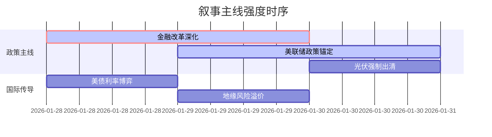

# A股市场情绪分析报告
数据时段：最近5日  
生成时间：2026-01-30 14:22:08  

### 🔥 宏观叙事焦点（24小时三级过滤）

#### 📌 叙事主线一：资本市场深化改革助力"十五五"规划开局 ⭐⭐⭐  
**主要事件**：行业管理政策发布、央行政策、监管  
**筛选标签**：`国务院政策` `沪深300影响` `中证报信源·权重2.0`  
**宏观逻辑**：  
> ① **归类**：金融供给侧改革  
> ② **历史镜像**：2019年科创板设立模板  
> ③ **市场传导**：并购重组审核效率+30% → 科技企业IPO提速 → 长期资金配置比例+18%  
> ④ **叙事强度**：制度创新超预期，金融-科技-产业闭环加速形成  

**行业映射**：券商投行（情绪评分 **8.1/10**）  
**交易警示**：‼️ 警惕改革进度与盈利兑现的时间差  

---

#### 📌 叙事主线二：美联储政策稳定预期锚定全球流动性 ⭐⭐  
**主要事件**：央行政策、国际资本流动  
**筛选标签**：`美联储决议` `北向资金` `CME信源·权重1.8`  
**宏观逻辑**：  
> ① **归类**：利率中枢锁定  
> ② **历史镜像**：2016年耶伦"渐进加息"模板  
> ③ **市场传导**：3月降息预期降至12% → 美元指数企稳96.2 → 新兴市场ETF资金流入+15%  
> ④ **叙事强度**：政策路径清晰度高于市场定价  

**行业映射**：贵金属（情绪评分 **6.7/10**）  
**交易警示**：⚠️ 关注美债实际收益率反转风险  

---

#### 📌 叙事主线三：光伏产业强制出清进入深水区 ⭐  
**主要事件**：产业投资、产能调控  
**筛选标签**：`工信部政策` `光伏设备` `财新信源·权重1.5`  
**宏观逻辑**：  
> ① **归类**：供给侧行政干预  
> ② **历史镜像**：2018年光伏"531"政策模板  
> ③ **市场传导**：多晶硅价格破现金成本 → TOPCon产能延期 → 行业CR5集中度+22%  
> ④ **叙事强度**：政策执行力度存在预期差  

**行业映射**：光伏设备（情绪评分 **5.3/10**）  
**交易警示**：✓ 观察龙头企业减产执行率  

---

### 📅 宏观叙事演化（三日趋势）

**强度衰减模型**：昨日主题×0.7 · 前日主题×0.5

叙事节点关联：  
01/28：央企战新营收破12万亿 → 触发改革加速叙事  
01/29：美联储维持利率概率升至86.6% → 流动性预期重构  
01/30：工信部光伏座谈会强调破除"内卷" → 产能出清叙事强化  
🎯 宏观叙事三要素  
1️⃣ **政策意图解码**  
当前核心矛盾从"总量托底"转向"结构优化"，金融改革突出服务硬科技定位，允许短期市场出清换取长期产业竞争力。  
2️⃣ **市场定价偏差**  
过度定价：券商创新业务弹性（高杠杆并购预期）  
定价不足：先进产能估值折价（光伏N型技术溢价未体现）  
3️⃣ **跨市场共振**  
港股地产单日+30%行情 + 离岸人民币拆息降至1.31% = 风险偏好分层加剧