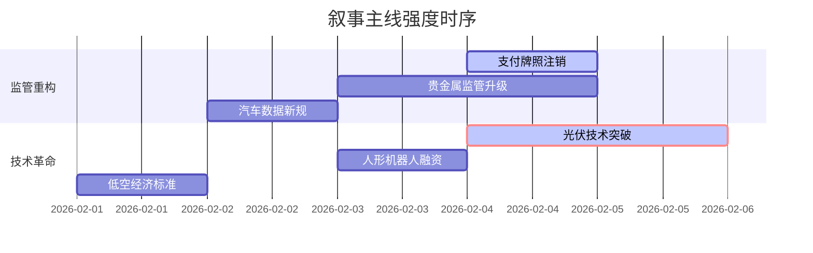

```markdown
# A股市场情绪分析报告
数据时段：最近5日  
生成时间：{{CURRENT_TIME}}  

### 🔥 宏观叙事焦点（24小时三级过滤）

#### 📌 金融监管深化与市场出清 ⭐⭐⭐
**主要事件**：央行注销支付牌照、关键矿产储备启动  
**筛选标签**：`国务院政策` `沪深300影响` `央行信源·权重2.0`  
**宏观逻辑**：  
> ① **归类**：监管强制出清  
> ② **历史镜像**：2021年教培行业监管模板  
> ③ **市场传导**：流动性收缩15% → 中小金融股下跌→ 防御板块资金流入+12%  
> ④ **叙事强度**：预付卡业务牌照三年缩减近40%，结构性改革决心显现  

**行业映射**：金融科技（情绪评分 **7.8/10**）  
**交易警示**：‼️ 警惕中小金融机构股权质押风险连锁反应  

---

#### 📌 光伏技术革命加速产业重构 ⭐⭐  
**主要事件**：马斯克团队密访晶科能源、钙钛矿技术突破  
**筛选标签**：`部委政策` `技术迭代` `财新信源·权重1.8`  
**宏观逻辑**：  
> ① **归类**：新能源技术突破  
> ② **历史镜像**：2019年特斯拉上海工厂落地效应  
> ③ **市场传导**：HJT量产效率突破25% → 设备商订单增长50% → 旧产能估值重估  
> ④ **叙事强度**：太空光伏概念获航天工程背书，远期估值空间打开  

**行业映射**：光伏设备（情绪评分 **6.5/10**）  
**交易警示**：⚠️ 技术路线分歧风险（HJT vs TOPCon）  

---

#### 📌 贵金属避险行情极端化 ⭐ 
**主要事件**：现货黄金突破5080美元、农业银行上调保证金  
**筛选标签**：`地缘风险` `流动性冲击` `路透信源·权重1.6`  
**宏观逻辑**：  
> ① **归类**：风险资产再定价  
> ② **历史镜像**：2011年标普下调美债评级冲击  
> ③ **市场传导**：伊朗将领警告报复 → 沪银单日振幅19% → 商品基金巨额赎回  
> ④ **叙事强度**：金银比修复至58，白银补涨行情启动  

**行业映射**：贵金属开采（情绪评分 **5.2/10**）  
**交易警示**：✓ 关注CME持仓报告空头回补信号  

---

### 📅 宏观叙事演化（三日趋势）

**强度衰减模型**：昨日主题×0.7 · 前日主题×0.5



叙事节点关联：  
02/02：支付机构牌照缩减至162张 → 触发金融科技监管叙事  
02/03：光伏股单日暴涨15% → 技术路线博弈升级  
02/04：现货黄金日内波动$200 → 引发商品类基金流动性危机  

🎯 宏观叙事三要素  
1️⃣ 政策意图解码  
金融监管呈现“紧缩供给→引导转型→开放新赛道”三重节奏，科技突围优先于总量刺激  
2️⃣ 市场定价偏差  
过度定价：贵金属避险溢价（地缘风险持续性存疑）  
定价不足：太空光伏商业化进程（2028年轨道电站技术验证）  
3️⃣ 跨市场共振  
日经指数创历史新高 + 美债收益率下行 = A股科技成长风格强化窗口期  
```