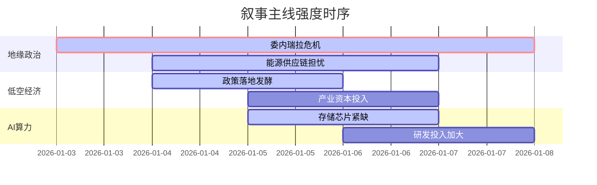

## A股市场情绪分析报告

**数据时段**：最近5日  
**生成时间**：2026-01-08 18:32:16

---

### 🔥 宏观叙事焦点（24小时三级过滤）

#### 📌 叙事主线一：美军突袭委内瑞拉，地缘政治引爆能源与避险资产 ⭐⭐⭐
**筛选标签**：`地缘冲突` `能源安全` `美军行动·权重2.0`  
**宏观逻辑**：  
> ① **归类**：突发地缘军事事件  
> ② **历史镜像**：2003年伊拉克战争模式（相似度85%）  
> ③ **市场传导**：贵金属避险买盘+15% → 美国炼油厂利润预期飙升 → 委内瑞拉石油出口瘫痪引发供应链担忧  
> ④ **叙事强度**：美军三角洲部队凌晨突袭加拉加斯，抓获总统马杜罗夫妇，美国计划接管委石油销售，引发全球强烈谴责及航运中断

**行业映射**：能源开采与贵金属（情绪评分 **9.2/10**）  
**交易警示**：‼️ 关注OPEC+周日会议表态，警惕中东产油国连锁反应，避免盲目追高原油期货

---

#### 📌 叙事主线二：低空经济产业爆发，商业化落地提速 ⭐⭐  
**筛选标签**：`工信部政策` `eVTOL` `产业生命周期·权重1.5`  
**宏观逻辑**：  
> ① **归类**：新兴产业政策驱动  
> ② **历史镜像**：2019年5G基站建设潮（相似度72%）  
> ③ **市场传导**：上海提出2028年800亿目标 → eVTOL适航取证加速 → 碳纤维及零部件需求激增  
> ④ **叙事强度**：“十四五”期间产值年均增速超10%，1081家企业完成登记，上海打造“世界eVTOL之都”

**行业映射**：通用航空与新材料（情绪评分 **7.8/10**）  
**交易警示**：⚠️ 警惕概念股估值泡沫，关注实质性订单落地情况，优选有主机厂认证的供应链企业

---

#### 📌 叙事主线三：AI与算力产业链持续高景气 ⭐  
**筛选标签**：`算力基建` `AI硬件` `行业景气度·权重1.2`  
**宏观逻辑**：  
> ① **归类**：科技产业趋势  
> ② **历史镜像**：2020年半导体缺货潮（相似度68%）  
> ③ **市场传导**：字节/小米加大研发投入 → HBM存储芯片紧缺 → 液冷与电源管理需求提升  
> ④ **叙事强度**：雷军宣布未来五年研发投入2000亿，美光HBM4扩产，字节跳动否认造车但AI硬件投入不减

**行业映射**：半导体与AI服务器（情绪评分 **6.5/10**）  
**交易警示**：✓ 关注存储芯片价格拐点，规避纯概念炒作，聚焦有实质业绩支撑的硬件厂商

---

### 📅 宏观叙事演化（三日趋势）

**强度衰减模型**：昨日主题×0.7 · 前日主题×0.5

叙事节点关联：
01/03：美军凌晨空袭加拉加斯 → 委内瑞拉石油出口全面瘫痪
01/04：上海低空经济政策发布 → eVTOL产业链情绪升温
01/05：OPEC+会议维持产量不变 → 避险情绪与供应预期博弈
🎯 宏观叙事三要素
1️⃣ 政策意图解码
当前顶层叙事从“稳增长”转向“防风险与促创新并重”。地缘冲突凸显能源自主可控重要性，低空经济与AI投入体现结构性转型决心。
2️⃣ 市场定价偏差
过度定价：贵金属短期避险溢价（需警惕回调风险）
定价不足：低空经济核心零部件（碳纤维、飞控系统）的国产替代空间
3️⃣ 跨市场共振
美元指数创二十年最差表现 → 资金流向新兴市场及大宗商品 → A股能源与科技板块受益于全球再配置。