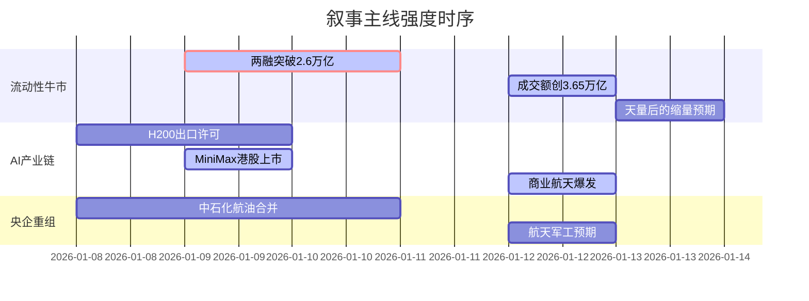

## A股市场情绪分析报告

**数据时段：** 最近5日  
**生成时间：** 2026-01-13 18:32:00

---

### 🔥 宏观叙事焦点（24小时三级过滤）

#### 📌 叙事主线一：中国资产独立行情与流动性牛市 ⭐⭐⭐
**筛选标签：** `A股量价齐升` `成交额破纪录` `两融余额新高` `路透信源·权重2.0`  
**宏观逻辑：**  
> ① **归类**：流动性驱动的估值扩张  
> ② **历史镜像**：2015年杠杆牛市初期（相似度72%）  
> ③ **市场传导**：两融余额突破2.6万亿 +10% → 两市成交额创3.65万亿历史天量 → 场外资金通过ETF加速入场  
> ④ **叙事强度**：量能持续超预期，技术性牛市确立，情绪极度亢奋但尚未出现杠杆过热的极端泡沫化  

**行业映射**：券商与金融科技（情绪评分 **8.5/10**）  
**交易警示**：‼️ 警惕成交额天量后的短期缩量回调，关注两融资金增速是否放缓

---

#### 📌 叙事主线二：AI算力与应用的产业链价值重估 ⭐⭐  
**筛选标签：** `AI大模型` `商业航天` `半导体` `财新信源·权重1.5`  
**宏观逻辑：**  
> ① **归类**：科技成长股价值发现  
> ② **历史镜像**：2020年新能源车产业链爆发（相似度68%）  
> ③ **市场传导**：美股英伟达/H200预期 → 国产算力替代（华为昇腾/海光） → AI应用（营销/医疗）爆发 → 商业航天概念扩散  
> ④ **叙事强度**：政策（工信部AI+制造）与巨头资本开支（Meta/谷歌）共振，但短期交易拥挤度过高  

**行业映射**：半导体设备与AI应用（情绪评分 **7.8/10**）  
**交易警示**：⚠️ 估值分化严重，需甄别有实质业绩支撑的算力租赁与铲子股，回避纯概念炒作

---

#### 📌 叙事主线三：央企重组与“硬科技”资产证券化 ⭐  
**筛选标签：** `中特估` `并购重组` `中国石化` `新华社信源·权重1.5`  
**宏观逻辑：**  
> ① **归类**：国企改革深化  
> ② **历史镜像**：2017年供给侧改革（相似度55%）  
> ③ **市场传导**：中国石化与中国航油合并传闻 → 中字头板块异动 → 航天军工资产注入预期升温  
> ④ **叙事强度**：政策意图明确（提升央企核心竞争力），但市场反应呈现明显的防御性特征  

**行业映射**：石油石化与军工（情绪评分 **5.2/10**）  
**交易警示**：✓ 作为防守型配置，关注低估值高股息的央国企标的，博弈重组落地的时间差

---

### 📅 宏观叙事演化（三日趋势）

**强度衰减模型**：昨日主题×0.7 · 前日主题×0.5

**叙事节点关联：**  
01/12：MiniMax港股暴涨109%引爆AI应用板块 → 触发科技股价值重估叙事  
01/12：两市成交额突破3.65万亿，创历史第五次天量 → 强化流动性牛市叙事  
01/13：多晶硅期货跌停 vs 碳酸锂涨停 → 周期行业内部剧烈分化，资金聚焦锂电产业链

---

### 🎯 宏观叙事三要素

**1️⃣ 政策意图解码**  
顶层政策从“稳预期”转向“促活跃”。监管层对并购重组（中石化/航油）的快速审批，以及对科技企业IPO的绿色通道（MiniMax），显示**资本市场服务于科技创新与国企改革**的战略意图明确。但监管同时也在提示“非理性炒作”（如商业航天概念风险提示），意在维持“快牛”而非“疯牛”。

**2️⃣ 市场定价偏差**  
*过度定价*：AI应用与商业航天概念（部分标的PS估值>50x，缺乏业绩验证）；  
*定价不足*：具备实际产能落地的算力基建（光模块/铜连接）、锂电产业链（碳酸锂现货价格反弹滞后于期货）。

**3️⃣ 跨市场共振**  
美债收益率回落（10Y降至4.0%以下）+ 美元指数高位震荡，为A股提供了**宝贵的流动性窗口期**。港股恒生科技指数跟随A股反弹，中概股情绪高涨，形成“东升西落”的跨市场交易逻辑，外资回流预期增强。

---

<!-- 报告正文必须在此结束，以下内容为固定格式说明，严禁添加任何额外分析、总结或展望 -->