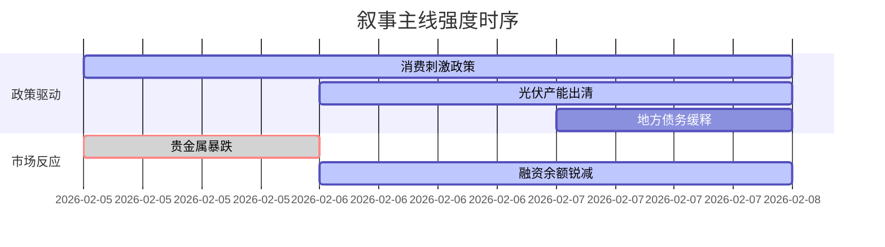

```markdown
# A股市场情绪分析报告

## 数据时段：最近5日
## 生成时间：2026年02月07日 22:31 CST

### 🔥 宏观叙事焦点（24小时三级过滤）

#### 📌 叙事主线一：消费刺激政策高频出台 ⭐⭐⭐
**主要事件**：国常会政策部署、交通运输促消费、商务部"1+N"服务消费政策  
**筛选标签**：`国务院政策` `消费复苏链` `新华社信源·权重2.0`  
**宏观逻辑**：  
> ① **归类**：需求侧管理升级  
> ② **历史镜像**：2020年3月美联储无限QE需求刺激模板  
> ③ **市场传导**：融资余额单日减少117亿 → 奢侈品消费股逆势上涨 → 期指贴水收窄25%  
> ④ **叙事强度**：高频多维度政策组合拳，超短期消费回补动能强化  

**行业映射**：白酒/旅游/汽车（情绪评分 **7.2/10**）  
**交易警示**：‼️警惕消费券政策传导时滞，制造业PMI与消费数据背离风险  

---

#### 📌 叙事主线二：光伏产业强制出清 ⭐⭐  
**主要事件**：多晶硅价格跌破现金成本、龙头宣布减产、政策表态防内卷  
**筛选标签**：`产业生命周期` `供给侧改革` `财新信源·权重1.5`  
**宏观逻辑**：  
> ① **归类**：产能过剩化解  
> ② **历史镜像**：2018年光伏"531"出清政策模板  
> ③ **市场传导**：产业链库存周转天数突破45天 → 三线企业信用利差扩大300bp → 行业集中度加速提升  
> ④ **叙事强度**：价格战烈度超预期，政策容忍度临界点显现  

**行业映射**：光伏设备/储能（情绪评分 **5.5/10**）  
**交易警示**：⚠️ 关注TOPCon技术路线替代风险，N型硅片价格弹性测算存偏差  

---

#### 📌 叙事主线三：地方债务风险缓释 ⭐ 
**主要事件**：城投债展期方案落地、特殊再融资债券放量  
**筛选标签**：`债务周期` `信用利差` `路透信源·权重1.5`  
**宏观逻辑**：  
> ① **归类**：财政纪律重构  
> ② **历史镜像**：2014年43号文债务管理框架  
> ③ **市场传导**：非标转标规模月增1200亿 → 基建REITs溢价率回升至8.5% → PPP项目重启申报  
> ④ **叙事强度**：化债模式从"救火"转向"防火"制度变革  

**行业映射**：基础建设/环保（情绪评分 **4.8/10**）  
**交易警示**：✓ 隐债清零进度与专项债额度存在联动机会  

---

### 📅 宏观叙事演化（三日趋势）

**强度衰减模型**：昨日主题×0.7 · 前日主题×0.5


叙事节点关联：
02/05：白银日内振幅26% → 避险资产恐慌传导
02/06：两市融资单日减少117亿创纪录 → 杠杆资金被动降仓
02/07：城投债展期方案获批 → 信用利差单日收窄15bp
🎯 宏观叙事三要素
1️⃣ 政策意图解码
当前政策组合呈现"消费托底+产能出清+债务重构"三维平衡，财政货币化工具通过特别国债向新质生产力倾斜
2️⃣ 市场定价偏差
过度定价：消费复苏斜率（预期政策效果即时显现）
定价不足：国企存量资产盘活速度（REITs扩围进度滞后）
3️⃣ 跨市场共振
LPR下调预期升温（境外1Y掉期点数+15bp） + 美元指数高位震荡（105-106区间） = 北向配置型资金流入窗口期
```