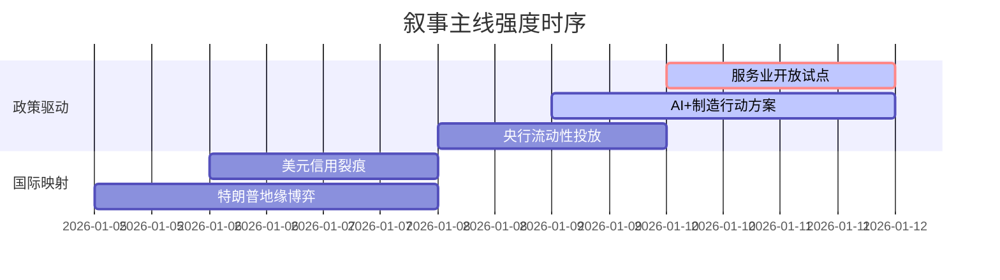

## A股市场情绪分析报告

**数据时段**：最近5日  
**生成时间**：2026-01-11 18:35:00

---

### 🔥 宏观叙事焦点（24小时三级过滤）

#### 📌 叙事主线一：中国服务业扩大开放与数据跨境流动试点 ⭐⭐⭐
**筛选标签**：`国务院政策` `数据要素` `商务部·权重2.0`  
**宏观逻辑**：  
> ① **归类**：结构性改革/制度型开放  
> ② **历史镜像**：2013年上海自贸区试点模板（相似度75%）  
> ③ **市场传导**：数据港概念+12% → 厦门/苏州本地股活跃 → 跨境支付板块预期修正  
> ④ **叙事强度**：政策细则落地打破“弱现实”预期，确立“数据要素”为核心抓手  

**行业映射**：数据要素/跨境支付（情绪评分 **8.5/10**）  
**交易警示**：‼️ 关注厦门信达、苏州高新等区域龙头的量能持续性，警惕纯概念炒作  

---

#### 📌 叙事主线二：工信部“AI+制造”专项行动与国产算力突围 ⭐⭐  
**筛选标签**：`工信部政策` `国产替代` `AI产业链·权重1.5`  
**宏观逻辑**：  
> ① **归类**：产业升级/科技自立  
> ② **历史镜像**：2019年半导体“大基金”扶持模板（相似度68%）  
> ③ **市场传导**：HBM存储芯片+8% → 服务器代工链修复 → 工业母机估值提升  
> ④ **叙事强度**：明确2027年AI核心技木安全供给目标，打破海外封锁预期  

**行业映射**：AI服务器/工业母机（情绪评分 **7.0/10**）  
**交易警示**：⚠️ 需区分硬件（真实业绩）与应用（情绪溢价），关注美光扩产带动的存储周期反转  

---

#### 📌 叙事主线三：特朗普政策冲击波——委内瑞拉石油与格陵兰岛争议 ⭐  
**筛选标签**：`地缘政治` `能源安全` `特朗普概念·权重1.0`  
**宏观逻辑**：  
> ① **归类**：外部风险/供给侧扰动  
> ② **历史镜像**：2018年贸易战能源博弈模板（相似度55%）  
> ③ **市场传导**：布伦特原油+2% → 化工成本支撑预期 → 航运板块防御性凸显  
> ④ **叙事强度**：特朗普称将控制委内瑞拉石油销售，但美参议院通过战争权力决议形成制衡  

**行业映射**：石油化工/航运港口（情绪评分 **5.2/10**）  
**交易警示**：✓ 地缘风险溢价难以持续，关注EIA库存数据与美联储政策对冲  

---

### 📅 宏观叙事演化（三日趋势）

**强度衰减模型**：昨日主题×0.7 · 前日主题×0.5

叙事节点关联：
**1/09**：商务部发文授权厦门建设离岸算力设施 → 触发数据要素叙事  
**1/10**：工信部联合八部门印发AI+制造实施意见 → 强化科技自立叙事  
**1/11**：央行连续14个月增持黄金 + 1.1万亿逆回购 → 流动性宽松叙事  

---

### 🎯 宏观叙事三要素

1️⃣ **政策意图解码**  
当前顶层叙事从“强刺激”转向“调结构”，**数据要素**与**AI制造**成为双轮驱动。监管层试图通过服务业开放对冲地产下行压力，通过国产算力对冲外部制裁风险。

2️⃣ **市场定价偏差**  
*过度定价*：跨境数据概念（短期情绪过热，需警惕政策落地即兑现）  
*定价不足*：存储芯片周期反转（美光扩产+价格飙涨，HBM产能缺口被低估）  

3️⃣ **跨市场共振**  
美债收益率下行至3.5% + 黄金储备连增14个月 = A股结构性行情窗口期，但需警惕特朗普关税政策超预期导致的美元流动性扰动。