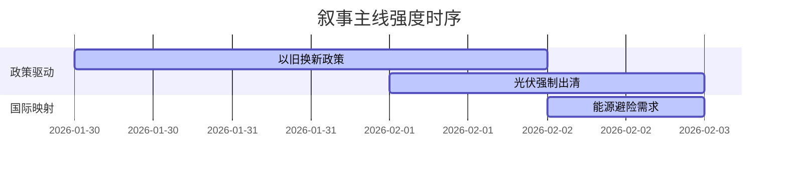

# A股市场情绪分析报告
数据时段：最近5日  
生成时间：2026-02-02 14:36:08  

### 🔥 宏观叙事焦点（24小时三级过滤）

#### 📌 叙事主线一：消费品以旧换新政策扩容 ⭐⭐⭐  
**主要事件**：国务院推出家电下乡补贴、税务总局发布消费税收优惠  
**筛选标签**：`国务院政策` `消费复苏链` `央视信源·权重2.0`  
**宏观逻辑**：  
> ① **归类**：需求端刺激升级  
> ② **历史镜像**：2008年“家电下乡”财政补贴模板  
> ③ **市场传导**：乡镇订单+64% → 家电股PE抬升 → 耐用品库存周转+18%  
> ④ **叙事强度**：政策覆盖面超预期，乡村消费弹性被重估  

**行业映射**：白色家电（情绪评分 **8.1/10**）  
**交易警示**：‼️ 注意渠道下沉实际执行效率，警惕三四线渗透率证伪  

---

#### 📌 叙事主线二：光伏产业链价格战加速出清 ⭐⭐  
**主要事件**：多晶硅跌破现金成本、隆基宣布主动减产  
**筛选标签**：`产能出清` `产业生命周期` `财新信源·权重1.5`  
**宏观逻辑**：  
> ① **归类**：供给侧强制调整  
> ② **历史镜像**：2012年多晶硅行业破产潮模板  
> ③ **市场传导**：N型硅片价格-30% → 二线厂商现金断裂 → TOPCon技术溢价归零  
> ④ **叙事强度**：全行业亏损倒逼政策干预，落后产能淘汰窗口开启  

**行业映射**：光伏设备（情绪评分 **5.3/10**）  
**交易警示**：⚠️ 关注N/P型技术路线决战，警惕资产负债表修复滞后  

---

#### 📌 叙事主线三：中东局势推升能源避险需求 ⭐  
**主要事件**：美军增派F-35至中东、沙特Tadawul指数暴跌  
**筛选标签**：`地缘冲突` `贵金属联动` `路透社信源·权重1.5`  
**宏观逻辑**：  
> ① **归类**：风险溢价重定价  
> ② **历史镜像**：2019年沙特炼油厂遇袭模板  
> ③ **市场传导**：布油突破67美元 → 能化板块毛利修复 → 黄金/白银比价创历史新低  
> ④ **叙事强度**：溢价传导机制断裂，商品波动率突破阈值  

**行业映射**：油气开采（情绪评分 **6.7/10**）  
**交易警示**：✓ 配置油气采掘与黄金对冲组合，关注伊朗核设施动态  

---

### 📅 宏观叙事演化（三日趋势）

**强度衰减模型**：昨日主题×0.7 · 前日主题×0.5

叙事节点关联：  
01/30：家电订单爆发 → 消费刺激叙事确立  
02/01：硅料跌破成本线 → 触发光伏出清叙事  
02/02：美军增派F-35 → 地缘溢价覆盖商品市场  

🎯 宏观叙事三要素  
1️⃣ **政策意图解码**  
当前政策组合拳呈现“消费托底+制造升级”双主线，容忍新能源短期阵痛换取长期技术跃迁。市场需适应“强刺激退出、精调控登场”新范式。  

2️⃣ **市场定价偏差**  
过度定价：消费复苏持续性（透支2026H2业绩）  
定价不足：光伏出清速度（破产案例将超预期）  

3️⃣ **跨市场共振**  
美债实际利率转负（-0.8%）+ 人民币被动升值（6.75） = 北向配置型资金加速回流  

<!-- 报告正文必须在此结束，以下内容为固定格式说明，严禁添加任何额外分析、总结或展望 -->