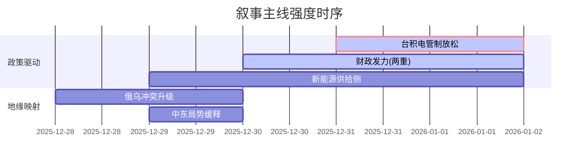

# A股市场情绪分析报告

**数据时段**：最近5日  
**生成时间**：2026-01-02 09:00:00

---

### 🔥 宏观叙事焦点（24小时三级过滤）

#### 📌 叙事主线一：**中美科技管制缓和与AI算力需求爆发** ⭐⭐⭐
**筛选标签**：`台积电` `国产算力` `AI大模型` `路透信源·权重2.0`

**宏观逻辑**：
> ① **归类**：供给端突破与需求端爆发  
> ② **历史镜像**：2020年半导体缺芯潮（技术封锁下的国产替代逻辑，相似度75%）  
> ③ **市场传导**：台积电获美对华设备销售许可 → 算力硬件（CPO/铜连接）及ASIC芯片产业链大涨 → 期指持仓量向科技龙头集中  
> ④ **叙事强度**：从单纯的“制裁预期”转向“管制松动+需求超预期”的戴维斯双击

**行业映射**：半导体（国产替代）、通信（CPO）、计算机（AI应用）（情绪评分 **8.5/10**）  
**交易警示**：‼️ 警惕短期交易拥挤度过高，关注1月CPO产业链业绩预告兑现情况

---

#### 📌 叙事主线二：**“两重”建设与财政前置发力** ⭐⭐⭐
**筛选标签**：`国务院政策` `REITs` `基建` `新华社信源·权重1.5`

**宏观逻辑**：
> ① **归类**：总量政策超预期落地  
> ② **历史镜像**：2019年Q4专项债发行加速模板（相似度70%）  
> ③ **市场传导**：发改委提前批“两重”项目2950亿元下达 → REITs市场扩容（沪深港通标的预期） → 基建产业链估值修复  
> ④ **叙事强度**：政策意图明确，打破“弱复苏”预期，确认2026年经济“开门红”基调

**行业映射**：基建（情绪评分 **7.0/10**）、房地产（情绪评分 **6.5/10**）  
**交易警示**：⚠️ 政策落地需匹配实物工作量，警惕“买预期卖事实”的短期波动

---

#### 📌 叙事主线三：**新能源供给侧改革2.0（锂/光伏）** ⭐⭐
**筛选标签**：`部委政策` `能源安全` `产业生命周期` `财新信源·权重1.5`

**宏观逻辑**：
> ① **归类**：产业强制出清与战略整合  
> ② **历史镜像**：2018年光伏“531”政策（相似度80%）  
> ③ **市场传导**：锂价跌破成本线 → 智利锂业国有化 → 多晶硅价格跌破现金成本 → 龙头企业宣布减产 → 供给侧改革预期升温  
> ④ **叙事强度**：市场自发出清叠加政策引导，产能出清加速期来临

**行业映射**：锂矿/电池（情绪评分 **5.0/10**）、光伏设备（情绪评分 **5.5/10**）  
**交易警示**：⚠️ 政策底与市场底背离风险，右侧信号需等待产能利用率回升

---

### 📅 宏观叙事演化（三日趋势）

**强度衰减模型**：昨日主题×0.7 · 前日主题×0.5

**叙事节点关联**：
*   **12/28-29**：俄乌冲突显著升级（远程打击）→ 原油/贵金属价格跳升 → 市场风险偏好受抑。
*   **12/30**：台积电获美设备销售许可 → 科技股情绪逆转，算力硬件引领反弹。
*   **12/31**：发改委下达2950亿“两重”资金 + REITs政策利好 → 基建/地产链估值修复，A500ETF资金加速流入。
*   **01/01**：12月PMI重回扩张区间（50.1%）→ 确认经济短期企稳，强化“春季躁动”逻辑。

---

🎯 **宏观叙事三要素**

1️⃣ **政策意图解码**
当前顶层叙事从“防风险”转向“稳增长+调结构”并重。核心在于**财政前置**（两重项目）与**科技突围**（算力/芯片）双轮驱动。允许部分产业（如新能源）短期阵痛，换取长期质量，政策定力超预期。

2️⃣ **市场定价偏差**
*   **过度定价**：贵金属/有色（短期投机情绪过热，CME保证金上调警示风险）。
*   **定价不足**：半导体设备国产化率提升速度（台积电许可事件打破市场悲观预期）；基建实物工作量落地速度（资金已到位，预期差待修复）。

3️⃣ **跨市场共振**
*   **美债**：收益率下行打开国内货币政策空间。
*   **美元**：高位缓释，利好人民币资产及出口链修复。
*   **港股**：南向资金全年净买入1.4万亿港元创纪录，显示内地资金对核心资产的配置需求强劲，AH溢价有望收敛。

---

<!-- 报告正文必须在此结束，以下内容为固定格式说明，严禁添加任何额外分析、总结或展望 -->