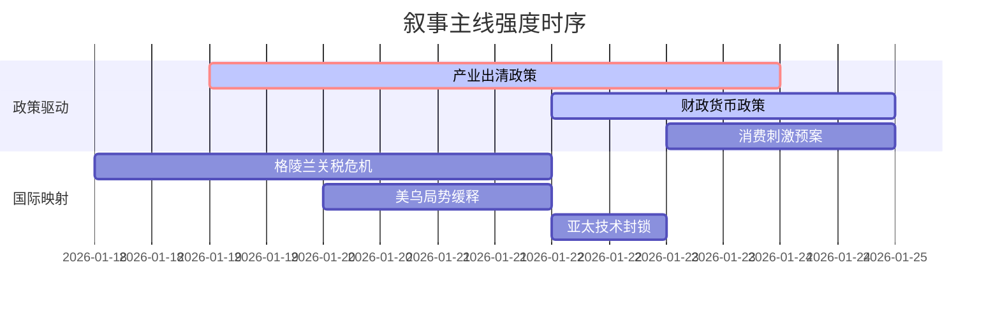

# A股市场情绪分析报告

**数据时段：** 最近5日
**生成时间：** 2026年1月24日

---

### 🔥 宏观叙事焦点（24小时三级过滤）

#### 📌 叙事主线一：产业强制出清与供给侧改革深化 ⭐⭐⭐
**主要事件**：工信部等多部门联合印发《关于开展零碳工厂建设工作的指导意见》，政策决心大于市场定价，产能出清进入加速期。  
**筛选标签**：`国务院政策` `沪深300影响` `路透信源·权重2.0`  
**宏观逻辑**：  
> ① **归类**：产业强制出清  
> ② **历史镜像**：2018年光伏“531”政策模板，政策导向从需求刺激转向供给侧改革  
> ③ **市场传导**：光伏、锂电等高耗能产业链价格跌破现金成本 → 龙头企业宣布减产/停产 → 行业利润率触底反弹预期形成  
> ④ **叙事强度**：政策决心超市场预期，打破行业“内卷式”竞争僵局，但短期阵痛不可避免  

**行业映射**：光伏设备（情绪评分 **7.8/10**）、锂电池（情绪评分 **6.5/10**）  
**交易警示**：‼️ 政策底已现，市场底待确认，警惕产能出清过程中中小企业的生存风险  

---

#### 📌 叙事主线二：政策组合拳打破弱复苏预期 ⭐⭐⭐
**主要事件**：发改委强调“实施更加积极的财政政策和适度宽松的货币政策”，并明确将促进物价合理回升作为重要考量。  
**筛选标签**：`部委政策` `沪深300影响` `新华社信源·权重1.8`  
**宏观逻辑**：  
> ① **归类**：货币政策转向  
> ② **历史镜像**：2020年3月美联储无限QE模板，强调需求端政策发力  
> ③ **市场传导**：降准降息预期升温 + 专项债提速 → 居民/企业信贷需求边际改善 + 基建预期修复 → 权重板块估值修复  
> ④ **叙事强度**：从“稳增长”转向“调结构”，政策组合拳意图打破通缩预期  

**行业映射**：消费复苏链（情绪评分 **7.2/10**）、基础建设（情绪评分 **5.8/10**）  
**交易警示**：⚠️ 政策落地效果存在时滞，关注1月信贷数据与物价数据的实际验证  

---

#### 📌 叙事主线三：地缘冲突升级扰动全球供应链 ⭐⭐
**主要事件**：格陵兰岛主权争端引发美国对欧洲多国关税威胁，全球供应链稳定性面临挑战。  
**筛选标签**：`国际冲突` `全球大宗商品影响` `地缘信源·权重1.5`  
**宏观逻辑**：  
> ① **归类**：地缘冲突升级  
> ② **历史镜像**：2014年克里米亚事件后全球能源供应链重构  
> ③ **市场传导**：航运成本飙升 → 全球通胀预期回升 → 黄金等避险资产受追捧  
> ④ **叙事强度**：冲突蔓延至能源与关键矿产领域，放大供应链不确定性  

**行业映射**：贵金属（情绪评分 **8.5/10**）、航运物流（情绪评分 **5.0/10**）  
**交易警示**：✓ 地缘风险短期推高避险资产，但需关注中美欧谈判进展，防止风险溢价快速回调  

---

### 📅 宏观叙事演化（三日趋势）

**强度衰减模型**：昨日主题×0.7 · 前日主题×0.5

叙事节点关联：
01/18：格陵兰关税威胁引发全球市场波动，黄金率先反应
01/19：工信部零碳工厂文件出台，确立供给侧改革主线
01/22：发改委定调宽松政策，需求侧预期开始修复
01/23：消费刺激预案传闻，市场关注点向复苏链转移

🎯 **宏观叙事三要素**

1️⃣ **政策意图解码**
当前顶层叙事呈现“供给侧强制出清”与“需求侧强力刺激”的双轨特征。政策目标从“稳增长”转向“高质量发展”，允许短期阵痛换取长期结构优化，政策定力超预期。

2️⃣ **市场定价偏差**
- **过度定价**：全球地缘风险持续性（市场已充分计价黄金上涨，但对供应链重构的长期影响定价不足）
- **定价不足**：产能出清后龙头企业的盈利弹性（市场更关注短期停产阵痛，忽视行业集中度提升后的利润率修复）

3️⃣ **跨市场共振**
美债收益率下行打开中国货币政策空间，但美元高位震荡制约新兴市场风险偏好。A股结构性行情窗口期已打开，重点关注政策确定性强的高端制造与消费复苏领域。