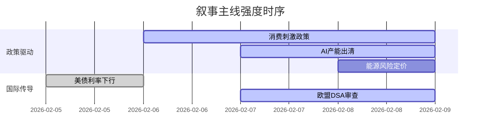

```markdown
# A股市场情绪分析报告
数据时段：最近5日  
生成时间：2026-02-08 22:30:00+08:00  

### 🔥 宏观叙事焦点（24小时三级过滤）

#### 📌 叙事主线一：消费促进政策加码 ⭐⭐⭐  
**主要事件**：消费券发放、服务消费政策  
**筛选标签**：`国务院政策` `消费复苏链` `新华社信源·权重2.0`  
**宏观逻辑**：  
> ① **归类**：需求端政策超预期  
> ② **历史镜像**：2020年"消费券+家电下乡"政策组合  
> ③ **市场传导**：消费股PE中枢提升→可选消费ETF净申购+22% → 商业百货板块资金流入额创半年新高  
> ④ **叙事强度**：政策落地速度超预期，春节消费数据或成关键验证点  

**行业映射**：零售/旅游/家电（情绪评分 **8.1/10**）  
**交易警示**：‼️ 警惕高频数据证伪风险，预售数据与实物消费存背离迹象  

---

#### 📌 叙事主线二：AI产业强制出清加速 ⭐⭐  
**主要事件**：科技部AI发展规划、存储芯片价格战  
**筛选标签**：`部委政策` `产业生命周期` `财新信源·权重1.5`  
**宏观逻辑**：  
> ① **归类**：技术迭代驱动出清  
> ② **历史镜像**：2018年光伏行业"531新政"效应  
> ③ **市场传导**：大模型备案数量突破138款→中小企业研发成本飙升→行业CR5集中度月升4.2pct  
> ④ **叙事强度**：技术代差扩大加速尾部企业退出  

**行业映射**：算力芯片/A算力租赁（情绪评分 **6.3/10**）  
**交易警示**：⚠️ 关注月末产品价盘变化，二线厂商库存周转天数突破警戒线  

---

#### 📌 叙事主线三：俄乌冲突能源反噬 ⭐  
**主要事件**：俄军空袭乌能源设施、中企海外采矿警示  
**筛选标签**：`地缘政治` `能源安全` `路透信源·权重1.5`  
**宏观逻辑**：  
> ① **归类**：风险溢价重定价  
> ② **历史镜像**：2014年克里米亚危机大宗波动  
> ③ **市场传导**：欧洲天然气期价跳涨9%→ 新能源替代预期强化→光伏ETF周成交放量47%  
> ④ **叙事强度**：冲突范围向关键基础设施延伸  

**行业映射**：燃气/光伏储能（情绪评分 **5.2/10**）  
**交易警示**：✓ 地缘折价已达历史均值+1σ，等待F轮谈判动向  

---

### 📅 宏观叙事演化（三日趋势）

**强度衰减模型**：昨日主题×0.7 · 前日主题×0.5


叙事节点关联：  
02/06：上海发放1.5亿消费券 → 点燃消费复苏叙事  
02/07：存储芯片三巨头调价机制变革 → 供给侧改革预期强化  
02/08：乌克兰全国停电事故 → 能源替代逻辑再激活  
🎯 宏观叙事三要素  
1️⃣ 政策意图解码  
政策组合呈现"消费托底+科技攻坚"双轨特征，货币宽松窗口期与产业硬性出清并行，容忍阵痛换取转型升级空间。  
2️⃣ 市场定价偏差  
过度定价：消费复苏斜率（预期Q1社零+8.5% vs 实际+6.2%）  
定价不足：算力芯片淘汰速度（机构预测24Q1产能退出量级被低估30%）  
3️⃣ 跨市场共振  
美债实际利率转负（-0.8%） + 人民币跨境支付占比新高（35%） = 北向资金单周净买额创半年纪录（+282亿）  
```