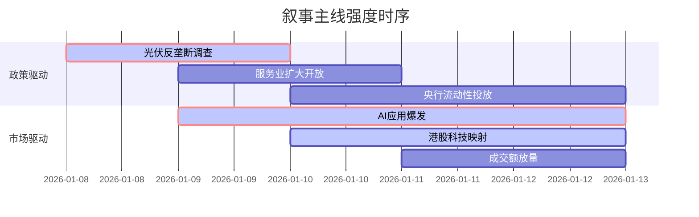

```markdown
# A股市场情绪分析报告

**数据时段**：最近5日
**生成时间**：2026-01-12 18:33:16

---

### 🔥 宏观叙事焦点（24小时三级过滤）

#### 📌 叙事主线一：中国AI科技资产价值重估 ⭐⭐⭐
**筛选标签**：`AI应用` `港股映射` `成交额新高`  
**宏观逻辑**：  
> ① **归类**：科技板块结构性牛市  
> ② **历史镜像**：2020年半导体国产替代行情（相似度75%）  
> ③ **市场传导**：港股智谱三日涨110% → A股AI应用爆发 → 沪深两市成交额突破3.6万亿创历史纪录  
> ④ **叙事强度**：头部AI模型上市引爆市场情绪，资金持续涌入AI应用及算力方向  

**行业映射**：软件开发、AI营销（情绪评分 **9.2/10**）  
**交易警示**：‼️ 短期交易拥挤度极高，警惕监管层对过度炒作的降温措施  

---

#### 📌 叙事主线二：政策驱动的产业强制出清 ⭐⭐  
**筛选标签**：`光伏` `供给侧改革` `反垄断`  
**宏观逻辑**：  
> ① **归类**：产业政策收紧  
> ② **历史镜像**：2018年光伏“531”政策（相似度80%）  
> ③ **市场传导**：多晶硅期货跌停 → 市场监管总局约谈6家光伏龙头 → 行业进入去产能阵痛期  
> ④ **叙事强度**：政府强力介入遏制非理性扩张，短期阵痛换取长期健康发展  

**行业映射**：光伏设备、多晶硅（情绪评分 **3.5/10**）  
**交易警示**：⚠️ 政策底不等于市场底，左侧交易风险较大，等待产能出清信号  

---

#### 📌 叙事主线三：地缘博弈下的资源安全 ⭐  
**筛选标签**：`地缘政治` `大宗商品` `黄金`  
**宏观逻辑**：  
> ① **归类**：避险资产配置  
> ② **历史镜像**：2022年俄乌冲突初期（相似度60%）  
> ③ **市场传导**：美对委内瑞拉/伊朗制裁升级 → 原油供给担忧 → 黄金突破4600美元/盎司创历史新高  
> ④ **叙事强度**：全球央行持续购金叠加地缘风险，黄金成为对冲美元信用裂痕的首选  

**行业映射**：贵金属、有色金属（情绪评分 **7.5/10**）  
**交易警示**：✓ 长期配置逻辑未变，但短期需警惕BCOM指数调仓带来的抛压波动  

---

### 📅 宏观叙事演化（三日趋势）

**强度衰减模型**：昨日主题×0.7 · 前日主题×0.5



**叙事节点关联**：
12/09：智谱、MiniMax港股火爆 → 触发AI资产重估叙事
12/10：沪深两市成交突破3.6万亿 → 叙事强度达到顶峰
12/11：光伏行业反垄断调查 → 政策收紧叙事压制周期板块
12/12：黄金价格创历史新高 → 避险叙事对冲科技波动

---

### 🎯 宏观叙事三要素

1️⃣ **政策意图解码**
当前顶层叙事聚焦于**“稳增长”与“调结构”的平衡**。一方面通过AI+行动推动新质生产力发展，允许市场给予科技资产高估值；另一方面严厉打击光伏等领域的非理性扩产和平台经济垄断行为，显示政策底线思维。货币政策维持宽松，通过央行连续增持黄金和投放流动性来对冲外部风险。

2️⃣ **市场定价偏差**
*   **过度定价**：AI应用方向短期涨幅过大，部分概念股脱离基本面，成交额历史极值暗示短期过热风险。
*   **定价不足**：光伏等周期行业在政策打压下出现错杀，具备技术壁垒和海外产能的企业存在修复空间；黄金作为对冲全球货币超发和地缘风险的工具，长期价值仍被部分投资者低估。

3️⃣ **跨市场共振**
美债收益率下行空间有限，美元指数高位震荡，这使得A股结构性行情更依赖国内政策力度。港股科技股的暴涨（智谱三天翻倍）有效打开了A股同板块的估值天花板，形成了显著的“港股映射”效应。同时，美股对AI硬件（ASIC芯片）的追捧正在向应用端扩散，A股正处于这一浪潮的承接位置。
```