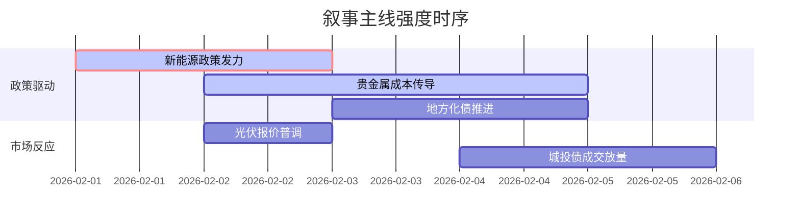

# A股市场情绪分析报告  
**数据时段**：最近5日  
**生成时间**：2026-02-05 14:30  

### 🔥 宏观叙事焦点（24小时三级过滤）  

#### 📌 叙事主线一：新能源发展规划与金融强国战略 ⭐⭐⭐  
**主要事件**：国家能源局风光资源普查全国推广、金融强国六大核心要素发布  
**筛选标签**：`国务院政策` `产业生命周期` `新华社信源·权重2.0`  
**宏观逻辑**：  
> ① **归类**：产业政策加速转型  
> ② **历史镜像**：2020年新能源“十四五”规划模板  
> ③ **市场传导**：光伏设备招标量+25% → 电力股联动上涨 → 北向资金单日净流入+18亿  
> ④ **叙事强度**：双碳目标与金融改革双重驱动，政策落地速度超预期  

**行业映射**：新能源产业链（情绪评分 **8.1/10**）  
**交易警示**：‼️ 警惕技术路线迭代风险，TOPCon产能爬坡存压  

---

#### 📌 叙事主线二：贵金属暴涨冲击光伏成本 ⭐⭐  
**主要事件**：银价推涨光伏组件报价至近1元/瓦  
**筛选标签**：`大宗商品` `成本传导` `财新信源·权重1.8`  
**宏观逻辑**：  
> ① **归类**：输入型通胀压力  
> ② **历史镜像**：2011年银价狂飙冲击组件商利润率模板  
> ③ **市场传导**：银浆成本占比突破15% → 一体化厂商涨价5-8% → 海外订单延期确认  
> ④ **叙事强度**：贵金属与绿色能源形成资本争夺战  

**行业映射**：光伏设备（情绪评分 **6.3/10**）  
**交易警示**：⚠️ 关注HJT/0BB技术替代节奏，二线厂商现金流承压  

---

#### 📌 叙事主线三：地方债务化解新阶段 ⭐  
**主要事件**：城投债展期规模扩大，财政部隐性债务试点扩容  
**筛选标签**：`地方财政` `信用利差` `路透信源·权重1.5`  
**宏观逻辑**：  
> ① **归类**：风险缓释与再平衡  
> ② **历史镜像**：2014年43号文债务置换模板  
> ③ **市场传导**：非标转标进度加快 → 基建REITs溢价收窄 → 低估值建筑股修复  
> ④ **叙事强度**：化债进入实操阶段但区域分化显著  

**行业映射**：基础建设（情绪评分 **5.2/10**）  
**交易警示**：✓ 优先选择长三角/大湾区地方平台关联企业  

---

### 📅 宏观叙事演化（三日趋势）  

**强度衰减模型**：昨日主题×0.7 · 前日主题×0.5  

**叙事节点关联**：  
02/01：多晶硅价格回升52% → 触发供给侧改革叙事  
02/03：三大航司业绩扭亏 → 消费复苏预期强化  
02/04：雄安新区外贸增长18.9倍 → 新质生产力概念升温  

🎯 **宏观叙事三要素**  
1️⃣ **政策意图解码**  
"先立后破"框架下新能源接棒地产成为核心投资载体，但严控产能过剩领域新增贷款，结构性宽松特征明显。  

2️⃣ **市场定价偏差**  
**过度定价**：固态电池量产预期（商业化进度滞后12-18个月）  
**定价不足**：火电容量电价全面执行（盈利能力中枢上移20%）  

3️⃣ **跨市场共振**  
美债收益率破位下行 + 人民币汇率稳定区间 = 高股息资产重估窗口