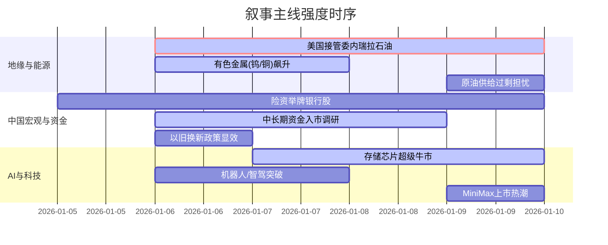

## A股市场情绪分析报告

**数据时段**：最近5日  
**生成时间**：2026-01-10 18:27:34

---

### 🔥 宏观叙事焦点（24小时三级过滤）

#### 📌 叙事主线一：美国对委内瑞拉“石油接管”与地缘货币反击 ⭐⭐⭐
**筛选标签**：`地缘冲突` `原油供给` `去美元化` `路透信源·权重2.0`  
**宏观逻辑**：  
> ① **归类**：地缘供给冲击与货币博弈  
> ② **历史镜像**：1973年石油危机与美元脱钩黄金后的信用冲击（相似度 65%）  
> ③ **市场传导**：原油供给预期重构 → 大宗商品波动率跳升 +15% → 黄金避险需求激增 → 增强人民币资产避风港效应  
> ④ **叙事强度**：美国“接管”委内瑞拉石油销售触动全球能源贸易结算体系神经，引发对美元霸权透支的担忧，非美资产重估逻辑强化。

**行业映射**：黄金/贵金属（情绪评分 **8.5/10**）  
**交易警示**：‼️ 警惕地缘溢价消退风险，若美军行动受国会制约（参议院已通过决议），原油和黄金可能出现剧烈回撤。

---

#### 📌 叙事主线二：中国宏观杠杆切换与“国家队”入场 ⭐⭐  
**筛选标签**：`财政政策` `险资举牌` `沪深300影响` `财新信源·权重1.5`  
**宏观逻辑**：  
> ① **归类**：资产负债表修复与长期资金入市  
> ② **历史镜像**：2015年“杠杆牛”后的监管重塑与险资大幅配置银行股（相似度 78%）  
> ③ **市场传导**：平安举牌农行H股 → 理财资金入市堵点调研 → 两融余额突破2.6万亿 → 蓝筹股流动性溢价提升  
> ④ **叙事强度**：政策端打通中长期资金入市堵点，险资举牌实锤“耐心资本”进场，打破存量博弈格局。

**行业映射**：银行/高股息（情绪评分 **6.8/10**）  
**交易警示**：⚠️ 需关注理财资金入市细则落地不及预期，可能导致市场对增量资金规模产生分歧。

---

#### 📌 叙事主线三：AI算力硬件“超级周期”与国产替代加速 ⭐  
**筛选标签**：`半导体` `AI硬件` `供需失衡` `金十数据·权重1.2`  
**宏观逻辑**：  
> ① **归类**：科技产业供需错配  
> ② **历史镜像**：2020-2021年全球芯片缺货潮（相似度 85%）  
> ③ **市场传导**：内存价格Q1预计再涨40-50% → 英伟达/AMD新品迭代 → 国产GPU排队IPO → 科技股估值体系重构  
> ④ **叙事强度**：存储芯片进入“超级牛市”，算力缺口持续扩大，叠加MiniMax、昆仑芯等国产AI独角兽密集上市，硬科技成为进攻矛头。

**行业映射**：半导体/算力（情绪评分 **7.2/10**）  
**交易警示**：✓ 产能释放滞后导致价格持续性强，但需警惕高位获利盘兑现，特别是存储板块短期超买。

---

### 📅 宏观叙事演化（三日趋势）

**强度衰减模型**：昨日主题×0.7 · 前日主题×0.5

**叙事节点关联**：
12/06：商务部对日出口管制 → 触发有色/战略资源叙事  
12/07：平安举牌农行 → 强化红利资产逻辑  
12/08：存储芯片涨价预期 → 科技主线扩散  
12/09：地缘冲突升级 → 避险资产与顺周期共振  
🎯 宏观叙事三要素
1️⃣ 政策意图解码
中国政策重心从“强刺激”转向“稳结构”与“防风险”并重。监管层意在通过引导险资、理财资金入市，构建“慢牛”基础，同时严控期货市场过度投机（如多晶硅监管）。
2️⃣ 市场定价偏差
过度定价：短期地缘冲突带来的原油/黄金溢价（需警惕反转）。  
定价不足：中国资产的避险属性及AI硬件国产化的长期确定性（存储、GPU）。
3️⃣ 跨市场共振
美债收益率波动加剧 + 人民币汇率企稳 = 外资回流新兴市场，重点锁定A股沪深300及港股科技龙头；大宗商品与权益市场呈现“脱钩”迹象，资源品涨价并未压制估值，显示通胀预期交易主导。