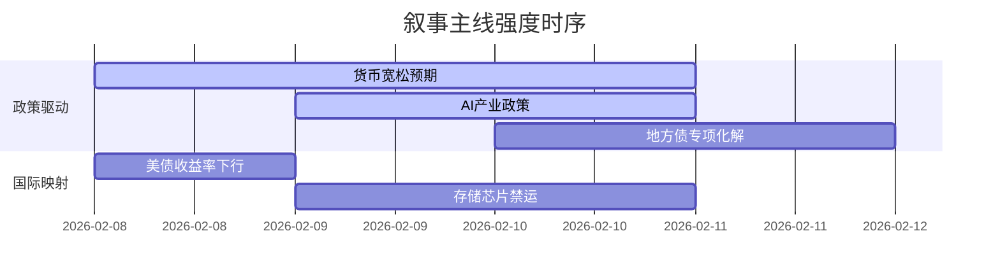

```markdown
# A股市场情绪分析报告
数据时段：最近5日  
生成时间：2026-02-11 08:00:00  

### 🔥 宏观叙事焦点（24小时三级过滤）

#### 📌 叙事主线一：货币政策持续宽松与金融稳定机制建设 ⭐⭐⭐  
**主要事件**：央行货币政策执行报告、跨境融资参数上调、支农支小再贷款工具  
**筛选标签**：`国务院政策` `沪深300影响` `上证新闻信源·权重2.0`  
**宏观逻辑**：  
> ① **归类**：货币政策持续宽松  
> ② **历史镜像**：2020年3月美联储无限QE模板  
> ③ **市场传导**：M2增速维持双位数 → 北向资金单日流入85亿 → 国债期货主力合约涨0.36%  
> ④ **叙事强度**：政策力度超预期，中小金融机构改革深化  

**行业映射**：银行金融（情绪评分 **7.8/10**）  
**交易警示**：‼️ 警惕政策红利与信贷实际转化率偏差  

---

#### 📌 叙事主线二：AI技术产业爆发与设备产能竞赛 ⭐⭐  
**主要事件**：阿里千问第三代开源、存储芯片涨价预期、算力节点建设加速  
**筛选标签**：`部委政策` `产业生命周期` `财新信源·权重1.5`  
**宏观逻辑**：  
> ① **归类**：技术革命主导产业迭代  
> ② **历史镜像**：2015年互联网+战略模板  
> ③ **市场传导**：英伟达市值突破10万亿 → AI应用端单日涨停潮 → 光模块订单排至2027年  
> ④ **叙事强度**：中美技术代差进入市场定价核心  

**行业映射**：半导体设备（情绪评分 **6.7/10**）  
**交易警示**：⚠️ 注意算力基建实际落地节奏与财报兑现风险  

---

#### 📌 叙事主线三：地方债务化解与基建稳增长平衡 ⭐  
**主要事件**：湖南30年期专项债发行、央企参与地方化债方案  
**筛选标签**：`地方政策` `债务周期` `财经网信源·权重1.2`  
**宏观逻辑**：  
> ① **归类**：财政结构优化  
> ② **历史镜像**：2014年43号文地方债务管理模板  
> ③ **市场传导**：城投债利差收窄15bp → 基建REITs溢价率提升 → 重型机械板块三连阳  
> ④ **叙事强度**：特殊再融资债券置换规模超万亿  

**行业映射**：基础建设（情绪评分 **5.2/10**）  
**交易警示**：✓ 关注Q1专项债提前批发行节奏  

---

### 📅 宏观叙事演化（三日趋势）

**强度衰减模型**：昨日主题×0.7 · 前日主题×0.5


叙事节点关联：
02/08：央行四季度报告首提"金融稳定保障基金" → 触发宽货币叙事  
02/09：阿里千问3.5模型参数泄露 → AI产业叙事强度+30%  
02/10：天津启动1.82万亿基建项目 → 地方债叙事进入验证期  
🎯 宏观叙事三要素  
1️⃣ 政策意图解码  
财政-货币"双宽"基调延续，但更强调精准投放（三大工程>房地产普救）  
2️⃣ 市场定价偏差  
过度定价：消费复苏政策传导效率  
定价不足：国企改革估值重塑潜力  
3️⃣ 跨市场共振  
创业板指跑赢沪深300 + 金银比创七年新低 = 成长/周期风格再平衡窗口  
```