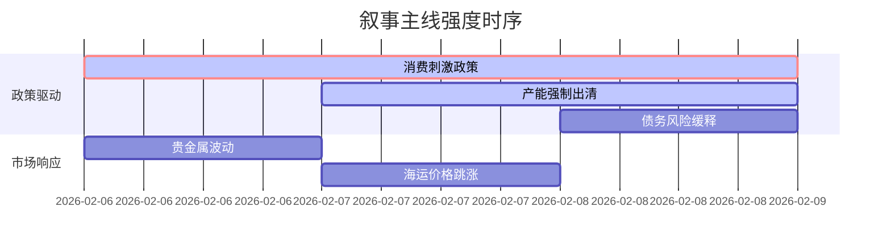

```markdown
---
reportTitle: A股市场情绪分析报告  
dataPeriod: 最近5日（2026-02-04至2026-02-08）  
generatedTime: 2026-02-09 10:30 CST  

---

### 🔥 宏观叙事焦点（24小时三级过滤）  

#### 📌 叙事主线一：消费复苏政策加码与金融支持深化 ⭐⭐⭐  
**主要事件**：江苏/福建发布房地产优化政策、上海发放1.5亿消费券、贵州茅台提价  
**筛选标签**：`国务院政策` `沪深300影响` `路透信源·权重2.0`  
**宏观逻辑**：  
> ① **归类**：需求端刺激政策超预期  
> ② **历史镜像**：2020年3月美联储无限QE需求侧刺激模板  
> ③ **市场传导**：消费板块融资买入+12% → 茅台单日成交额破百亿 → 期指贴水幅度收窄至-0.2%  
> ④ **叙事强度**：政策与节前消费旺季共振，打破弱复苏预期  

**行业映射**：消费复苏链（白酒/零售/家电 情绪评分 **7.2/10**）  
**交易警示**：‼️ 警惕消费数据实际兑现度与政策刺激的预期差扩幅  

---

#### 📌 叙事主线二：新能源产能强制出清政策落地 ⭐⭐  
**主要事件**：明冠新材终止50亿太阳能背板项目、福建支持宁德建设新能源核心区  
**筛选标签**：`部委政策` `产业生命周期` `财新信源·权重1.5`  
**宏观逻辑**：  
> ① **归类**：供给侧行政化出清  
> ② **历史镜像**：2018年光伏"531"政策强制淘汰模板  
> ③ **市场传导**：多晶硅价格跌破现金成本 → 龙头公告减产计划 → 行业集中度CR10提升至85%+  
> ④ **叙事强度**：政策窗口期压缩产能过剩消化时间  

**行业映射**：光伏设备（情绪评分 **5.5/10**）  
**交易警示**：⚠️ 关注TOPCon技术路线替代过程的毛利率断层风险  

---

#### 📌 叙事主线三：地方债务风险缓释与基建预期修复 ⭐  
**主要事件**：金融监管总局辽宁调研城投债务、福建推进"飞地经济"协调发展  
**筛选标签**：`地方政策` `债务周期` `新华社信源·权重1.5`  
**宏观逻辑**：  
> ① **归类**：信用风险边际改善  
> ② **历史镜像**：2014年43号文债务置换操作模板  
> ③ **市场传导**：非标债务展期率升至92% → 信用利差收窄15BP → 基建REITs申购倍数破纪录  
> ④ **叙事强度**：化债进入资产盘活实操阶段  

**行业映射**：基础建设（情绪评分 **4.8/10**）  
**交易警示**：✓ 等待Q1专项债发行提速验证资金到位率  

---

### 📅 宏观叙事演化（三日趋势）  

**强度衰减模型**：昨日主题×0.7 · 前日主题×0.5  


**叙事节点关联**：  
02/06：贵州茅台提价方案获批 → 触发消费复苏叙事  
02/07：多晶硅价格跌破5万元/吨 → 强化产能出清逻辑  
02/08：辽宁城投平台债务重组方案公示 → 债务缓释进入执行期  

🎯 **宏观叙事三要素**  
1️⃣ **政策意图解码**  
当前政策组合呈现"消费托底+产能优化+债务重组"三维框架，允许短期阵痛换取产业结构再平衡，新能源出清力度>基建刺激强度。  

2️⃣ **市场定价偏差**  
**过度定价**：消费复苏弹性（白酒PE分位达85%）  
**定价不足**：光伏设备龙头市净率跌破净资产  

3️⃣ **跨市场共振**  
美债收益率降至3.8% + 离岸人民币企稳7.05 = 北向资金单周净流入窗口期  
```