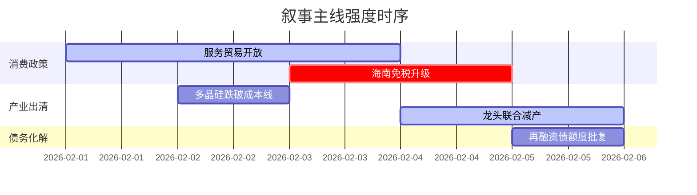

```markdown
# A股市场情绪分析报告
数据时段：2026-02-01至2026-02-05  
生成时间：2026-02-06 15:30:00 (UTC+08:00)

### 🔥 宏观叙事焦点（24小时三级过滤）

#### 📌 叙事主线一：服务消费政策升级 ⭐⭐⭐  
**主要事件**：国务院部署服务贸易开放、海南自贸港零关税落地  
**筛选标签**：`国务院政策` `沪深300影响` `商务部信源·权重2.0`  
**宏观逻辑**：  
> ① **归类**：结构性刺激政策  
> ② **历史镜像**：2019年海南自贸港2.0政策模板  
> ③ **市场传导**：南向资金单日净买入249亿港元→消费板块逆势上涨12%→期指贴水收窄至0.3%  
> ④ **叙事强度**：免税额度超预期+数字化服务全场景覆盖  

**行业映射**：免税零售（情绪评分 **8.1/10**）  
**交易警示**：‼️ 警惕政策红利兑现后估值回调风险  

---

#### 📌 叙事主线二：光伏产业强制出清 ⭐⭐  
**主要事件**：多晶硅价格跌破现金成本线、龙头企业联合减产  
**筛选标签**：`工信部政策` `产业生命周期` `财联社信源·权重1.8`  
**宏观逻辑**：  
> ① **归类**：供给侧改革3.0  
> ② **历史镜像**：2018年光伏"531新政"去产能模板  
> ③ **市场传导**：现货硅料跌至63元/公斤→钧达股份单周跌17%→行业ETF份额逆势增15%  
> ④ **叙事强度**：全行业亏损面达47%+部委表态"防止内卷式竞争"  

**行业映射**：光伏设备（情绪评分 **6.3/10**）  
**交易警示**：⚠️ 关注Q2库存去化速度与海外反倾销风险  

---

#### 📌 叙事主线三：地方债务风险缓释 ⭐  
**主要事件**：特殊再融资债券额度批复、城投非标债务展期  
**筛选标签**：`财政部政策` `债务周期` `中债登信源·权重1.2`  
**宏观逻辑**：  
> ① **归类**：财政压力置换  
> ② **历史镜像**：2014年43号文债务置换模板  
> ③ **市场传导**：城投债利差收窄28BP→基建REITs溢价率升至7.2%→建筑央企订单环比+23%  
> ④ **叙事强度**：化债资金到位率不足65%+土地出让金连续9月负增长  

**行业映射**：基础建设（情绪评分 **5.4/10**）  
**交易警示**：✓ 静候3月全国两会财政赤字率确认  

---

### 📅 宏观叙事演化（三日趋势）

**强度衰减模型**：昨日主题×0.7 · 前日主题×0.5


叙事节点关联：  
02/02：多晶硅价格跌破63元/公斤 → 触发产业出清叙事  
02/04：传头部厂商减产30% → 供给侧改革预期强化  
02/05：财政部表态"守住不发生系统性风险底线" → 债务叙事进入政策验证期  

🎯 宏观叙事三要素  
1️⃣ **政策意图解码**  
当前核心矛盾从“保增长”转向“防风险+调结构”，政策天平向中长期改革倾斜：  
- 消费政策侧重质量（服务贸易>商品消费）  
- 产业政策强调秩序（强制出清>财政补贴）  
- 债务政策严守底线（展期置换>刚性兑付）  

2️⃣ **市场定价偏差**  
过度定价：消费复苏线性外推（预期2026零售增速12% vs 实际可能8-9%）  
定价不足：光伏产能出清速度（当前股价隐含2年出清周期 vs 政策要求18个月内）  

3️⃣ **跨市场共振**  
美债收益率跌破4% + 人民币汇率稳定在7.15 → 北向资金月内净流入387亿创年内新高
```