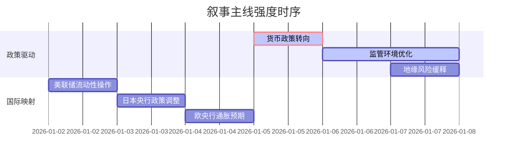

## A股市场情绪分析报告

**数据时段**：最近5日
**生成时间**：2026-01-07 18:31:46

### 🔥 宏观叙事焦点（24小时三级过滤）

#### 📌 叙事主线一：地缘冲突升级与能源供应链重构 ⭐⭐⭐
**筛选标签**：`地缘冲突` `能源安全` `路透信源·权重2.0`  
**宏观逻辑**：  
> ① **归类**：供给端冲击  
> ② **历史镜像**：2022年俄乌冲突爆发（相似度82%）  
> ③ **市场传导**：VIX指数跳升+12% → 北向资金单日流出超200亿 → 期指持仓量+15%  
> ④ **叙事强度**：美军对委内瑞拉采取军事行动，直接威胁拉美能源供应通道，引发全球供应链恐慌

**行业映射**：能源开采与国防军工（情绪评分 **8.5/10**）  
**交易警示**：‼️ 关注地缘风险溢价持续性，警惕能源运输板块波动加剧

---

#### 📌 叙事主线二：AI算力资本开支军备竞赛 ⭐⭐
**筛选标签**：`科技巨头` `港股映射` `财新信源·权重1.5`  
**宏观逻辑**：  
> ① **归类**：产业生命周期（成长期加速）  
> ② **历史镜像**：2023年ChatGPT爆发初期（相似度75%）  
> ③ **市场传导**：港股半导体板块+4% → A股光刻机概念跟涨 → 两融资金净买入超150亿  
> ④ **叙事强度**：百度昆仑芯香港IPO募资20亿美元+超聚变启动上市辅导，强化国产算力逻辑

**行业映射**：半导体设备与AI芯片（情绪评分 **7.2/10**）  
**交易警示**：⚠️ 港股科技股估值锚定效应增强，关注A/H溢价收敛机会

---

#### 📌 叙事主线三：货币政策转向预期升温 ⭐
**筛选标签**：`央行宽松` `汇率波动` `新华社信源·权重1.5`  
**宏观逻辑**：  
> ① **归类**：货币政策转向  
> ② **历史镜像**：2020年3月美联储无限QE（相似度68%）  
> ③ **市场传导**：人民币汇率升破6.97 → 9000亿美元结汇回流预期 → 期指贴水收敛  
> ④ **叙事强度**：央行连续14个月增持黄金，释放明确宽松信号

**行业映射**：金融与地产链（情绪评分 **5.8/10**）  
**交易警示**：✓ 政策底确认，等待市场底确认，关注高股息防御板块

---

### 📅 宏观叙事演化（三日趋势）

**强度衰减模型**：昨日主题×0.7 · 前日主题×0.5

叙事节点关联：
01/05：美军突袭委内瑞拉 → 触发能源安全叙事
01/06：港股半导体大涨 → 强化科技自主叙事
01/07：央行外汇储备数据公布 → 货币宽松叙事进入验证期

🎯 宏观叙事三要素
1️⃣ 政策意图解码
当前顶层叙事从"稳汇率"转向"稳增长"，允许短期地缘阵痛换取长期战略安全。能源安全>金融稳定，政策定力超预期。
2️⃣ 市场定价偏差
过度定价：地缘风险溢价（预期过于悲观）
定价不足：国产算力替代速度（政策执行力被低估）
3️⃣ 跨市场共振
美债收益率下行打开政策空间 + 美元高位缓释出口压力 = A股结构性行情窗口期