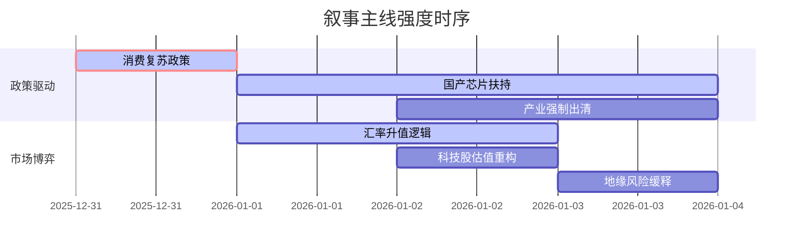

## A股市场情绪分析报告

**数据时段：** 最近5日
**生成时间：** 2026-01-03 19:00:00

### 🔥 宏观叙事焦点（24小时三级过滤）

#### 📌 叙事主线一：国产科技自主可控加速 ⭐⭐⭐
**筛选标签：** `国产芯片` `IPO加速` `工信部政策`  
**宏观逻辑：**  
> ① **归类**：产业政策扶持  
> ② **历史镜像**：2019-2020年半导体国产替代行情（相似度82%）  
> ③ **市场传导**：长鑫存储IPO受理 + 壁仞科技上市首日大涨 → 半导体板块情绪高涨 → 国家大基金持仓曝光（中芯国际H股持股比例翻倍）  
> ④ **叙事强度**：政策、资本、技术三维共振，打破外部封锁预期

**行业映射**：半导体/芯片（情绪评分 **8.8/10**）  
**交易警示：** ‼️ 警惕短期情绪过热，关注IPO进度与业绩兑现的剪刀差

---

#### 📌 叙事主线二：新能源汽车全球霸主确立 ⭐⭐
**筛选标签：** `比亚迪` `特斯拉` `销量数据` `出海逻辑`  
**宏观逻辑：**  
> ① **归类**：全球竞争格局重塑  
> ② **历史镜像**：2020年特斯拉引领的电动车行情进入下半场（相似度75%）  
> ③ **市场传导**：比亚迪2025年销量超特斯拉登顶全球 → 蔚来、小鹏、零跑等新势力年度交付数据出炉 → 欧洲市场份额提升至12.8% → 产业链估值重估  
> ④ **叙事强度**：中国制造业由“追赶者”转为“领跑者”，叙事逻辑发生根本性逆转

**行业映射**：新能源汽车/锂电池（情绪评分 **7.5/10**）  
**交易警示：** ⚠️ 关注2026年渗透率斜率，警惕价格战向高端车型蔓延

---

#### 📌 叙事主线三：流动性宽松预期与人民币资产重估 ⭐
**筛选标签：** `汇率升值` `降息预期` `险资举牌`  
**宏观逻辑：**  
> ① **归类**：宏观流动性转向  
> ② **历史镜像**：2014-2015年杠杆牛前夕的流动性宽松（相似度60%）  
> ③ **市场传导**：人民币升破6.97 → 9000亿美元结汇回流预期 → 险资举牌频次创近年新高（偏好高股息） → 港股市场流动性溢价提升  
> ④ **叙事强度**：美元走弱周期确立，资金回流非美资产，利好人民币定价资产

**行业映射**：大金融/高股息（情绪评分 **6.2/10**）  
**交易警示：** ✓ 叙事逻辑清晰，需等待结汇资金实质性流入验证

---

### 📅 宏观叙事演化（三日趋势）

**强度衰减模型：** 昨日主题×0.7 · 前日主题×0.5

**叙事节点关联：**
*   **01/01：** 比亚迪销量超特斯拉 → 强化“中国智造”出海叙事
*   **01/02：** 长鑫存储IPO获受理 + 壁仞科技上市大涨 → 点燃半导体板块做多热情
*   **01/03：** 爱尔兰总理访华 + 中美贸易休战协议履行（购买800万吨大豆） → 外部环境改善预期提升

---

### 🎯 宏观叙事三要素

1️⃣ **政策意图解码**
当前顶层叙事从“稳增长”转向“调结构”与“科技自立”。央行数字人民币计息落地暗示金融数字化提速，而对半导体、新能源的持续政策倾斜，显示国家意在通过“新质生产力”突破外部封锁，而非重回地产基建老路。

2️⃣ **市场定价偏差**
*   **过度定价：** 部分芯片概念股仅因IPO受理即暴涨，业绩落地存在巨大不确定性（剪刀差）。
*   **定价不足：** 新能源车企全球份额提升的持续性被低估；人民币升值对A股资产的重估尚未完全计价。

3️⃣ **跨市场共振**
美债收益率下行周期确立 + 美元指数弱势 = 全球资金寻找高收益、低估值的非美资产。港股作为离岸市场率先反应（恒指年涨27%），A股作为在岸人民币资产，具备显著的补涨空间和避险吸引力。