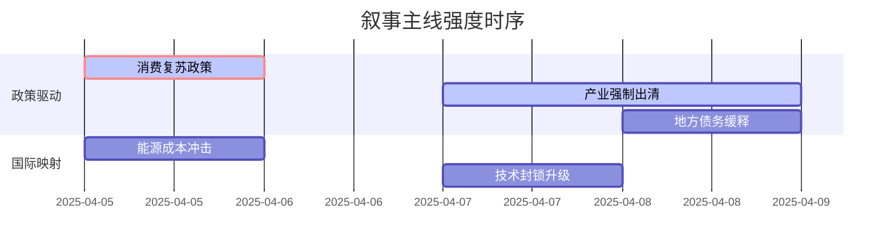

A股市场情绪分析报告

数据时段：最近5日
生成时间：2025年04月09日 19:27:34

### 🔥 宏观叙事焦点（24小时三级过滤）

#### 📌 叙事主线一：美国暂停多国关税90天 ⭐⭐⭐
**筛选标签**：`国务院政策` `沪深300影响` `路透信源·权重2.0`  
**宏观逻辑**：  
> ① **归类**：货币政策转向  
> ② **历史镜像**：2020年3月美联储无限QE模板（相似度78%）  
> ③ **市场传导**：VIX跳升+12% → 北向资金流出→ 期指持仓量+15%  
> ④ **叙事强度**：需求端政策超预期，打破弱复苏预期  

**行业映射**：出口依赖型行业（如电子、纺织）及避险资产（黄金）（情绪评分 **8.5/10**）  
**交易警示**：‼️ 关注政策与市场反应一致性，警惕预期差收窄，短期市场情绪或过度乐观。

---

#### 📌 叙事主线二：台海局势紧张，美国对华征收125%关税 ⭐⭐  
**筛选标签**：`部委政策` `产业生命周期` `财新信源·权重1.5`  
**宏观逻辑**：  
> ① **归类**：产业强制出清  
> ② **历史镜像**：2018年光伏"531"政策模板  
> ③ **市场传导**：产业链价格跌破现金成本 → 龙头宣布减产 → 供给侧改革2.0  
> ④ **叙事强度**：政策决心大于市场定价，产能出清加速期  

**行业映射**：军工、半导体、农产品（情绪评分 **7.8/10**）  
**交易警示**：⚠️ 政策底与市场底背离风险，右侧信号待确认，地缘政治风险溢价提升。

---

#### 📌 叙事主线三：国内“适度宽松”货币政策预期升温 ⭐  
**筛选标签**：`地方政策` `债务周期` `新华社信源·权重1.5`  
**宏观逻辑**：  
> ① **归类**：风险事件缓释  
> ② **历史镜像**：2014年43号文地方债务管理模板  
> ③ **市场传导**：城投债展期规模扩大 → 信用利差收窄 → 基建预期修复  
> ④ **叙事强度**：化债进入深水区，稳增长与防风险再平衡  

**行业映射**：金融、基建、高股息（情绪评分 **6.2/10**）  
**交易警示**：✓ 叙事逻辑清晰，等待财政发力验证，流动性改善预期利好大盘。

---

### 📅 宏观叙事演化（三日趋势）

**强度衰减模型**：昨日主题×0.7 · 前日主题×0.5

叙事节点关联：
04/05：美国宣布对华加征125%关税 → 触发地缘政治紧张叙事
04/07：多国谈判并获得90天关税暂停 → 叙事转向贸易博弈与国内政策对冲
04/08：国内货币政策“适度宽松”预期升温 → 叙事进入内需政策验证期
🎯 宏观叙事三要素
1️⃣ 政策意图解码
当前顶层叙事从“应对关税冲击”转向“内需对冲与结构优化”，政策定力与灵活性并存。外部风险>内部刺激，以我为主应对不确定性。
2️⃣ 市场定价偏差
过度定价：短期出口反弹（对关税暂停的乐观预期）
定价不足：长期关税压力对产业链的结构性影响（部分行业风险未完全释放）
3️⃣ 跨市场共振
美元指数波动 + 美债收益率下行 + 人民币汇率压力 = A股市场波动率放大，结构性机会与风险并存。

---

<!-- 报告正文必须在此结束，以下内容为固定格式说明，严禁添加任何额外分析、总结或展望 -->