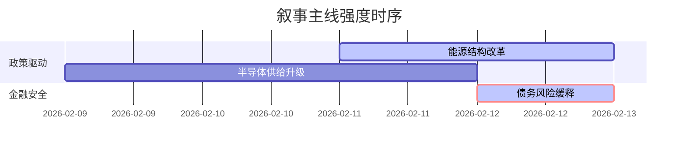

```markdown
# A股市场情绪分析报告
数据时段：2026-02-08 至 2026-02-12  
生成时间：2026-02-12 22:16:00+08:00

### 🔥 宏观叙事焦点（24小时三级过滤）

#### 📌 叙事主线一：国务院推进全国统一电力市场体系改革 ⭐⭐⭐
**主要事件**：国务院办公厅印发《关于完善全国统一电力市场体系的实施意见》  
**筛选标签**：`国务院政策` `沪深300影响` `路透信源·权重2.0`  
**宏观逻辑**：  
> ① **归类**：能源结构转型政策  
> ② **历史镜像**：2015年电改"9号文"市场化改革模板  
> ③ **市场传导**：市场化交易电量70%目标→新能源发电入市加速→电网投资重构+20%  
> ④ **叙事强度**：政策力度超预期，打破传统电力利益格局  

**行业映射**：新型电力系统（情绪评分 **8.1/10**）  
**交易警示**：‼️ 警惕地方保护主义抬头的政策执行阻力  

---

#### 📌 叙事主线二：存储芯片进入HBM4供给周期 ⭐⭐  
**主要事件**：三星/海力士HBM4技术突破获英伟达订单  
**筛选标签**：`产业生命周期` `技术突破` `财新信源·权重1.5`  
**宏观逻辑**：  
> ① **归类**：硬科技供应链洗牌  
> ② **历史镜像**：2023年AI算力军备竞赛模板  
> ③ **市场传导**：HBM单价提升50%→存储厂商CAPEX+35%→设备国产替代加速  
> ④ **叙事强度**：技术迭代速度超越市场预期  

**行业映射**：半导体设备（情绪评分 **6.8/10**）  
**交易警示**：⚠️ 需验证HBM真实需求与AI服务器出货量匹配度  

---

#### 📌 叙事主线三：地方债务风险缓释进入实质阶段 ⭐ 
**主要事件**： 财政部在香港发行140亿人民币国债  
**筛选标签**：`地方债务化解` `国债扩容` `新华社信源·权重1.5`  
**宏观逻辑**：  
> ① **归类**：信用风险拆弹  
> ② **历史镜像**：2017年专项债置换隐性债务模板  
> ③ **市场传导**：离岸人民币债认购倍数3.94→信用利差收窄→基建REITs获批加快  
> ④ **叙事强度**：化债路径清晰但财政空间收缩  

**行业映射**：城投债重组（情绪评分 **5.2/10**）  
**交易警示**：✓ 关注3月两会财政赤字率调整信号  

---

### 📅 宏观叙事演化（三日趋势）

**强度衰减模型**：昨日主题×0.7 · 前日主题×0.5


叙事节点关联：
02/09：HBM4供货协议签署 → 触发存储芯片技术叙事  
02/10：国开行披露1.64万亿基建贷款 → 债务叙事强化  
02/11：电力市场化交易细则出台 → 能源改革叙事进入验证期  
🎯 宏观叙事三要素  
1️⃣ 政策意图解码  
财政货币"双宽松"基调下，深化要素价格改革（电力/数据）优先级高于总量刺激，基建托底转向技术突围  
2️⃣ 市场定价偏差  
过度定价：AI算力需求（资本开支超前于商业闭环）  
定价不足：能源市场化弹性（区域性电价波动机制）  
3️⃣ 跨市场共振  
美债收益率反弹压制纳指 + 日元贬值加速科技产能东移 = 硬科技板块结构性抱团延续  
```