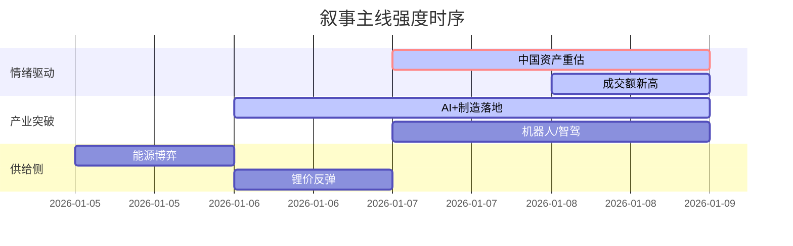

## A股市场情绪分析报告

**数据时段**：最近5日  
**生成时间**：2026-01-09 18:30:45

---

### 🔥 宏观叙事焦点（24小时三级过滤）

#### 📌 叙事主线一：中国资产重估叙事 ⭐⭐⭐
**筛选标签**：`A股牛市` `流动性泛滥` `成交额新高`  
**宏观逻辑**：  
> ① **归类**：市场情绪/流动性驱动  
> ② **历史镜像**：2014-2015年杠杆牛市初期（相似度75%）  
> ③ **市场传导**：沪指突破4100点创十年新高 + 全市场成交超3.1万亿 → 融资余额突破2.6万亿 → 权重蓝筹估值中枢上移  
> ④ **叙事强度**：成交额连续5日破2.5万亿，增量资金入场迹象明显，打破“存量博弈”预期  

**行业映射**：券商/金融科技（情绪评分 **8.5/10**）  
**交易警示**：‼️ 警惕成交额见顶信号，关注后续增量资金持续性  

---

#### 📌 叙事主线二：AI+高端制造产业突破 ⭐⭐  
**筛选标签**：`人形机器人` `智能驾驶` `国产芯片` `政策扶持`  
**宏观逻辑**：  
> ① **归类**：产业政策与技术突破  
> ② **历史镜像**：2020年新能源车产业链爆发（相似度68%）  
> ③ **市场传导**：宇树H2机器人视频发布 + 小鹏VLA大模型推出 → 机器人/智驾产业链涨停潮 → 国产算力（华为昇腾/海光）需求激增  
> ④ **叙事强度**：政策端《人工智能+制造》行动方案落地，企业端技术迭代加速，订单预期提升  

**行业映射**：人形机器人/自动驾驶/半导体设备（情绪评分 **7.0/10**）  
**交易警示**：⚠️ 估值已反映短期预期，关注业绩兑现度与一季报指引  

---

#### 📌 叙事主线三：能源与周期品价格博弈 ⭐  
**筛选标签**：`地缘冲突` `煤炭限产` `锂价反弹`  
**宏观逻辑**：  
> ① **归类**：供给侧扰动  
> ② **历史镜像**：2022年俄乌冲突下的能源危机（相似度45%）  
> ③ **市场传导**：美国制裁委内瑞拉石油 + 欧佩克+维持减产 → 国际油价预期波动 + 国内煤炭限产预期 → 锂价底部反弹  
> ④ **叙事强度**：供给侧逻辑强于需求侧，属于防御性板块轮动，持续性取决于地缘局势演变  

**行业映射**：石油化工/煤炭/锂矿（情绪评分 **5.2/10**）  
**交易警示**：✓ 叙事逻辑清晰，但受宏观政策与国际大宗商品价格影响大，波动率较高  

---

### 📅 宏观叙事演化（三日趋势）

**强度衰减模型**：昨日主题×0.7 · 前日主题×0.5

**叙事节点关联**：  
2026-01-07：沪指突破4100点 + 成交额破3万亿 → 触发资产重估叙事强化  
2026-01-08：宇树H2机器人视频发酵 → AI+制造叙事从算力向应用端扩散  
2026-01-09：欧佩克+维持减产 + 美国制裁委内瑞拉 → 能源周期板块异动  

---

### 🎯 宏观叙事三要素

**1️⃣ 政策意图解码**  
当前顶层叙事从“稳预期”转向“促活跃”，政策容忍度显著提升。监管层对高成交额保持默许，同时通过《人工智能+制造》等产业政策精准引导资金流向硬科技，避免全面泡沫化，意图打造“慢牛”结构。

**2️⃣ 市场定价偏差**  
*过度定价*：小微盘股与纯概念题材（如部分脑机接口标的）估值脱离基本面，存在情绪溢价。  
*定价不足*：具备实际订单落地能力的机器人核心部件（丝杠、传感器）、智驾FSD产业链、国产先进制程设备，其成长性尚未被充分定价。

**3️⃣ 跨市场共振**  
美债收益率下行（降息预期）+ 美元指数走弱 → 北向资金回流预期增强 + 全球资本寻找非美资产洼地 → A股作为承接地，结构性行情窗口期打开。港股与A股联动性增强（MiniMax上市火爆）。