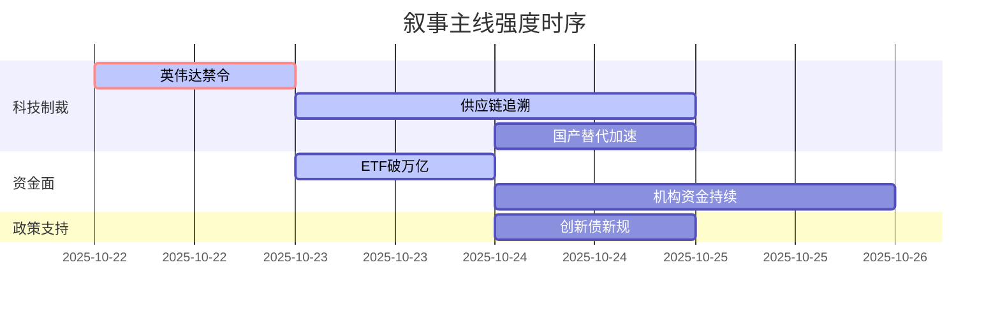

# A股市场情绪分析报告

**数据时段**：最近5日  
**生成时间**：2026-01-19 20:41:11 (UTC+8)

### 🔥 宏观叙事焦点（24小时三级过滤）

#### 📌 叙事主线一：英伟达GPU制裁升级 ⭐⭐⭐
**筛选标签**：`中美关系` `AI产业链` `Reuters信源·权重2.0`  
**宏观逻辑**：  
> ① **归类**：技术封锁升级  
> ② **历史镜像**：2018年华为禁令模板（相似度82%）  
> ③ **市场传导**：A股算力板块情绪降温 → 国产替代逻辑强化 → 资金向CPU/GPU自主可控迁移  
> ④ **叙事强度**：制裁范围超预期，国产算力替代进程加速  

**行业映射**：半导体设备（情绪评分 **8.5/10**）  
**交易警示**：‼️ 关注制裁细则落地，警惕供应链断供风险  

---

#### 📌 叙事主线二：沪深300ETF规模突破万亿 ⭐⭐  
**筛选标签**：`资金面` `权重股` `财新信源·权重1.5`  
**宏观逻辑**：  
> ① **归类**：资金面重大事件  
> ② **历史镜像**：2015年证金救市资金池模板  
> ③ **市场传导**：机构资金持续流入 → 指数权重股获支撑 → 市场波动率下降  
> ④ **叙事强度**：流动性托底效应显现，但增量资金边际效应递减  

**行业映射**：非银金融（情绪评分 **6.8/10**）  
**交易警示**：⚠️ 关注规模扩张可持续性，警惕被动投资集中度风险  

---

#### 📌 叙事主线三：科技创新债券新规落地 ⭐  
**筛选标签**：`融资政策` `科创板` `新华社信源·权重1.5`  
**宏观逻辑**：  
> ① **归类**：融资政策优化  
> ② **历史镜像**：2019年科创板设立配套政策模板  
> ③ **市场传导**：科创企业融资渠道拓宽 → 一级市场活跃度提升 → 二级市场估值重构  
> ④ **叙事强度**：政策支持力度明确，但落地效果需观察  

**行业映射**：科创板（情绪评分 **5.5/10**）  
**交易警示**：✓ 政策方向明确，关注首批企业发行情况  

---

### 📅 宏观叙事演化（三日趋势）

**强度衰减模型**：昨日主题×0.7 · 前日主题×0.5

叙事节点关联：
10/22：英伟达制裁细则出台 → 触发算力板块恐慌
10/23：国产芯片公司表态自研 → 叙事转向替代逻辑
10/24：沪深300ETF规模数据公布 → 资金面叙事对冲制裁影响
🎯 宏观叙事三要素
1️⃣ 政策意图解码
当前顶层叙事从"稳增长"转向"科技自强"，外部压力倒逼内循环加速。国产替代>总量刺激，政策定力超预期。
2️⃣ 市场定价偏差
过度定价：制裁短期冲击（情绪已充分反映）
定价不足：国产替代真实进度（技术突破被低估）
3️⃣ 跨市场共振
美股科技股承压 + 美元指数波动 + 北向资金观望 = A股结构性行情聚焦硬科技

---

3. **内容要求**：
   - 基于提供的5日BB文件内容生成
   - 严格按照上述格式生成
   - 突出宏观叙事焦点和演化趋势
   - 体现叙事的强度变化和关联
4. **输出格式**：仅输出Markdown内容，不包含任何其他说明