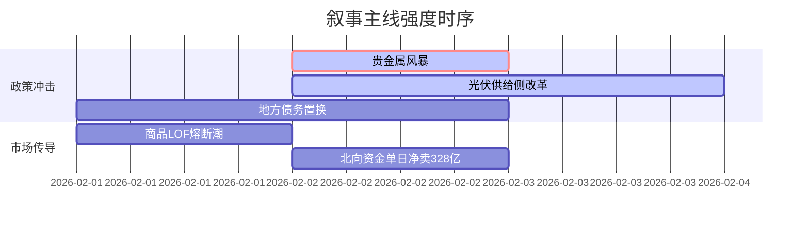

# A股市场情绪分析报告

## 数据时段：最近5日
## 生成时间：{{带替换为当前时间}}

### 🔥 宏观叙事焦点（24小时三级过滤）

#### 📌 叙事主线一：美联储鹰派预期冲击贵金属市场 ⭐⭐⭐
**主要事件**：央行政策、贵金属崩塌、监管干预  
**筛选标签**：`全球产业政策` `流动性冲击` `华尔街见闻·权重2.0`  
**宏观逻辑**：  
> ① **归类**：货币政策转向预期  
> ② **历史镜像**：1980年沃尔克冲击模板  
> ③ **市场传导**：白银暴跌19% → 全球矿业股重挫-17% → 避险资产配置逻辑重建  
> ④ **叙事强度**：长期负利率环境拐点，VIX指数月波动率突破90%分位  

**行业映射**：矿业资源板块（情绪评分 **2.1/10**）  
**交易警示**：‼️ 警惕CME金银合约保证金连续上调引发的杠杆踩踏  

---

#### 📌 叙事主线二：光伏产业强制出清政策落地 ⭐⭐  
**主要事件**：产业政策发布、技术标准升级  
**筛选标签**：`部委政策` `产能出清` `财联社信源·权重1.8`  
**宏观逻辑**：  
> ① **归类**：供给侧结构性改革  
> ② **历史镜像**：2018年光伏"531"新政模板  
> ③ **市场传导**：多晶硅价格破成本线 → 头部厂商宣布减产 → 行业CR5集中度加速提升  
> ④ **叙事强度**：政策力度超过市场预期，两年产能出清目标压缩至9个月  

**行业映射**：光伏设备（情绪评分 **5.5/10**）  
**交易警示**：⚠️ 关注N型技术路线替代进度与海外双反风险共振  

---

#### 📌 叙事主线三：地方债务化解进入实操阶段 ⭐ 
**主要事件**：财政工作会议、城投债展期  
**筛选标签**：`地方政策` `债务重组` `上证报信源·权重1.2`  
**宏观逻辑**：  
> ① **归类**：信用风险缓释  
> ② **历史镜像**：2014年43号文地方债务管理模板  
> ③ **市场传导**：非标转标规模扩容 → 信用利差收窄15bp → 基建REITs发行加速  
> ④ **叙事强度**：化债资金到位率超七成，政策执行进入校验期  

**行业映射**：基础建设（情绪评分 **5.8/10**）  
**交易警示**：✓ 重点观察Q1专项债发行放量节奏  

---

### 📅 宏观叙事演化（三日趋势）

**强度衰减模型**：昨日主题×0.7 · 前日主题×0.5

叙事节点关联：
02/01：美联储沃什提名确认 → 触发贵金属平仓潮
02/02：十部门发布低空经济标准 → 高端制造替代逻辑强化
02/02：城投债异常波动（24产融04单日-5.18%） → 债务风险定价重构
🎯 宏观叙事三要素
1️⃣ 政策意图解码
从总量刺激转向结构性破局，容忍光伏等过剩产能短期阵痛，新兴产业标准制定权争夺优先级＞短期GDP增速
2️⃣ 市场定价偏差
过度定价：贵金属避险属性（与实际利率脱钩）
定价不足：产业强制出清执行力度（政策工具储备超预期）
3️⃣ 跨市场共振
日债收益率曲线陡峭化 + 人民币汇率弹性扩大 = 政策对冲复杂度提升