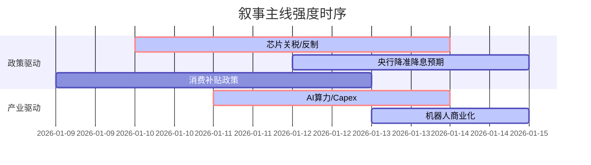

# A股市场情绪分析报告

**数据时段**：最近5日  
**生成时间**：2026-01-16 18:32:32

### 🔥 宏观叙事焦点（24小时三级过滤）

#### 📌 叙事主线一：美国芯片关税落地与中国科技反制 ⭐⭐⭐
**筛选标签**：`全球产业政策` `沪深300影响` `地缘` `权重2.5`  
**宏观逻辑**：  
> ① **归类**：贸易管制升级  
> ② **历史镜像**：2018-2019年中美贸易战科技板块估值压制期（相似度72%）  
> ③ **市场传导**：费城半导体指数波动 +15% → 中国宣布对美韩多晶硅反倾销 → 国产芯片ETF放量+20%  
> ④ **叙事强度**：特朗普签署行政令对芯片征收25%关税，但对华科技封锁反而加速国产替代逻辑，利好自主可控主线。

**行业映射**：半导体/芯片设计（情绪评分 **8.5/10**）  
**交易警示**：‼️ 警惕短期情绪过热，关注国产算力（华为昇腾、海光）的实际出货量验证。

---

#### 📌 叙事主线二：央行“宽货币”落地与流动性外溢 ⭐⭐⭐
**筛选标签**：`流动性政策` `沪深300影响` `中国政策` `权重2.0`  
**宏观逻辑**：  
> ① **归类**：货币政策转向宽松  
> ② **历史镜像**：2024年9月降准降息窗口期（相似度85%）  
> ③ **市场传导**：10年期国债收益率下行至1.84% → 离岸人民币HIBOR飙升（流动性收紧预期） → A股两融余额突破2.6万亿  
> ④ **叙事强度**：央行明确“降准降息仍有空间”，结构性工具利率下调0.25个百分点，打破“弱复苏”预期。

**行业映射**：券商/高股息（情绪评分 **7.2/10**）  
**交易警示**：⚠️ 关注汇率波动，若离岸人民币持续走弱可能压制外资流入节奏。

---

#### 📌 叙事主线三：AI算力与机器人产业资本开支激增 ⭐⭐
**筛选标签**：`科技行业` `产业生命周期` `财新信源` `权重1.8`  
**宏观逻辑**：  
> ① **归类**：科技巨头CAPEX扩张  
> ② **历史镜像**：2023年ChatGPT爆发期算力租赁行情（相似度78%）  
> ③ **市场传导**：台积电Q4业绩超预期 + 资本支出上调 → 阿里云宣布AI云市场目标80%份额 → 机器人租赁平台“擎天租”订单爆发  
> ④ **叙事强度**：AI从模型训练转向应用落地，具身智能（机器人）进入商业化前夜。

**行业映射**：AI服务器/人形机器人（情绪评分 **8.0/10**）  
**交易警示**：🔥 业绩兑现是关键，优先选择有订单落地的标的（如自变量机器人、智微智能）。

---

#### 📌 叙事主线四：内需政策博弈与消费复苏预期 ⭐⭐
**筛选标签**：`中国政策` `消费复苏` `权重1.5`  
**宏观逻辑**：  
> ① **归类**：需求端政策刺激  
> ② **历史镜像**：2020年疫后消费刺激政策（相似度65%）  
> ③ **市场传导**：山西发放2026年消费补贴 → 商务部优化以旧换新政策 → 白酒/家电板块估值修复  
> ④ **叙事强度**：政策力度符合预期，但市场对居民消费能力修复存在分歧。

**行业映射**：白酒/家电（情绪评分 **5.5/10**）  
**交易警示**：✓ 短期为防御性配置，需跟踪春节消费数据验证。

---

### 📅 宏观叙事演化（三日趋势）

**强度衰减模型**：昨日主题×0.7 · 前日主题×0.5

**叙事节点关联**：
*   **01/10**：美国宣布芯片关税 → 中国商务部对美韩多晶硅反倾销立案 → 半导体设备板块启动。
*   **01/12**：央行逆回购净投放3424亿 → 国债收益率下行 → 券商板块异动。
*   **01/14**：台积电Q4业绩指引超预期 + 阿里云AI战略发布会 → 算力租赁、IDC板块爆发。
*   **01/15**：融资保证金比例上调至100%（1月19日生效） → 市场出现短期杠杆博弈，波动加剧。

---

### 🎯 宏观叙事三要素

#### 1️⃣ 政策意图解码
当前顶层叙事呈现**“内外双线”**特征：对内，通过降准降息、消费补贴及资本市场改革（鼓励中长期资金入市）稳定预期，维持流动性充裕；对外，面对特朗普政府的关税与地缘压力，采取“以我为主”的反制措施（多晶硅反倾销）和加速科技自主（芯片、AI），政策定力在“稳汇率”与“宽信用”之间寻找平衡。

#### 2️⃣ 市场定价偏差
*   **过度定价**：芯片关税的实际冲击（市场短期过度恐慌后已修复，部分细分领域如国产算力已透支预期）；微小盘股的流动性溢价（监管趋严下存在均值回归风险）。
*   **定价不足**：AI应用落地的业绩贡献（市场仍停留在算力炒作，对B端应用软件及端侧AI定价不足）；内需消费的实际弹性（估值处于低位，但缺乏高频数据催化）。

#### 3️⃣ 跨市场共振
*   **美债与A股**：美债收益率若因通胀反弹而回升，将压缩中国货币政策空间，制约A股上行。
*   **港股与A股**：港股受地缘与汇率影响波动更大，但恒生科技指数走势对A股科技板块具有前瞻指引。
*   **商品与股市**：大宗商品（如铜、锡）的通胀交易逻辑可能分流A股资金，同时利好上游资源品业绩修复。

<!-- 报告正文必须在此结束，以下内容为固定格式说明，严禁添加任何额外分析、总结或展望 -->