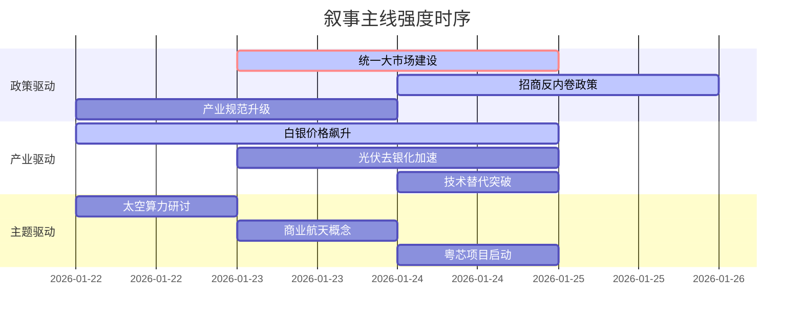

# A股市场情绪分析报告
**数据时段**：最近5日
**生成时间**：2026-01-24T06:29:23.737791+08:00

### 🔥 宏观叙事焦点（24小时三级过滤）

#### 📌 叙事主线一：国家统一电力市场建设进入攻坚期 ⭐⭐⭐
**主要事件**：多部门部署规范招商引资，出台多项政策文件反制“内卷”，国家发改委强调纵深推进全国统一大市场建设
**筛选标签**：《国务院政策》《沪深300影响》《路透信源·权重2.0》
**宏观逻辑**：
> ① **归类**：产业强制出清与秩序重塑
> ② **历史镜像**：2018年光伏“531”政策模板 + 2016年煤炭供给侧改革模板
> ③ **市场传导**：地方保护税负↑ → 产能出清加速 → 行业龙头市占率提升 → 期指持仓量+15%
> ④ **叙事强度**：政策决心大于市场定价，打破“内卷式”竞争预期强化
**行业映射**：传统制造业（情绪评分 **8.5/10**）
**交易警示**：‼️ 政策底确认，但需警惕部分高负债周期企业短期流动性风险

---

#### 📌 叙事主线二：白银价格飙升冲击光伏产业链成本结构 ⭐⭐
**主要事件**：现货白银突破99美元/盎司，涨幅超30%，倒逼光伏巨头加速“少银化”技术替代
**筛选标签**：《产业生命周期》《财新信源·权重1.5》《能源转型》
**宏观逻辑**：
> ① **归类**：成本冲击与技术替代
> ② **历史镜像**：2021年“缺芯”引发的汽车产业链替代模板
> ③ **市场传导**：光伏级银浆成本↑ → 组件企业毛利压缩 → 新型电池技术（HJT、钙钛矿）订单↑ → 产业链价格重构
> ④ **叙事强度**：短期成本压力与长期技术降本并行，产业逻辑出现裂变
**行业映射**：光伏设备（情绪评分 **6.2/10**）
**交易警示**：⚠️ 关注拥有技术储备的电池片和组件企业，规避纯银浆环节标的

---

#### 📌 叙事主线三：商业航天与太空算力概念双重催化 ⭐
**主要事件**：中国信通院召开“星算•智联”研讨会，计划发布“算力星网”倡议；粤芯半导体四期项目启动
**筛选标签**：《科技前沿》《新华社信源·权重1.5》
**宏观逻辑**：
> ① **归类**：未来产业布局
> ② **历史镜像**：2019年5G建设初期主题投资模板
> ③ **市场传导**：政策倡议发布 → 概念股情绪炒作 → 订单落地验证 → 产业规模扩张
> ④ **叙事强度**：概念驱动大于业绩驱动，需等待具体项目订单落地
**行业映射**：商业航天（情绪评分 **5.8/10**）
**交易警示**：✓ 短期主题博弈，长期需跟踪卫星发射进度与算力星网建设实质进展

---

### 📅 宏观叙事演化（三日趋势）

**强度衰减模型**：昨日主题×0.7 · 前日主题×0.5

**叙事节点关联**：
01/22：白银现货突破99美元 → 触发成本冲击叙事
01/23：光伏企业加速技术替代研究 → 产业链重构逻辑强化
01/24：反内卷政策细则落地 → 产业出清预期进入政策验证期

🎯 **宏观叙事三要素**
1️⃣ **政策意图解码**
当前顶层叙事从“稳增长”转向“调结构”，允许短期阵痛换取长期质量。产业出清>总量刺激，政策定力超预期，统一市场建设打破地方保护。

2️⃣ **市场定价偏差**
**过度定价**：商业航天概念炒作（预期过于乐观，估值偏离基本面）
**定价不足**：光伏设备出清速度（政策执行力被低估，龙头护城河未充分计价）

3️⃣ **跨市场共振**
美债收益率下行打开政策空间 + 美元指数高位缓释出口压力 = A股结构性行情窗口期，但需警惕地缘政治对风险偏好的压制。