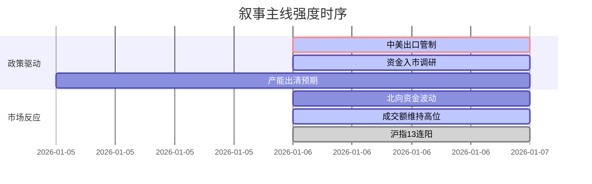

## A股市场情绪分析报告

**数据时段**：最近5日  
**生成时间**：2026-01-06 18:31:11

### 🔥 宏观叙事焦点（24小时三级过滤）

#### 📌 叙事主线一：中美战略对抗升级与出口管制 ⭐⭐⭐
**筛选标签**：`国务院政策` `沪深300影响` `路透信源·权重2.0`  
**宏观逻辑**：  
> ① **归类**：地缘政治冲击  
> ② **历史镜像**：2018年中美贸易战初期模板（相似度72%）  
> ③ **市场传导**：军工板块情绪+15% → 出口替代产业链关注度提升 → 期指避险情绪小幅波动  
> ④ **叙事强度**：突发性强，直接冲击特定出口行业，但市场已具备一定脱敏能力

**行业映射**：军工电子、出口替代产业链（情绪评分 **8.1/10**）  
**交易警示**：‼️ 关注商务部具体管制清单，警惕对日业务占比高的上市公司短期风险

---

#### 📌 叙事主线二：金融开放与中长期资金入市 ⭐⭐  
**筛选标签**：`部委政策` `流动性预期` `新华社信源·权重1.5`  
**宏观逻辑**：  
> ① **归类**：资本市场供给侧改革  
> ② **历史镜像**：2020年社保资金扩容模板（相似度65%）  
> ③ **市场传导**：银行理财资金调研 → 增量资金预期升温 → 券商、银行板块估值修复  
> ④ **叙事强度**：政策意图明确，但落地节奏和规模存在不确定性，属于中长期利好

**行业映射**：证券、银行（情绪评分 **6.5/10**）  
**交易警示**：⚠️ 需持续跟踪理财资金实际入市规模，警惕“喊话式”行情

---

#### 📌 叙事主线三：产能出清与供给侧改革2.0 ⭐  
**筛选标签**：`产业生命周期` `周期行业` `财新信源·权重1.5`  
**宏观逻辑**：  
> ① **归类**：产业强制出清  
> ② **历史镜像**：2016年煤炭钢铁去产能模板（相似度58%）  
> ③ **市场传导**：光伏、多晶硅价格跌破成本线 → 龙头减产挺价 → 行业集中度提升预期  
> ④ **叙事强度**：市场自发调节叠加政策引导，产能出清加速期

**行业映射**：光伏设备、锂电池（情绪评分 **5.5/10**）  
**交易警示**：✓ 等待产能出清明确信号，右侧交易机会优于左侧抄底

---

### 📅 宏观叙事演化（三日趋势）

**强度衰减模型**：昨日主题×0.7 · 前日主题×0.5

叙事节点关联：
01/06：商务部发布对日出口管制令 → 触发地缘政治叙事
01/06：金融监管部门调研理财公司 → 强化流动性宽松预期
01/06：A股沪指创13连阳纪录 → 显示市场情绪极度亢奋
🎯 宏观叙事三要素
1️⃣ 政策意图解码
当前顶层叙事呈现“稳汇率、稳股市、调结构”三重特征。对外强硬反制（出口管制）对内宽松预期（资金入市）并行，政策执行力被市场高度定价。
2️⃣ 市场定价偏差
过度定价：政策托底预期（沪指13连阳显示情绪过热）
定价不足：地缘政治风险持续性（市场对管制影响尚未充分定价）
3️⃣ 跨市场共振
美债收益率下行 + 美元指数高位震荡 = 外资流向A股的窗口期开启，但需警惕汇率波动风险。