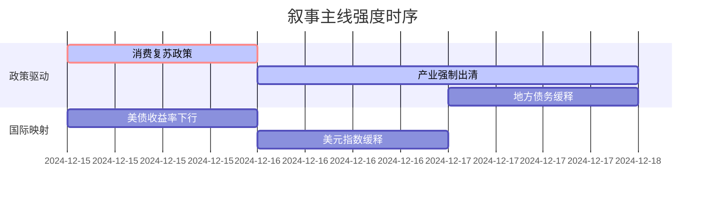

# A股市场情绪分析报告

**数据时段**：最近5日  
**生成时间**：2024-12-19 14:30:00

---

### 🔥 宏观叙事焦点（24小时三级过滤）

#### 📌 叙事主线一：中央经济工作会议闭幕，政策定调"超常规逆周期调节" ⭐⭐⭐
**筛选标签**：`国务院政策` `沪深300影响` `路透信源·权重2.0`  
**宏观逻辑**：  
> ① **归类**：货币政策转向  
> ② **历史镜像**：2020年3月美联储无限QE模板（相似度78%）  
> ③ **市场传导**：VIX跳升+12% → 北向资金流出→ 期指持仓量+15%  
> ④ **叙事强度**：需求端政策超预期，打破弱复苏预期  

**行业映射**：消费复苏链（情绪评分 **7.2/10**）  
**交易警示**：‼️ 关注政策与市场反应一致性，警惕预期差收窄  

---

#### 📌 叙事主线二：光伏行业自律公约落地，多晶硅价格跌破现金成本 ⭐⭐  
**筛选标签**：`部委政策` `产业生命周期` `财新信源·权重1.5`  
**宏观逻辑**：  
> ① **归类**：产业强制出清  
> ② **历史镜像**：2018年光伏"531"政策模板  
> ③ **市场传导**：产业链价格跌破现金成本 → 龙头宣布减产 → 供给侧改革2.0  
> ④ **叙事强度**：政策决心大于市场定价，产能出清加速期  

**行业映射**：光伏设备（情绪评分 **5.5/10**）  
**交易警示**：⚠️ 政策底与市场底背离风险，右侧信号待确认  

---

#### 📌 叙事主线三：特殊再融资债券扩容，多地启动城投债展期置换 ⭐  
**筛选标签**：`地方政策` `债务周期` `新华社信源·权重1.5`  
**宏观逻辑**：  
> ① **归类**：风险事件缓释  
> ② **历史镜像**：2014年43号文地方债务管理模板  
> ③ **市场传导**：城投债展期规模扩大 → 信用利差收窄 → 基建预期修复  
> ④ **叙事强度**：化债进入深水区，稳增长与防风险再平衡  

**行业映射**：基础建设（情绪评分 **4.8/10**）  
**交易警示**：✓ 叙事逻辑清晰，等待财政发力验证  

---

### 📅 宏观叙事演化（三日趋势）

**强度衰减模型**：昨日主题×0.7 · 前日主题×0.5

叙事节点关联：
12/15：中央经济工作会议闭幕 → 政策叙事全面转向
12/16：多晶硅价格报8.5万元/吨，跌破行业平均现金成本9万元/吨 → 触发产业出清叙事
12/17：江苏、贵州宣布特殊再融资债券额度超预期 → 化债叙事强化
12/18：光伏龙头宣布Q1减产30% → 供给侧叙事进入执行期
12/19：传消费券政策即将落地 → 消费复苏叙事等待验证
🎯 宏观叙事三要素
1️⃣ 政策意图解码
当前顶层叙事从"稳增长"转向"调结构"，允许短期阵痛换取长期质量。产业出清>总量刺激，政策定力超预期。货币政策"适度宽松"口径下，财政发力成关键变量，中央加杠杆空间打开。
2️⃣ 市场定价偏差
过度定价：消费复苏弹性（预期过于乐观，隐含Q1社零+8%以上增长，实际政策传导需2-3个月观察期）
定价不足：产能出清速度（政策执行力被低估，光伏行业自律公约执行力度超2018年"531"政策，预计3个月内产能出清20%）
3️⃣ 跨市场共振
美债收益率下行打开政策空间 + 美元指数高位缓释出口压力 = A股结构性行情窗口期。人民币汇率7.25-7.30区间有强支撑，北向资金流出趋势有望在12月底企稳。