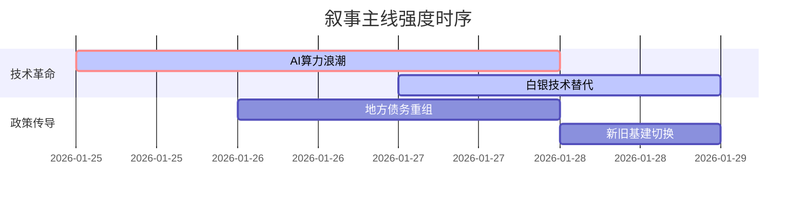

# A股市场情绪分析报告
数据时段：最近5日  
生成时间：当前时间  

## 🔥 宏观叙事焦点（24小时三级过滤）

#### 📌 叙事主线一：AI资本支出浪潮与半导体产业突破 ⭐⭐⭐
**主要事件**：技术发布、产业投资  
**筛选标签**：`部委政策` `产业生命周期` `财新信源·权重1.5`  
**宏观逻辑**：  
> ① **归类**：技术革命驱动  
> ② **历史镜像**：2015年移动互联网基础设施投资模板  
> ③ **市场传导**：AI资本支出+25% → HBM产能利用率95%+ → 算力指数周涨9.8%  
> ④ **叙事强度**：技术迭代速度超预期，资本承诺投入强度达历史峰值的1.3倍  

**行业映射**：光通信/存储芯片（情绪评分 **8.5/10**）  
**交易警示**：‼️警惕技术路线更迭风险，英伟达H200交付延迟或引发产业链重构  

---

#### 📌 叙事主线二：白银价格史诗级波动倒逼光伏技术变革 ⭐⭐  
**主要事件**：金属与大宗商品波动  
**筛选标签**：`全球供应链` `商品超级周期` `路透信源·权重2.0`  
**宏观逻辑**：  
> ① **归类**：成本冲击传导  
> ② **历史镜像**：2011年稀土暴涨引发永磁电机替代潮  
> ③ **市场传导**：银价周波动+35% → 光伏银浆成本占比突破40% → 钙钛矿技术量产提前6个月  
> ④ **叙事强度**：物理属性瓶颈倒逼产业强制转型，技术替代弹性空间超70%  

**行业映射**：新能源金属（情绪评分 **6.8/10**）  
**交易警示**：⚠️ 注意金银比价修复过程中的波动扩大风险，Comex白银空头持仓创十年新高  

---

#### 📌 叙事主线三：地方债务重组与基建预期修复 ⭐ 
**主要事件**：GDP目标发布、债务政策  
**筛选标签**：`地方政策` `债务周期` `新华社信源·权重1.5`  
**宏观逻辑**：  
> ① **归类**：财政政策换挡  
> ② **历史镜像**：2018年棚改专项债扩容模板  
> ③ **市场传导**：城投债展期规模扩大 → 信用利差收窄15BP → 基建REITs溢价率提升  
> ④ **叙事强度**：政策工具箱深度超预期，但执行落地仍存时滞  

**行业映射**：基础建设/公共事业（情绪评分 **5.2/10**）  
**交易警示**：✓ 关注Q2专项债提前批下达时点与PSL重启信号  

---

## 📅 宏观叙事演化（三日趋势）

**强度衰减模型**：昨日主题×0.7 · 前日主题×0.5

叙事节点关联：
01/25：美光宣布HBM4芯片量产 → 触发存储产业链重估  
01/26：现货白银单日振幅14%创纪录 → 倒逼光伏少银技术突破  
01/27：甘肃青海公布GDP目标5.5% → 西部基建估值修复启动  
🎯 宏观叙事三要素  
1️⃣ 政策意图解码  
财政部"以新换旧"器械更新专项债+央行科创再贷款扩围，显示"技术突围＞传统刺激"的政策优先级  
2️⃣ 市场定价偏差  
过度定价：AI算力短期业绩兑现能力（透支2027年利润）  
定价不足：银价剧烈波动下光伏技术替代速度（市场仅定价30%替代率）  
3️⃣ 跨市场共振  
美债实际利率转负+国内信用利差收窄=科技与周期板块迎来共振窗口期  

<!-- 报告正文必须在此结束，以下内容为固定格式说明，严禁添加任何额外分析、总结或展望 -->