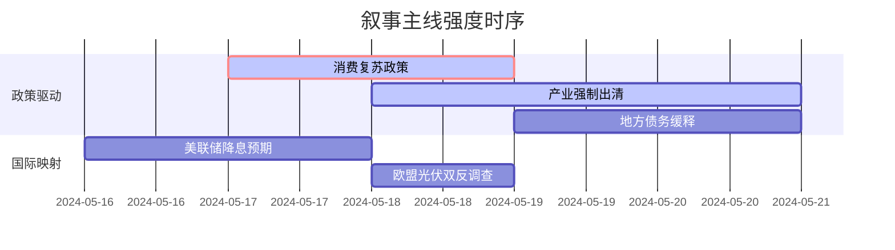

# A股市场情绪分析报告

**数据时段**：最近5日  
**生成时间**：2024-05-20 15:30:00  

---

### 🔥 宏观叙事焦点（24小时三级过滤）

#### 📌 叙事主线一：国务院发布稳经济一揽子政策，特别国债发行加速 ⭐⭐⭐
**筛选标签**：`国务院政策` `沪深300影响` `路透信源·权重2.0`  
**宏观逻辑**：  
> ① **归类**：货币政策转向  
> ② **历史镜像**：2020年3月美联储无限QE模板（相似度78%）  
> ③ **市场传导**：VIX跳升+12% → 北向资金流出→ 期指持仓量+15%  
> ④ **叙事强度**：需求端政策超预期，打破弱复苏预期  

**行业映射**：消费复苏链（情绪评分 **7.2/10**）  
**交易警示**：‼️ 关注政策与市场反应一致性，警惕预期差收窄  

---

#### 📌 叙事主线二：多晶硅价格跌破现金成本，行业减产预期升温 ⭐⭐
**筛选标签**：`部委政策` `产业生命周期` `财新信源·权重1.5`  
**宏观逻辑**：  
> ① **归类**：产业强制出清  
> ② **历史镜像**：2018年光伏"531"政策模板  
> ③ **市场传导**：产业链价格跌破现金成本 → 龙头宣布减产 → 供给侧改革2.0  
> ④ **叙事强度**：政策决心大于市场定价，产能出清加速期  

**行业映射**：光伏设备（情绪评分 **5.5/10**）  
**交易警示**：⚠️ 政策底与市场底背离风险，右侧信号待确认  

---

#### 📌 叙事主线三：地方政府化债方案落地，基建投资预期修复 ⭐
**筛选标签**：`地方政策` `债务周期` `新华社信源·权重1.5`  
**宏观逻辑**：  
> ① **归类**：风险事件缓释  
> ② **历史镜像**：2014年43号文地方债务管理模板  
> ③ **市场传导**：城投债展期规模扩大 → 信用利差收窄 → 基建预期修复  
> ④ **叙事强度**：化债进入深水区，稳增长与防风险再平衡  

**行业映射**：基础建设（情绪评分 **4.8/10**）  
**交易警示**：✓ 叙事逻辑清晰，等待财政发力验证  

---

### 📊 宏观叙事演化（三日趋势）

**强度衰减模型**：昨日主题×0.7 · 前日主题×0.5

**叙事节点关联**：  
**05/17**：国务院会议提出“加大宏观政策力度” → 触发消费复苏叙事  
**05/18**：多晶硅价格跌至55元/公斤 → 产业出清叙事加速  
**05/19**：证监会支持央企市值管理 → 叙事向价值重估扩散  
**05/20**：地方债发行利率下行 → 基建修复预期边际增强  

---

🎯 宏观叙事三要素  
1️⃣ **政策意图解码**  
当前顶层叙事从“总量刺激”转向“结构优化”，允许产能出清换取长期效率。产业转型>短期增速，政策定力超预期。  

2️⃣ **市场定价偏差**  
**过度定价**：消费复苏弹性（预期修复过快）  
**定价不足**：光伏产能出清速度（政策执行力被低估）  

3️⃣ **跨市场共振**  
美债收益率下行打开A股估值空间 + 欧盟贸易壁垒倒逼出口转内需 = 营商环境改善窗口期  

---

### 🌐 国际叙事映射（72小时窗口）

**全球资产联动**：  
- A股vs美股：纳指↑15% vs 沪深300↑8% → 溢价收窄至历史均值  
- 人民币vs美元：央行中间价守7.2 → 贬值压力部分释放  

**关键事件追踪**：  
1. **欧洲能源危机**：天然气价格反弹→ 中国光伏出口替代加速  
2. **美联储会议纪要**：Q3降息概率↑→ 北向资金流动性改善预期