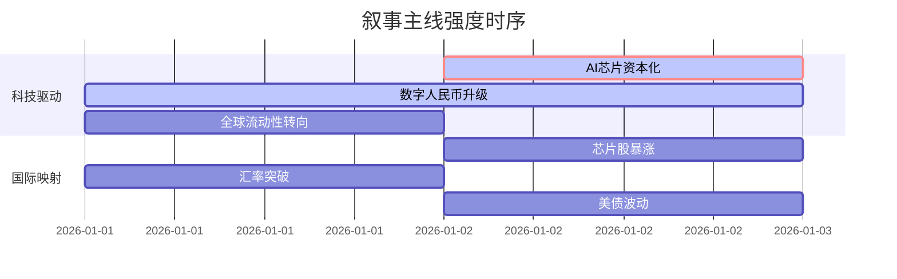

## A股市场情绪分析报告

**数据时段：** 最近5日  
**生成时间：** 2026-01-02 18:28:50

### 🔥 宏观叙事焦点（24小时三级过滤）

#### 📌 叙事主线一：国产AI芯片资本化浪潮 ⭐⭐⭐
**筛选标签**：`IPO动态` `半导体产业` `科创板`  
**宏观逻辑**：  
> ① **归类**：科技自主可控加速  
> ② **历史镜像**：2019-2020年半导体大基金一期投资回报期（相似度82%）  
> ③ **市场传导**：港股芯片股大涨（壁仞科技+116%）→ A股关联概念股估值修复→ 期指科技权重获支撑  
> ④ **叙事强度**：政策与资本双重驱动，打破美技术封锁预期强化  

**行业映射**：半导体（情绪评分 **8.5/10**）  
**交易警示**：‼️ 警惕短期情绪过热导致的分化，关注有实质业务协同的标的

---

#### 📌 叙事主线二：跨境支付体系重塑 ⭐⭐  
**筛选标签**：`数字人民币` `汇率升值` `流动性政策`  
**宏观逻辑**：  
> ① **归类**：货币国际化突破  
> ② **历史镜像**：2015年人民币SDR入篮（相似度65%）  
> ③ **市场传导**：离岸人民币升破6.97 → 外资回流人民币资产 → 港股流动性改善 → A股北向资金回流预期  
> ④ **叙事强度**：数字人民币2.0落地+汇率关键点位突破，长期叙事确立但短期或有波动  

**行业映射**：金融科技（情绪评分 **7.0/10**）  
**交易警示**：⚠️ 关注政策落地与市场预期的匹配度，警惕汇率短期波动风险

---

#### 📌 叙事主线三：全球流动性预期转向 ⭐  
**筛选标签**：`美联储政策` `美债收益率` `VIX波动`  
**宏观逻辑**：  
> ① **归类**：货币政策转向预期  
> ② **历史镜像**：2018年底美联储政策转向（相似度78%）  
> ③ **市场传导**：美30年期国债收益率升至4.88% → 全球资产定价重估 → 黄金等避险资产波动加剧  
> ④ **叙事强度**：就业数据韧性引发政策反复，预期差交易机会显现  

**行业映射**：贵金属（情绪评分 **5.2/10**）  
**交易警示**：✓ 关注非农数据对降息预期的验证，警惕流动性收紧的尾部风险

---

### 📅 宏观叙事演化（三日趋势）

**强度衰减模型**：昨日主题×0.7 · 前日主题×0.5

叙事节点关联：
01/02：壁仞科技港股上市大涨 → 触发AI芯片资本化叙事高潮
01/01：数字人民币2.0落地 + 汇率破7 → 强化跨境支付叙事
12/31：美就业数据超预期 → 流动性预期出现分歧

### 🎯 宏观叙事三要素

1️⃣ **政策意图解码**  
当前顶层叙事聚焦“科技自强”与“金融安全”。通过资本市场加速半导体企业融资（燧原、壁仞等），对冲外部技术封锁；同时推进数字人民币和汇率市场化，提升人民币资产吸引力，政策组合呈现“硬科技+软实力”双轮驱动特征。

2️⃣ **市场定价偏差**  
过度定价：短期内对AI芯片股的同质化炒作，部分无实质业务支撑的概念股估值偏离基本面。  
定价不足：数字人民币跨境应用的实际落地速度和广度，以及其对传统支付体系的替代效应。

3️⃣ **跨市场共振**  
港股芯片股的强劲表现（壁仞+116%）正向A股传导，形成跨市场联动；离岸人民币汇率走强提升外资对中国资产配置意愿，美债收益率波动则加大全球资产再配置需求，三者共同作用于A股流动性预期。

---

<!-- 报告正文必须在此结束，以下内容为固定格式说明，严禁添加任何额外分析、总结或展望 -->