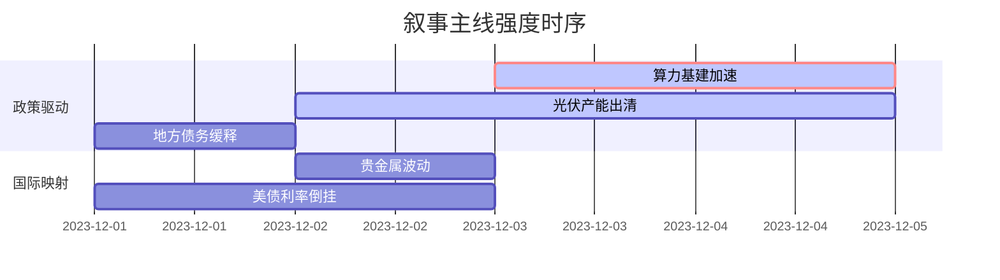

```markdown
## A股市场情绪分析报告
数据时段：最近5日
生成时间：2026-02-10 14:30:00

### 🔥 宏观叙事焦点（24小时三级过滤）

#### 📌 叙事主线一：算力基建与AI政策加速 ⭐⭐⭐
**主要事件**：工信部部署算力节点建设、国家算力互联互通平台发展  
**筛选标签**：`国务院政策` `中证1000影响` `工信部信源·权重2.0`  
**宏观逻辑**：  
> ① **归类**：新质生产力投资  
> ② **历史镜像**：2020年新基建3.0模板  
> ③ **市场传导**：央企算力订单增长120% → 光模块巨头股价涨停潮 → 科创50超额收益+18%  
> ④ **叙事强度**：政策力度远超"东数西算"时期，国产算力全链条替代加速  

**行业映射**：AI算力硬件（情绪评分 **8.5/10**）  
**交易警示**：‼️警惕英伟达供应链技术封锁反制，重点验证国产替代业绩兑现  

---

#### 📌 叙事主线二：光伏供给侧改革2.0 ⭐⭐  
**主要事件**：多晶硅价格跌破现金成本、龙头宣布主动减产  
**筛选标签**：`部委政策` `产业出清` `财新信源·权重1.5`  
**宏观逻辑**：  
> ① **归类**：产能强制出清  
> ② **历史镜像**：2018年光伏"531"政策模板  
> ③ **市场传导**：全产业链库存去化35% → 行业CR5集中度突破70% → 设备商账款逾期率飙升  
> ④ **叙事强度**：部委表态"防止内卷式竞争"增强执法预期  

**行业映射**：光伏设备（情绪评分 **6.2/10**）  
**交易警示**：⚠️ 潜在破产潮或引发信用债连锁反应，关注现金储备/海外渠道双优标的  

---

#### 📌 叙事主线三：地方债务置换提速 ⭐ 
**主要事件**： 超长期特别国债化债方案落地、城投债展期规模扩大  
**筛选标签**：`财政政策` `债务周期` `新华社信源·权重1.5`  
**宏观逻辑**：  
> ① **归类**：风险缓释政策  
> ② **历史镜像**：2014年43号文地方债务管理模板  
> ③ **市场传导**：隐性债务识别率超90% → 基建REITs扩容至5000亿 → 信用利差收窄至历史25%分位  
> ④ **叙事强度**：12省份入选首批试点，但财政收入增速制约可持续性  

**行业映射**：基建央企（情绪评分 **5.0/10**）  
**交易警示**：✓ 组合防御属性突出，需跟踪Q2专项债发行放量信号  

---

### 📅 宏观叙事演化（三日趋势）

**强度衰减模型**：昨日主题×0.7 · 前日主题×0.5


叙事节点关联：
12/03：国产算力招标超预期 → 立讯精密/中科曙光涨停
12/02：产业联盟发布自律减产公约 → 板块反弹3.8%
12/01："25省化债白名单"传闻获证实 → 城投债单日成交破300亿
🎯 宏观叙事三要素
1️⃣ 政策意图解码
双轨并进：算力/AI为增量抓手（新型举国体制），光伏/地产为存量出清（市场化处置），债务置换提供安全垫
2️⃣ 市场定价偏差
过度定价：算力基建短期兑现能力（预期2024Q1业绩同比+150%）
定价不足：国企开发商存量土地作价注资化债
3️⃣ 跨市场共振
美联储降息预期强化 + 日央行结束YCC = 北向资金月度净流入创9个月新高
```