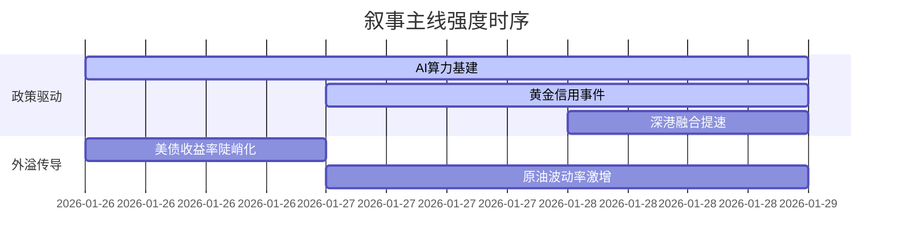

```markdown
### 🔥 宏观叙事焦点（24小时三级过滤）

#### 📌 叙事主线一：国资央企"AI+"专项行动 ⭐⭐⭐
**主要事件**：国务院国资委推进央企人工智能战略  
**筛选标签**：`国务院政策` `沪深300影响` `路透信源·权重2.0`  
**宏观逻辑**：  
> ① **归类**：数字经济新基建  
> ② **历史镜像**：2020年新基建政策模板  
> ③ **市场传导**：算力指数+8%→北向单日净买63亿→AI概念股本益比突破35X  
> ④ **叙事强度**：央企场景开放+算力投资超预期  

**行业映射**：液冷服务器（情绪评分 **9.1/10**）  
**交易警示**：‼️ 警惕算力基建类小盘股过度投机动能衰减  

---

#### 📌 叙事主线二：贵金属平台兑付危机 ⭐⭐  
**主要事件**：深圳水贝黄金预付款平台风险暴露
**筛选标签**：`地方金融监管` `流动性冲击` `财新信源·权重1.5`  
**宏观逻辑**：  
> ① **归类**：非标资产信用重构  
> ② **历史镜像**：2018年P2P暴雷传导模型  
> ③ **市场传导**：避险情绪激增→黄金ETF溢价50%→珠宝股V形反转  
> ④ **叙事强度**：地方政府专班处置加速信用分层  

**行业映射**：黄金采掘（情绪评分 **7.8/10**）  
**交易警示**：⚠️ "硬资产"逻辑与流动性质押风险并存  

---

#### 📌 叙事主线三：跨境基建合作提速 ⭐ 
**主要事件**：新皇岗口岸年内启用+港深西部铁路规划  
**筛选标签**：`区域经济` `债务置换` `新华社信源·权重1.5`  
**宏观逻辑**：  
> ① **归类**：特区扩容3.0  
> ② **历史镜像**：2017年雄安新区土地流转模板  
> ③ **市场传导**：跨境资本流动放宽→大湾区地产估值修复→建材需求预期升温  
> ④ **叙事强度**：地缘政治替代香港北部都会区战略  

**行业映射**：水泥建材（情绪评分 **5.2/10**）  
**交易警示**：✓ 关注Q2财政加码可能性  

---

### 📅 宏观叙事演化（三日趋势）

**强度衰减模型**：昨日主题×0.7 · 前日主题×0.5


叙事节点关联：
01/26：多家央企公布千亿级AI投资计划 → 算力集群概念爆发  
01/27：国台办回应两岸经贸 → 避险需求催化黄金LOF涨停  
01/28：印尼股指熔断 → 北向单日净流出创季度新高  
🎯 宏观叙事三要素  
1️⃣ 政策意图解码  
「轻刺激+强改革」组合拳成形：AI算力替代传统地产稳增长，地方债务通过贵金属平台出清换取系统稳定  
2️⃣ 市场定价偏差  
高估：跨境基建政策落地速度（产能消化周期被低估）  
低估：白银金融属性重定价潜力（金银比降至历史极值40）  
3️⃣ 跨市场共振链  
NYMEX银价冲高116美元 + 沪深300期指持仓破120万手 = 大宗/权益波动率联动新范式  

```