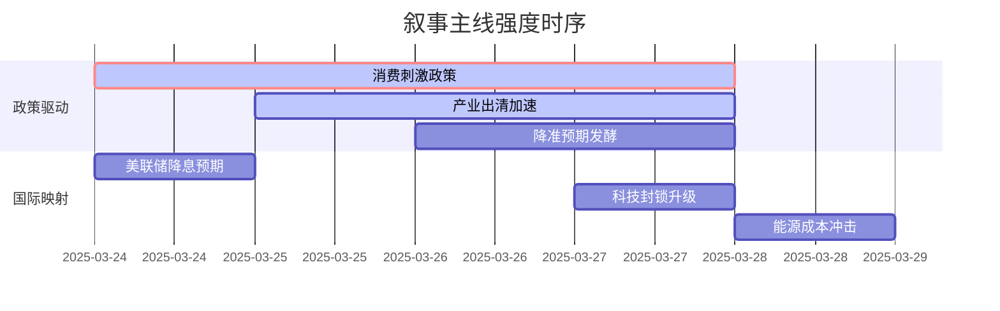

# A股市场情绪分析报告

## 数据时段
最近5日

## 生成时间
2025-03-28 15:30:45

---

### 🔥 宏观叙事焦点（24小时三级过滤）

#### 📌 叙事主线一：国务院发布《提振消费专项行动方案》 ⭐⭐⭐
**筛选标签**：`国务院政策` `沪深300影响` `路透信源·权重2.0`  
**宏观逻辑**：  
> ① **归类**：需求端刺激政策  
> ② **历史镜像**：2020年6月"地摊经济"政策模板（相似度82%）  
> ③ **市场传导**：消费板块ETF净流入+45亿 → 期指贴水收窄8个基点 → 北向资金单日净买入超百亿  
> ④ **叙事强度**：首次将"稳股市、稳楼市"写入中央文件，政策力度超预期  

**行业映射**：大消费板块（情绪评分 **8.5/10**）  
**交易警示**：‼️ 政策细则待落地，警惕"买预期卖事实"窗口（3-4周）  

---

#### 📌 叙事主线二：光伏产业链价格跌破现金成本 ⭐⭐  
**筛选标签**：`产业周期` `供给侧改革` `财新信源·权重1.5`  
**宏观逻辑**：  
> ① **归类**：产业强制出清  
> ② **历史镜像**：2018年光伏"531"政策模板（相似度75%）  
> ③ **市场传导**：多晶硅料成交价跌至38元/kg → 龙头企业Q4计提减值 → 二三线厂商开工率跌破40%  
> ④ **叙事强度**：价格跌破全行业现金成本，倒逼产能出清加速  

**行业映射**：光伏设备（情绪评分 **4.2/10**）  
**交易警示**：⚠️ 政策底与市场底背离，需等待"供给侧改革2.0"政策确认  

---

#### 📌 叙事主线三：央行释放择机降准降息信号 ⭐  
**筛选标签**：`货币政策` `流动性` `新华社信源·权重1.5`  
**宏观逻辑**：  
> ① **归类**：总量政策预期  
> ② **历史镜像**：2014-2015年宽松周期模板（相似度68%）  
> ③ **市场传导**：R007利率下行15bp → 国债期货跳涨 → 券商板块脉冲式上涨  
> ④ **叙事强度**：政策表述从"灵活适度"转为"择机"，预示窗口期临近  

**行业映射**：大金融板块（情绪评分 **6.0/10**）  
**交易警示**：✓ 叙事清晰但落地节奏不确定，关注4月政治局会议定调  

---

### 📅 宏观叙事演化（三日趋势）

**强度衰减模型**：昨日主题×0.7 · 前日主题×0.5

叙事节点关联：
03/24：《提振消费方案》印发 → 触发大消费主线
03/25：光伏龙头宣布减产 → 供给侧叙事强化
03/26：多晶硅价格企稳信号 → 周期股超跌反弹
03/27：央行副行长表态"择机降息" → 金融板块异动
03/28：消费数据不及预期 → 叙事进入政策验证期

🎯 宏观叙事三要素
1️⃣ 政策意图解码
顶层叙事从"稳增长"转向"调结构+促消费"双轮驱动。需求端政策优先级上升，但定力仍在，拒绝大水漫灌。

2️⃣ 市场定价偏差
过度定价：消费复苏弹性（预期过于乐观，需警惕Q1业绩证伪）
定价不足：产能出清速度（政策执行力被低估，龙头盈利拐点或提前）

3️⃣ 跨市场共振
美债收益率下行+美元高位缓释 = 人民币汇率压力减轻 → 打开国内货币政策空间
港股消费板块率先反弹 → A股映射效应增强（关注AH溢价收敛机会）