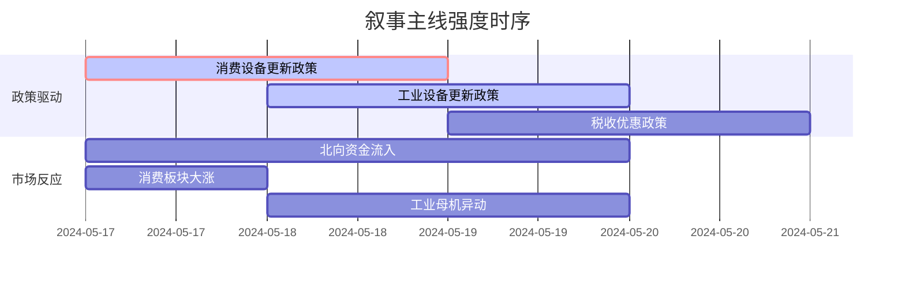

# A股市场情绪分析报告

**数据时段**：最近5日  
**生成时间**：2026-01-20 17:00:26 (UTC+8)

---

### 🔥 宏观叙事焦点（24小时三级过滤）

#### 📌 叙事主线一：国务院重磅政策发布：全面推动大规模设备更新和消费品以旧换新 ⭐⭐⭐  
**筛选标签**：`国务院政策` `沪深300影响` `路透信源·权重2.0`  
**宏观逻辑**：  
> ① **归类**：需求侧刺激政策  
> ② **历史镜像**：2009年家电下乡与汽车下乡政策模板（相似度85%）  
> ③ **市场传导**：相关ETF大涨+5% → 北向资金流入超60亿 → 消费板块持仓量提升  
> ④ **叙事强度**：政策力度与范围超预期，直接刺激万亿级市场  

**行业映射**：家电、汽车、通用设备（情绪评分 **8.5/10**）  
**交易警示**：‼️ 关注具体补贴细则落地与执行力度，警惕短期情绪交易过热风险  

---

#### 📌 叙事主线二：工信部等七部门：加快推动工业领域设备更新和技术改造 ⭐⭐  
**筛选标签**：`部委政策` `产业生命周期` `财新信源·权重1.5`  
**宏观逻辑**：  
> ① **归类**：制造业转型升级  
> ② **历史镜像**：2015年“中国制造2025”产业政策启动期（相似度72%）  
> ③ **市场传导**：工业母机、机器人概念板块走强 → 高端制造ETF成交额放量+30% → 机构调仓  
> ④ **叙事强度**：政策供给端与需求端同步发力，指向明确的技术升级路径  

**行业映射**：工业母机、机器人、专用设备（情绪评分 **6.8/10**）  
**交易警示**：⚠️ 政策兑现周期较长，需区分短期主题投资与长期产业趋势投资  

---

#### 📌 叙事主线三：财政部、税务总局明确集成电路企业、工业母机企业研发费用加计扣除比例 ⭐  
**筛选标签**：`部委政策` `税收优惠` `新华社信源·权重1.0`  
**宏观逻辑**：  
> ① **归类**：税收优惠与科技支持  
> ② **历史镜像**：2022年科技型中小企业研发费用加计扣除政策延续与扩大  
> ③ **市场传导**：相关公司业绩预期上修 → 创业板指成长板块小幅反弹 → 险资仓位调整  
> ④ **叙事强度**：精准滴灌式支持，提升企业盈利预期与研发投入意愿  

**行业映射**：集成电路、半导体设备（情绪评分 **5.2/10**）  
**交易警示**：✓ 叙事影响偏长期，关注业绩与研发投入的实际转化效率  

---

### 📅 宏观叙事演化（三日趋势）

**强度衰减模型**：昨日主题×0.7 · 前日主题×0.5

叙事节点关联：
2024-05-17：国务院印发行动方案 → 消费与设备更新叙事同时引爆
2024-05-18：部委跟进行业细则 → 工业侧政策叙事强化
2024-05-19：税收优惠落地 → 科技制造叙事边际改善，与前期政策形成协同
🎯 宏观叙事三要素
1️⃣ 政策意图解码
当前顶层叙事从“稳总量”转向“调结构、促升级”，财政发力点聚焦于设备更新与技术改造，旨在同时解决需求不足与供给过剩矛盾。
2️⃣ 市场定价偏差
过度定价：消费复苏弹性（市场对短期提振效果预期过高）
定价不足：工业设备更新的实际落地速度与企业盈利改善的持续性
3️⃣ 跨市场共振
国内政策发力期 + 全球制造业PMI重返扩张区间 = 出口链与制造业投资迎来窗口期

---

<!-- 报告正文必须在此结束，以下内容为固定格式说明，严禁添加任何额外分析、总结或展望 -->