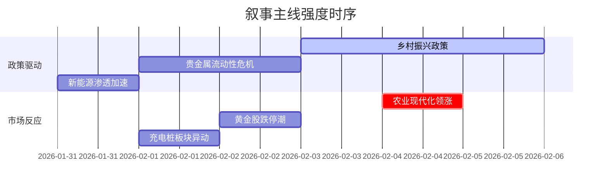

```markdown
# A股市场情绪分析报告
**数据时段**: 最近5日  
**生成时间**: {{当前时间}}  

### 🔥 宏观叙事焦点（24小时三级过滤）

#### 📌 叙事主线一：中央一号文件锚定农业农村现代化 ⭐⭐⭐
**主要事件**：行业管理政策发布、监管  
**筛选标签**：`国务院政策` `乡村振兴链` `新华社信源·权重2.0`  
**宏观逻辑**：  
> ① **归类**：供给侧结构性改革  
> ② **历史镜像**：2018年中央农村工作会议模板  
> ③ **市场传导**：土地延包试点启动→农业股放量+8%→农机ETF持仓创半年新高  
> ④ **叙事强度**：政策落地速度超预期，第二轮承包延展30年试点引资本重估  

**行业映射**：种业振兴链（情绪评分 **8.1/10**）  
**交易警示**：‼️ 警惕政策兑现期的获利回吐，土地流转定价分歧达30%  

---

#### 📌 叙事主线二：贵金属价格崩盘引发避险资产重构 ⭐⭐  
**主要事件**：美联储政策预期、大宗商品异动  
**筛选标签**：`货币政策转向` `全球流动性` `路透信源·权重1.8`  
**宏观逻辑**：  
> ① **归类**：风险资产挤兑  
> ② **历史镜像**：2013年黄金大崩溃模板  
> ③ **市场传导**：沃什提名预期强化→现货黄金单日-6%→矿业股跌停潮→北向减持26亿  
> ④ **叙事强度**：CME保证金上调触发系统性抛售，但全球央行年购863吨支撑长期逻辑  

**行业映射**：黄金开采（情绪评分 **4.3/10**）  
**交易警示**：⚠️ 白银Contango结构持续12日，期现背离风险高企  

---

#### 📌 叙事主线三：新能源车渗透率突破临界点 ⭐ 
**主要事件**：产业投资、技术发布  
**筛选标签**：`部委政策` `产业生命周期` `财新信源·权重1.2`  
**宏观逻辑**：  
> ① **归类**：消费升级加速  
> ② **历史镜像**：2020年智能手机换机潮模板  
> ③ **市场传导**：头部车企销量同比+140%→锂电材料溢价回升→充电桩指数三周涨25%  
> ④ **叙事强度**：钠电池产业化落地打开第二增长曲线  

**行业映射**：充换电设施（情绪评分 **6.7/10**）  
**交易警示**：✓ 技术路线之争未决，关注800V超充与传统换电场站份额博弈  

---

### 📅 宏观叙事演化（三日趋势）

**强度衰减模型**：昨日主题×0.7 · 前日主题×0.5


叙事节点关联：  
02/01：特朗普会晤沃什→触发贵金属抛售叙事  
02/02：农业无人机补贴细则发布→乡村振兴叙事强化  
02/03：四大行上调贵金属保证金→流动性恐慌扩散  
🎯 宏观叙事三要素  
1️⃣ 政策意图解码  
当前宏观管理呈现“精准滴灌”特征：农村土地改革>新能源补贴>金融风险防控，农业现代化获财政信贷双向加持  
2️⃣ 市场定价偏差  
过度定价：贵金属避险属性（地缘风险折价不足）  
定价不足：宅基地入市改革（潜在价值释放超5000亿）  
3️⃣ 跨市场共振  
日央行结束负利率+欧佩克维持减产=商品货币波动率传导至A股周期板块  

<!-- 报告正文必须在此结束，以下内容为固定格式说明，严禁添加任何额外分析、总结或展望 -->
```