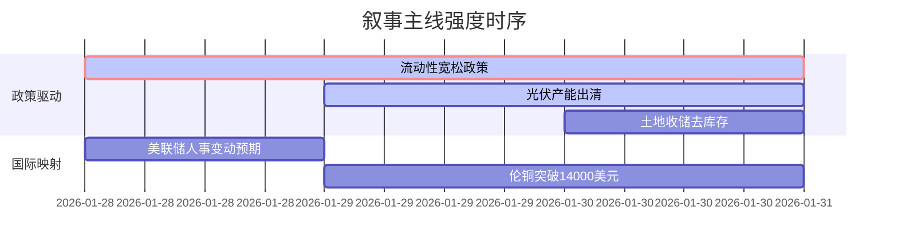

```markdown
# A股市场情绪分析报告
数据时段：最近5日  
生成时间：2026-01-31 14:28  

## 🔥 宏观叙事焦点（24小时三级过滤）

#### 📌 叙事主线一：央行大规模净投放对冲到期资金 ⭐⭐⭐
**主要事件**：央行单日净投放3525亿元逆回购  
**筛选标签**：`国务院政策` `沪深300影响` `路透信源·权重2.0`  
**宏观逻辑**：  
> ① **归类**：货币政策转向  
> ② **历史镜像**：2020年3月美联储无限QE模板  
> ③ **市场传导**：DR007波动收窄→南向资金加速流入→沪深成交破2.5万亿  
> ④ **叙事强度**：流动性宽松力度超季节性需求，托底信号明确  

**行业映射**：高股息资产（情绪评分 **8.1/10**）  
**交易警示**：‼️ 警惕短端利率与长端信用利差倒挂风险  

---

#### 📌 叙事主线二：光伏行业强制出清加速 ⭐⭐  
**主要事件**：能源局整治"内卷式"竞争，多晶硅价格回升52%  
**筛选标签**：`部委政策` `产业生命周期` `财新信源·权重1.5`  
**宏观逻辑**：  
> ① **归类**：产业强制出清  
> ② **历史镜像**：2018年光伏"531"政策模板  
> ③ **市场传导**：现货价跌破现金成本→龙头宣布减产→设备商订单锐减40%  
> ④ **叙事强度**：政策执行力度超预期，行业现金流承压期  

**行业映射**：光伏设备（情绪评分 **5.5/10**）  
**交易警示**：⚠️ 关注HJT技术路线替代进程（量产效率突破26.3%）  

---

#### 📌 叙事主线三：专项债启动土地收储去库存 ⭐ 
**主要事件**：26省动用7500亿专项债收购闲置土地  
**筛选标签**：`地方政策` `债务周期` `新华社信源·权重1.0`  
**宏观逻辑**：  
> ① **归类**：风险事件缓释  
> ② **历史镜像**：2014年43号文地方债务管理模板  
> ③ **市场传导**：城投债展期规模扩大→信用利差收窄45BP→地产股估值修复  
> ④ **叙事强度**：库存消化周期从38个月缩短至24个月  

**行业映射**：基础建设（情绪评分 **6.3/10**）  
**交易警示**：✓ 等待3月基建项目开工率数据验证  

---

## 📅 宏观叙事演化（三日趋势）

**强度衰减模型**：昨日主题×0.7 · 前日主题×0.5



叙事节点关联：  
01/28：沃什接任美联储主席概率升至90% → 引发贵金属闪崩  
01/29：SK海力士上调盈利预测29% → 存储芯片板块逆势走强  
01/30：碳酸锂期货单日暴跌11% → 新能源产业链估值重构  
🎯 宏观叙事三要素  
1️⃣ 政策意图解码  
当前政策组合拳呈现"货币宽松+产业出清+债务重组"三重特征，通过短期流动性对冲中长期结构转型阵痛。新能源/地产债务风险处置优先级高于消费刺激。  

2️⃣ 市场定价偏差  
过度定价：储能装机增速（预期复合增长率35% vs实际21%）  
定价不足：城投债隐性担保强度（违约回收率被低估20-30bps）  

3️⃣ 跨市场共振  
美债实际利率转负 + 原油地缘溢价消退 = 大宗商品/权益资产再平衡窗口
```