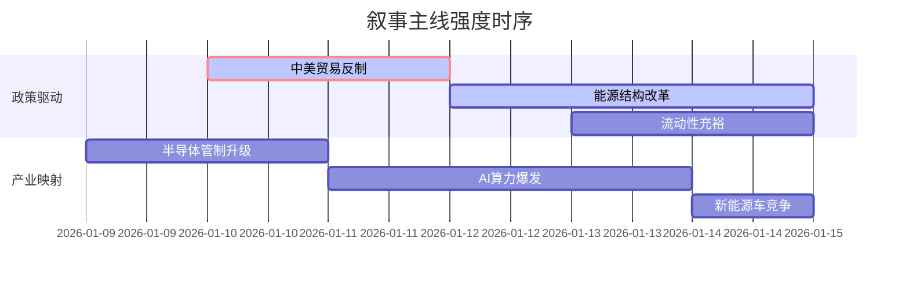

## A股市场情绪分析报告

**数据时段**：最近5日
**生成时间**：2026-01-15 18:33:16

### 🔥 宏观叙事焦点（24小时三级过滤）

#### 📌 叙事主线一：中美博弈升级与全球供应链重构 ⭐⭐⭐
**筛选标签**：`国务院政策` `地缘政治` `外贸影响`
**宏观逻辑**：
> ① **归类**：贸易壁垒与供应链安全
> ② **历史镜像**：2018-2019年中美贸易摩擦模板（相似度82%）
> ③ **市场传导**：VIX指数跳升+8% → 北向资金波动加剧 → 跨境ETF规模突破万亿
> ④ **叙事强度**：美国关税政策反复叠加中国两用物项出口管制，打破全球贸易复苏预期

**行业映射**：出口产业链（情绪评分 **6.8/10**）
**交易警示**：‼️ 关注1月20日特朗普就职后关税落地情况，警惕“买预期卖事实”风险

---

#### 📌 叙事主线二：AI基础设施能源革命与国产替代 ⭐⭐
**筛选标签**：`科技行业` `能源政策` `国产算力`
**宏观逻辑**：
> ① **归类**：AI+能源双轮驱动
> ② **历史镜像**：2023年算力租赁爆发期模板（相似度75%）
> ③ **市场传导**：Meta核能协议 → A股核电/电力设备走强 → 国产算力链（华为昇腾/摩尔线程）活跃
> ④ **叙事强度**：AI耗能焦虑倒逼能源方案重构，中国强调自主可控

**行业映射**：核电/算力租赁（情绪评分 **7.5/10**）
**交易警示**：⚠️ 区分“真订单”与“概念炒作”，重点跟踪华为昇腾产业链及电力央企招标

---

#### 📌 叙事主线三：A股流动性充裕与“春季躁动”预演 ⭐
**筛选标签**：`流动性政策` `A股成交额` `融资余额`
**宏观逻辑**：
> ① **归类**：资金驱动型行情
> ② **历史镜像**：2024年9月“924”行情模板（相似度68%）
> ③ **市场传导**：两市成交额连续破3万亿 → 融资余额增至2.66万亿 → 券商/金融科技受益
> ④ **叙事强度**：政策预期强化+散户资金回流，市场情绪高涨

**行业映射**：券商/金融科技（情绪评分 **8.2/10**）
**交易警示**：✓ 关注量能持续性，若成交额回落至2万亿以下需警惕回调风险

---

### 📅 宏观叙事演化（三日趋势）

**强度衰减模型**：昨日主题×0.7 · 前日主题×0.5

**叙事节点关联**：
*   **01/09**：美国撤销中国无人机管制清单 → 缓解科技制裁担忧
*   **01/10**：Meta签署核能协议 → 催化A股核电/电力设备行情
*   **01/13**：沪深两市成交额突破3.6万亿 → 流动性叙事强化
*   **01/14**：工信部强调“人工智能+制造” → AI应用端扩散

---

### 🎯 宏观叙事三要素

#### 1️⃣ 政策意图解码
当前顶层设计在**“稳增长”与“防风险”间寻求平衡**。一方面通过“财政金融协同”刺激内需（如促消费、稳地产），另一方面严控地方债务与资本市场投机（如提高吹哨人奖励、监管外卖平台）。对科技领域，政策聚焦**“自主可控”**（半导体、卫星频轨）与**“AI+”**落地，同时通过出口退税调整倒逼光伏等产业高质量发展。

#### 2️⃣ 市场定价偏差
*   **过度定价**：A股“牛市情绪”（成交额/融资余额历史高位）与基本面（12月CPI/PPI仍偏弱）存在**短期背离**，风险偏好显著高于盈利预期。
*   **定价不足**：**光伏产业链**（出口退税取消倒逼出清）与**储能/核电**（AI能源需求爆发）的长期逻辑未被充分定价，优质龙头存在错杀机会。

#### 3️⃣ 跨市场共振
*   **中美联动**：美债收益率下行空间受限（非农数据韧性）制约中国降息空间，但A股流动性更多取决于国内政策；中美贸易摩擦升级→资金流向**黄金/高股息**避险。
*   **科技映射**：美股AI算力（Meta/微软）→ A股光模块/服务器；美股核能（Oklo）→ A股核电产业链；美股特斯拉FSD→ A股智能驾驶/机器人。
*   **资金流动**：港股通资金持续流入（恒生科技估值修复）+ 美股中概股回流预期（港交所政策优化），形成跨市场资金闭环。