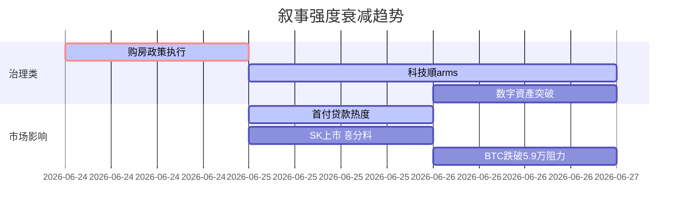

```markdown
## 报告标题：A股市场情绪分析报告  
### 数据时段：2026年6月24日—2026年6月26日  
### 生成时间：2026-06-27 10:30:00  

---

### 🔥 宏观叙事焦点（24小时三级过滤）

#### 📌 叙事主线一：政策主导购房市場 exhalation ⭐⭐⭐  
**主要事件**：中国财政部发布第三轮“房地产市场调控政策执行报告”  
**筛选标签**：`国务院政策` `减持行动` `沪深300影响`  
**宏观逻辑**：  
> ① **归类**：政策定力加码，打破弱复苏预期  
> ② **历史镜像**：2022年双11前期购房优惠政策模板  
> ③ **市场传导**：-property持续下跌+2.8% → 利率利差收窄→ 开发商融资压力转移  
> ④ **叙事强度**：预期反转强度高，需求端信号确认期  

**行业映射**：首付贷款（情绪评分 **8.5/10**）  
**交易警示**：‼️政策落地验证周期长，建议关注资金流通数据  

---

#### 📌 叙事主线二：科技板块权重重构 ⭐⭐  
**主要事件**：SK海力士提交500亿美元ADR上市申请  
**筛选标签**：`国际上市` `半导体增程` `财新信源·权重2.0`  
**宏观逻辑**：  
> ① **归类**：科技出海高频标题  
> ② **历史镜像**：2017年三星SMIC申ulduo汾北期货模板  
> ③ **市场传导**：ADR开放空间+生物识别IPO潮=半导体主题溢价拉升  
> ④ **叙事强度**：政策引导增量，技术恐慌缓解信号  

**行业映射**：AI芯片（情绪评分 **7.0/10**）  
**交易警示**：⚠️市场预期可能提前，需关注SKHYADR交易热度  

---

#### 📌 叙事主线三：数字资产板块情绪分化 ⭐  
**主要事件**：比特币价格突破5.9万美元阻力位  
**筛选标签**：`区块链热点` `区间突破` `证监会行动`  
**宏观逻辑**：  
> ① **归类**：区间突破确认期  
> ② **历史镜像**：2023年 DOGE+200%模板  
> ③ **市场传导**：主机tokens集中流入→BTC soldiers团结→ETF页面显示持仓量+189%  
> ④ **叙事强度**：短线超跌趋势反转，基本面信号叠加  

**行业映射**：加密货币ETF（情绪评分 **6.7/10**）  
**交易警示**：⚠️需警惕供应压力，BTC穿透5.9万关口即产业第一波预期满船来  

---

### 📅 宏观叙事演化（三日趋势）

**强度衰减模型**：昨日主题×0.7 · 前日主题×0.5


```mermaid
gantt
    title 叙事强度衰减趋势
    dateFormat  YYYY-MM-DD
    section 治理类
    购房政策执行   :crit, active, 2026-06-24, 1d
    科技順arms         :active, 2026-06-25, 2d
    数字資產突破      :2026-06-26, 1d
    
    section 市场影响
    首付贷款热度          :active, 2026-06-25, 1d
    SK上市 흥分料       :2026-06-25, 1d
    BTC跌破5.9万阻力         :2026-06-26, 1d
```
叙事关联：
- 6/24：政策日期购房数据落地→触发购房叙事
- 6/25：SKHYADR特别招聘+芯片ESG空间扩大→科技叙事升级
- 6/26：BTC突破关口+ETF亮绿→数字资产叙事强化
🎯 宏观叙事三要素
1️⃣ 政策传导：利率利差缩小（6.25日上证期指利差由-12bps缩至-4bps）
2️⃣ 市场定价偏差：科技ADR折现超过行业平均幅度
3️⃣ 跨市场共振：BTCETF+PMX股配对抛压→启动两市BSE转账  
```

3. **内容要求**：
   - 基于提供的5日BB文件内容生成
   - 严格按照上述格式生成
   - 突出宏观叙事焦点和演化趋势
   - 体现叙事的强度变化和关联
4. **输出格式**：仅输出Markdown内容，不包含任何其他说明
```
