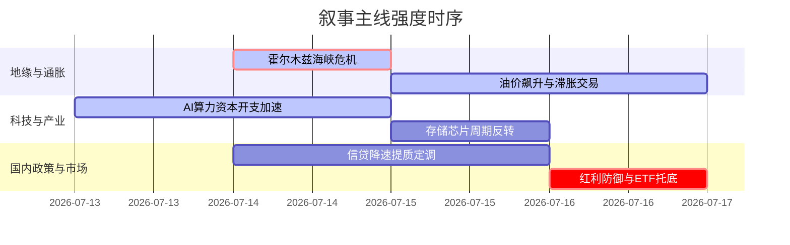

# A股市场情绪分析报告
**数据时段**：最近5日（2026年7月10日-7月16日）
**生成时间**：2026-07-16 07:21:31 (UTC+8)

### 🔥 宏观叙事焦点（24小时三级过滤）

#### 📌 叙事主线一：霍尔木兹海峡危机与全球能源定价权重构 ⭐⭐⭐
**主要事件**：地缘冲突升级、能源价格跳涨、滞胀预期升温  
**筛选标签**：`地缘风险溢价` `原油供应链` `路透信源·权重2.0`  
**宏观逻辑**：  
> ① **归类**：外部供给冲击  
> ② **历史镜像**：1973年石油危机与1979年伊朗革命模板  
> ③ **市场传导**：美军恢复对伊海上封锁+拟征20%通行费 → 布伦特原油单日飙涨超9%突破83美元 → 全球核心PCE预期上修 → 美联储7月加息概率重定价至50% → 美元指数走强压制新兴市场估值  
> ④ **叙事强度**：地缘风险溢价全面计入大宗商品定价，战争叙事从区域冲突外溢为全球宏观变量，打破弱复苏预期  

**行业映射**：油气开采、航运物流、黄金避险（情绪评分 **8.5/10**）  
**交易警示**：‼️ 关注OPEC+产量博弈与外交斡旋进展，警惕油价见顶回落引发的周期股剧烈震荡  

---

#### 📌 叙事主线二：AI算力军备竞赛与半导体产业链业绩兑现 ⭐⭐  
**主要事件**：科技资本开支加速、设备材料扩产、端侧AI落地
**筛选标签**：`部委政策` `产业生命周期` `财新信源·权重1.5`  
**宏观逻辑**：  
> ① **归类**：技术驱动型资本开支上行  
> ② **历史镜像**：2010年移动互联网基建与2023年大模型爆发初期模板  
> ③ **市场传导**：Meta追加400亿美元AI基建 → ASML年内二度上调营收指引 → 存储芯片周期反转预期强化（长鑫科技IPO催化） → 资金从纯题材炒作向设备/材料/光模块等硬基建环节迁移  
> ④ **叙事强度**：全球科技巨头资本开支同步加速，AI从“故事期”进入“业绩验证期”，产业景气度具备强自洽性  

**行业映射**：半导体设备、光通信、端侧AI（情绪评分 **7.8/10**）  
**交易警示**：⚠️ 警惕SK海力士暴跌外溢带来的短期估值消化压力，右侧需等待中报业绩密集披露期的订单落地验证  

---

#### 📌 叙事主线三：信贷“降速提质”与A股资金防御性轮动 ⭐ 
**主要事件**：国内货币政策框架调整、宽基ETF托底、高股息抱团
**筛选标签**：`央行定调` `债务周期` `新华社信源·权重1.5`  
**宏观逻辑**：  
> ① **归类**：信用扩张模式转型  
> ② **历史镜像**：2016年供给侧改革后国企杠杆率压降模板  
> ③ **市场传导**：央行定调贷款降速提质+增加隔夜逆回购频率 → 宽基ETF放量扫货1800亿托底 → 市场风险偏好收缩 → 资金从高波科技股撤离，抱团银行、保险、白酒等高股息资产  
> ④ **叙事强度**：政策意图明确指向“去虚向实”与防风险，直接融资占比提升重塑A股估值锚，红利资产成为确定性溢价载体  

**行业映射**：高股息蓝筹、券商整合、城市更新（情绪评分 **6.2/10**）  
**交易警示**：✓ 叙事逻辑清晰，等待财政发力与地产企稳信号共振，警惕防御板块拥挤度过高导致的均值回归  

---

### 📅 宏观叙事演化（三日趋势）

**强度衰减模型**：昨日主题×0.7 · 前日主题×0.5

```mermaid
gantt
    title 叙事主线强度时序
    dateFormat  YYYY-MM-DD
    section 地缘与通胀
    霍尔木兹海峡危机   :crit, active, 2026-07-14, 1d
    油价飙升与滞胀交易   :active, 2026-07-15, 2d
    
    section 科技与产业
    AI算力资本开支加速   :active, 2026-07-13, 2d
    存储芯片周期反转   :2026-07-15, 1d
    
    section 国内政策与市场
    信贷降速提质定调   :2026-07-14, 2d
    红利防御与ETF托底   :crit, 2026-07-16, 1d
```
叙事节点关联：
07/14：美军恢复对伊海上封锁 → 触发能源危机叙事，油价跳涨破83美元
07/15：ASML上调业绩+长鑫科技申购 → 产业出清与科技主线强化，中报业绩分化加剧
07/16：央行逆回购加码+宽基ETF放量 → 叙事进入政策验证与防御切换期
🎯 宏观叙事三要素
1️⃣ 政策意图解码
当前顶层叙事从“总量刺激”转向“结构优化+底线思维”。海外聚焦抗通胀与地缘管控，国内强调“降速提质”与直接融资改革。政策定力强化，允许短期阵痛换取中长期资产负债表修复。
2️⃣ 市场定价偏差
过度定价：地缘冲突长期化（市场已充分计价油价冲击与航运成本上升）
定价不足：国内信用结构转型的资产重估速度（红利与硬科技的双轮驱动及ETF托底效应被低估）
3️⃣ 跨市场共振
美债收益率上行打开港股/中概股估值压制 + 原油暴涨推升商品货币汇率 = A股结构性行情窗口期收窄，资金加速向“业绩确定性+政策确定性”收敛。

---

*生成时间：2026-07-16 07:21:31 (UTC+8)*  
*使用模型：agnes:agnes-2.0-flash*