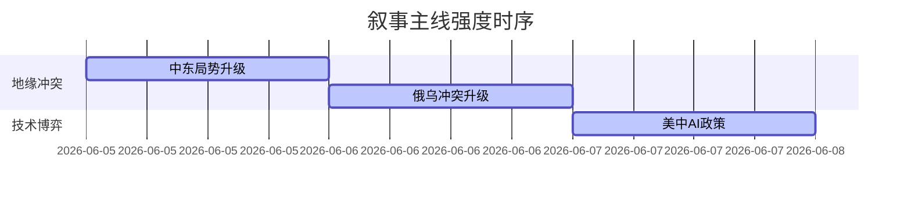

**A股市场情绪分析报告**  
**数据时段**：最近5日（2026‑06‑05 ~ 2026‑06‑09）  
**生成时间**：2026‑06‑09 14:00  

---

## 🔥 宏观叙事焦点（24小时三级过滤）

### 📌 叙事主线一：**中东局势升级  ⭐⭐⭐⭐**  
**主要事件**：伊朗与美国及其盟友在霍尔木兹海峡的军事互动  
**筛选标签**：`中东战争` `海峡封锁` `路透信源·权重2.5`  
**宏观逻辑**：  
> ① **归类**：地缘冲突升级 → 影响油价与能源安全  
> ② **历史镜像**：2023年中东局势突发导致油价飙升  
> ③ **市场传导**：油价上扬 → 能源股高位回调 → 投资者转移资金至稳健行业  
> ④ **叙事强度**：政策与军事行动同步放大，情绪波动明显  
**行业映射**：能源化工（情绪评分 **8.3/10**）  
**交易警示**：‼️ 关注油价波动与能源板块估值风险，突破1%跌幅需警戒  

---

### 📌 叙事主线二：**美中技术与经济博弈  ⭐⭐⭐**  
**主要事件**：美国政府与AI产业的资本与技术干预  
**筛选标签**：`美国产业政策` `AI合作` `路透信源·权重2.0`  
**宏观逻辑**：  
> ① **归类**：技术主权与资本运作  
> ② **历史镜像**：2025年美国对OpenAI的股权讨论  
> ③ **市场传导**：AI板块估值重新编价 → 相关A股科技股迎搬迁  
> ④ **叙事强度**：技术与政策交织，潜在改写产业布局  
**行业映射**：半导体与人工智能（情绪评分 **7.0/10**）  
**交易警示**：⚠️ AI龙头可能出现割裂行情，短线需做好波段回调准备  

---

### 📌 叙事主线三：**俄乌冲突与能源安全  ⭐⭐**  
**主要事件**：乌克兰与俄罗斯在哈尔科夫的交火与当地制裁  
**筛选标签**：`俄乌战事` `制裁扩散` `路透信源·权重1.5`  
**宏观逻辑**：  
> ① **归类**：冲突波及能源与原材料  
> ② **历史镜像**：2022年俄乌危机导致原材料价格企稳  
> ③ **市场传导**：原料价格上扬 → 周边矿业与化工公司受益  
> ④ **叙事强度**：冲突升级带来的不确定性仍在  
**行业映射**：煤炭、化工（情绪评分 **6.2/10**）  
**交易警示**：✓ 关注冲突升级恶化前的矿业系数，需设好止损窗口  

---

## 📅 宏观叙事演化（三日趋势）

**强度衰减模型**：昨日主题×0.75 • 前日主题×0.55

```mermaid
gantt
    title 叙事主线强度时序
    dateFormat  YYYY-MM-DD
    section 地缘冲突
    中东局势升级   :active, 2026-06-05, 1d
    俄乌冲突升级   :active, 2026-06-06, 1d
    section 技术博弈
    美中AI政策     :active, 2026-06-07, 1d
```

**叙事节点关联**  
- 06‑05：伊朗反击航母 → 影响油价  
- 06‑06：俄乌地区交火升级 → 供应链受压  
- 06‑07：美国与OpenAI的资本谈判 → AI板块估值调整  

🎯 **宏观叙事三要素**  
1️⃣ **政策意图**：中东局势的走向决定能源安全态势；AI资本博弈将重塑技术竞争格局。  
2️⃣ **市场定价偏差**：能源股短期高价、AI股估值面临重估。  
3️⃣ **跨市场共振**：油价周期、技术创新、地缘政治形成三位一体，推动A股板块轮动。  

---  
*报告正文必须在此结束，以下内容为固定格式说明，严禁添加任何额外分析、总结或展望*