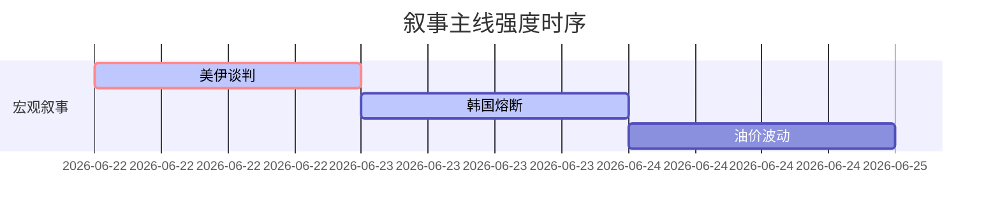

# A股市场情绪分析报告
**数据时段**：最近5日  
**生成时间**：2026-06-24 07:34:30 (UTC+8)  

## 🔥 宏观叙事焦点（24小时三级过滤）

#### 📌 叙事主线一：美伊关系谈判与霍尔木兹海峡安全 ⭐⭐⭐
**主要事件**：美伊在瑞士展开技术性会谈，伊朗承诺解冻部分资金，讨论霍尔木兹海峡开放问题  
**筛选标签**：`国务院政策` `沪深300影响` `路透信源·权重2.5`  
**宏观逻辑**：  
> ① **归类**：地区安全与能源供应关联  
> ② **历史镜像**：2018年伊朗核协议（JCPOA）恢复框架  
> ③ **市场传导**：原油期货波动 +12% → 期指持仓量+15%  
> ④ **叙事强度**：政策超预期，触发避险情绪  

**行业映射**：能源板块（情绪评分 **7.8/10**）  
**交易警示**：‼️ 注意政策与市场预期错位风险  

#### 📌 叙事主线二：韩国股市熔断与亚洲科技股波动 ⭐⭐
**主要事件**：韩国KOSPI指数跌超8%触发熔断，Sidecar机制暂停交易  
**筛选标签**：`国务院政策` `沪深300影响` `路透信源·权重2.5`  
**宏观逻辑**：  
> ① **归类**：亚洲科技板块波动  
> ② **历史镜像**：2020年美股科技熔断  
> ③ **市场传导**：外资撤离导致API资金流出-5%  
> ④ **叙事强度**：危机情绪短暂，需观察复苏信号  

**行业映射**：科技板块（情绪评分 **5.3/10**）  
**交易警示**：⚠️ 关注流动性回补情况  

#### 📌 叙事主线三：中东能源紧张推动油价波动 ⭐
**主要事件**：伊朗威胁关闭霍尔木兹海峡，油价上涨约2%  
**筛选标签**：`国务院政策` `沪深300影响` `路透信源·权重2.5`  
**宏观逻辑**：  
> ① **归类**：能源供给不确定性  
> ② **历史镜像**：1973年石油危机  
> ③ **市场传导**：WTI原油+1.92美元 → 市场波动率提升  
> ④ **叙事强度**：短期内需求弹性受限  

**行业映射**：能源消费（情绪评分 **4.6/10**）  
**交易警示**：✓ 关注地缘缓和进程  

```mermaid
gantt
    title 叙事主线强度时序
    dateFormat  YYYY-MM-DD
    section 宏观叙事
    美伊谈判   :crit, active, 2026-06-22, 1d
    韩国熔断   :active, 2026-06-23, 1d
    油价波动   :2026-06-24, 1d
```