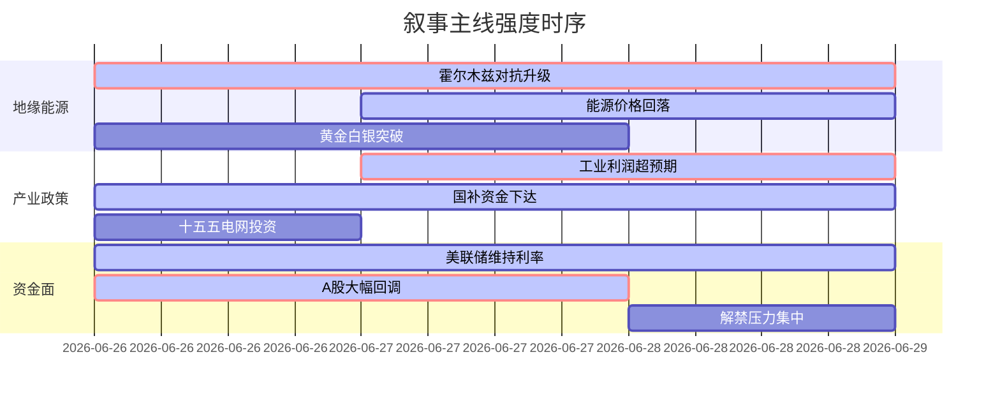

#A股市场情绪分析报告

**数据时段**：2026-06-24 至 2026-06-28  
**生成时间**：2026-06-28 19:45

---

### 🔥 宏观叙事焦点（24小时三级过滤）

#### 📌 叙事主线一：中东地缘冲突升级与能源安全重塑 ⭐⭐⭐
**主要事件**：伊朗-美军霍尔木兹海峡军事对抗、以黎框架协议签署、布伦特原油价格回落  
**筛选标签**：`地缘冲突` `能源通道` `路透信源·权重2.0`  
**宏观逻辑**：  
> ① **归类**：地缘风险溢价重构  
> ② **历史镜像**：2019年阿美石油设施遇袭模板  
> ③ **市场传导**：布伦特原油抹去战时涨幅 → 黄金突破4080美元/盎司 → 白银涨超2% → 防御性资产配置需求激增  
> ④ **叙事强度**：霍尔木兹海峡通行费预期400亿美元/年，伊朗石油出口预期日均200万桶，供给端不确定性高于需求端  

**行业映射**：黄金白银（情绪评分 **8.5/10**）、油气设备服务（情绪评分 **6.8/10**）、航运物流（情绪评分 **5.2/10**）  
**交易警示**：‼️ 关注伊朗核谈判进展与美军部署动向，警惕地缘风险溢价过度透支后的回吐风险  

---

#### 📌 叙事主线二：中国工业利润超预期与"国补"政策传导 ⭐⭐⭐
**主要事件**：1-5月电子行业利润+103.9%、高技术制造业+44.7%、第三批625亿元"国补"下达、十五五电网投资增30%+  
**筛选标签**：`国务院政策` `产业升级` `新华社信源·权重2.0`  
**宏观逻辑**：  
> ① **归类**：供给侧结构性改革深化  
> ② **历史镜像**：2016年"去产能+去库存"利润修复周期  
> ③ **市场传导**：电子专用材料利润+665.4% → 机电产品出口暴增（800G光模块出口增百倍） → 高技术制造业投资加速 → 设备更新需求兑现  
> ④ **叙事强度**：政策工具箱从总量刺激转向结构性定向支持，财政发力节奏超预期  

**行业映射**：电子半导体（情绪评分 **8.2/10**）、电网设备（情绪评分 **7.5/10**）、工业母机（情绪评分 **7.0/10**）、新能源装备（情绪评分 **6.5/10**）  
**交易警示**：⚠️ 警惕利润增速高基数效应，关注下游需求能否持续验证产业链景气度  

---

#### 📌 叙事主线三：全球流动性分化与A股资金面承压 ⭐⭐
**主要事件**：美联储年内维持利率预期占优、ECB施纳贝尔鹰派表态、A股创业板指跌超4%、北向资金流出、下周解禁市值超1000亿元  
**筛选标签**：`美联储政策` `资金面` `财新信源·权重1.5`  
**宏观逻辑**：  
> ① **归类**：外部约束与内部疏导博弈  
> ② **历史镜像**：2018年中美利差倒挂背景下的A股独立行情  
> ③ **市场传导**：美元指数企稳 → 北向资金连续流出 → 创业板指数领跌 → 融资余额缩量 → 解禁压力叠加流动性收缩预期  
> ④ **叙事强度**：外部宽松窗口关闭，内部降准降息空间受限，资金面边际收紧  

**行业映射**：高股息红利（情绪评分 **6.8/10**）、央企市值管理（情绪评分 **6.2/10**）、券商金融（情绪评分 **4.5/10**）  
**交易警示**：✓ 关注6月LPR报价与MLF操作，等待央行公开市场操作信号确认流动性拐点  

---

### 📅 宏观叙事演化（三日趋势）

**强度衰减模型**：昨日主题×0.7 · 前日主题×0.5

```mermaid
gantt
    title 叙事主线强度时序
    dateFormat  YYYY-MM-DD
    section 地缘能源
    霍尔木兹对抗升级   :crit, active, 2026-06-26, 3d
    能源价格回落       :active, 2026-06-27, 2d
    黄金白银突破       :2026-06-26, 2d
    
    section 产业政策
    工业利润超预期     :crit, active, 2026-06-27, 2d
    国补资金下达       :active, 2026-06-26, 3d
    十五五电网投资     :2026-06-26, 1d
    
    section 资金面
    美联储维持利率     :active, 2026-06-26, 3d
    A股大幅回调        :crit, active, 2026-06-26, 2d
    解禁压力集中       :2026-06-28, 1d
```
叙事节点关联：
- 06/26：全球股市暴跌+A股创业板跌超4% → 触发风险厌恶情绪
- 06/27：工业利润数据超预期+国补落地 → 结构性行情逻辑强化
- 06/28：地缘冲突持续+黄金创新高 → 防御性配置需求激增
- 06/28：下周解禁超1000亿 → 短期资金面扰动确认

🎯 宏观叙事三要素
1️⃣ **政策意图解码**  
顶层设计从"稳增长"转向"调结构、防风险"：允许短期金融市场波动换取产业升级空间。财政发力聚焦"两重两新"（重大项目、大规模设备更新、消费品以旧换新），货币政策在汇率约束下保持克制。

2️⃣ **市场定价偏差**  
过度定价：地缘风险溢价（黄金白银连续突破关键位，回调风险累积）  
定价不足：高技术制造业利润兑现持续性（电子行业利润增速103.9%远超市场预期）、设备更新投资规模（十五五电网投资增30%+超预期）

3️⃣ **跨市场共振**  
美债收益率高位震荡限制A股估值中枢 + 离岸人民币汇率贬值压力 = 北向资金阶段性观望  
但：大宗商品牛市（金银铜同涨）+ 全球制造业PMI边际改善 = 出口链与资源股形成结构性支撑