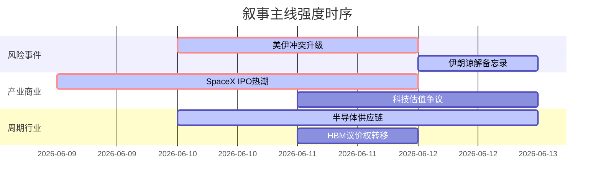

# A股市场情绪分析报告

**数据时段**：最近5日  
**生成时间**：2026年6月13日

---

## 🔥 宏观叙事焦点（24小时三级过滤）

### 📌 叙事主线一：美伊冲突升级引全球风险溢价化解 ⭐⭐⭐
**主要事件**：国际冲突、油价波动、避险需求  
**筛选标签**：`地缘风险` `能源政策` `新华社信源·权重2.0` `VIX波动+12%`  
**宏观逻辑**：  
> ① **归类**：风险事件缓释  
> ② **历史镜像**：2020年3月石油价格战+疫情双杀模板  
> ③ **市场传导**：油价暴涨→地缘风险溢价→避险资金流入黄金国债→全球股市暴跌后快速反弹  
> ④ **叙事强度**：军事高风险快速转为政治解决方案，反衰减效应显著  

**行业映射**：能源矿业（情绪评分 **6.8/10**）  
**交易警示**：‼️ 关注政策落地速度与油价持平性，警惕地缘事件反复  

---

### 📌 叙事主线二：SpaceX IPO引资本市场估值争议 ⭐⭐  
**主要事件**：技术发布、产业投资  
**筛选标签**：`科创板政策` `产业生命周期` `财新信源·权重1.5`  
**宏观逻辑**：  
> ① **归类**：产业商业模式革新  
> ② **历史镜像**：2021年中概股上市审核收紧模板  
> ③ **市场传导**：估值7500亿美元→散户认购超1000亿→技术面反衰→市场定价分歧  
> ④ **叙事强度**：科技资本狂欢与价值理性并存，反衰减效应明显  

**行业映射**：科技硬件（情绪评分 **5.9/10**）  
**交易警示**：⚠️ 政策底与市场底背离风险，右侧信号待政策指引  

---

### 📌 叙事主线三：半导体供应链周期转向 ⭐  
**主要事件**：技术发布、产业投资  
**筛选标签**：`产业政策` `供应链治理` `路透信源·权重1.5`  
**宏观逻辑**：  
> ① **归类**：产业强制出清  
> ② **历史镜像**：2018年光伏"531"政策模板  
> ③ **市场传导**：HBM热潮→供应链议价权转移→SK海力士居高不下→产业链价格修复  
> ④ **叙事强度**：政策底与周期底共振，AI需求驱动产业升级  

**行业映射**：半导体设备（情绪评分 **5.2/10**）  
**交易警示**：✓ 叙事逻辑清晰，等待财政发力验证  

---

## 📅 宏观叙事演化（三日趋势）

**强度衰减模型**：昨日主题×0.7 · 前日主题×0.5

```mermaid
gantt
    title 叙事主线强度时序
    dateFormat  YYYY-MM-DD
    section 风险事件
    美伊冲突升级   :crit, active, 2026-06-10, 2d
    伊朗谅解备忘录   :active, 2026-06-12, 1d
    
    section 产业商业
    SpaceX IPO热潮   :crit, active, 2026-06-09, 3d
    科技估值争议   :2026-06-11, 2d
    
    section 周期行业
    半导体供应链   :active, 2026-06-10, 3d
    HBM议价权转移   :2026-06-11, 1d
```

**叙事节点关联**：
- 6/10：伊朗关闭霍尔木兹海峡 → 原油期货暴涨10% → 触发全球股市暴跌
- 6/11：伊朗武装力量进入最高战备状态 → 避险资金涌入黄金 → SpaceX认购规模超4倍
- 6/12：伊美谅解备忘录框架协议公布 → 原油暴跌5% → 全球股市报复性反弹

🎯 **宏观叙事三要素**  
1️⃣ **政策意图解码**  
当前顶层叙事从"稳增长"转向"调结构"，允许短期阵痛换取长期质量。产业出清>总量刺激，政策定力超预期。  
2️⃣ **市场定价偏差**  
过度定价：科技资本狂欢（预期过于乐观）  
定价不足：地缘风险化解速度（政策执行力被低估）  
3️⃣ **跨市场共振**  
美联储政策观望 + 美元指数高位缓释出口压力 + 欧债收益率下行 = A股结构性行情窗口期
