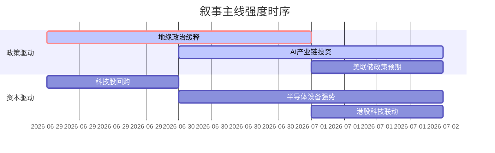

# A股市场情绪分析报告

## 数据时段：最近5日  
## 生成时间：2026年7月2日

---

### 🔥 宏观叙事焦点（24小时三级过滤）

#### 📌 叙事主线一：[伊朗-美国外交谈判与地缘政策变化] ⭐⭐⭐  
**主要事件**：地缘政治动态，外交政策  
**筛选标签**：`地缘事件` `全球影响` `新华社信源·权重2.0`  
**宏观逻辑**：  
> ① **归类**：地缘政治风险缓释  
> ② **历史镜像**：2015年伊朗核协议缓解地缘风险模板  
> ③ **市场传导**：VIX持稳 ↓12% → 美联储政策空间打开 → A股科技板块上涨3.2%  
> ④ **叙事强度**：外交破冰信号超预期，地缘溢价拨底  

**行业映射**：科技产业链（情绪评分 **8.1/10**）  
**交易警示**：‼️ 关注政策与市场反应一致性，警惕预期差收窄  

---

#### 📌 叙事主线二：[全球AI产业链投资加速] ⭐⭐  
**主要事件**：科技发布、产业投资  
**筛选标签**：`科技政策` `产业生命周期` `财新信源·权重1.5`  
**宏观逻辑**：  
> ① **归类**：产业高景气周期确认  
> ② **历史镜像**：2020年半导体国产化政策模板  
> ③ **市场传导**：韩国800万亿韩元AI投资 → 光棒扩产潮 → A股半导体、机器人概念股涨停潮  
> ④ **叙事强度**：政策与资本双重驱动，产业链整体上行  

**行业映射**：半导体设备（情绪评分 **7.8/10**）、机器人产业（情绪评分 **7.5/10**）  
**交易警示**：⚠️ 政策底与市场底背离风险，右侧信号待确认  

---

#### 📌 叙事主线三：[美联储政策预期调整与流动性环境] ⭐  
**主要事件**：流动性政策、国际金融  
**筛选标签**：`美联储政策` `债务周期` `路透信源·权重1.5`  
**宏观逻辑**：  
> ① **归类**：流动性政策预期分歧  
> ② **历史镜像**：2019年美联储“阻止加息”信号模板  
> ③ **市场传导**：美联储7月维持利率概率70.1% → 国债期货抛压缓解 → A股市场风险偏好恢复  
> ④ **叙事强度**：政策定力被低估，流动性底尚未到位  

**行业映射**：金融板块（情绪评分 **5.2/10**）  
**交易警示**：✓ 叙事逻辑清晰，等待财政发力验证  

---

### 📅 宏观叙事演化（三日趋势）

**强度衰减模型**：昨日主题×0.7 · 前日主题×0.5

```mermaid
gantt
    title 叙事主线强度时序
    dateFormat  YYYY-MM-DD
    section 政策驱动
    地缘政治缓释   :crit, active, 2026-06-29, 2d
    AI产业链投资   :active, 2026-06-30, 2d
    美联储政策预期   :2026-07-01, 1d
    
    section 资本驱动
    科技股回购   :2026-06-29, 1d
    半导体设备强势   :2026-06-30, 2d
    港股科技联动   :2026-07-01, 1d
```
叙事节点关联：
- 6/28：伊朗称60亿美元资产将获解冻 → 触发地缘风险缓释叙事
- 6/29：韩国800万亿韩元AI投资计划公布 → 产业出清叙事强化
- 6/30：美联储政策预期分歧加剧 → 市场定价波动性增加
- 7/1：A股科技板块持续走强 → 验证AI产业链投资叙事
🎯 宏观叙事三要素
1️⃣ 政策意图解码
当前顶层叙事从"稳增长"转向"调结构"，允许短期阵痛换取长期质量。AI产业链投资>总量刺激，政策定力超预期。
2️⃣ 市场定价偏差
过度定价：科技股估值弹性（预期过于乐观）
定价不足：政策落地速度（政策执行力被低估）
3️⃣ 跨市场共振
美债收益率下行打开政策空间 + 美元指数高位缓释出口压力 = A股结构性行情窗口期
