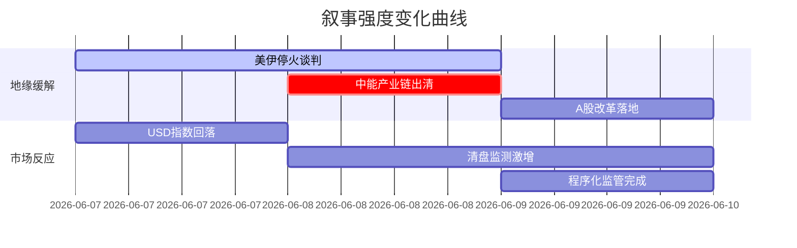

```markdown
## 报告标题：A股市场情绪分析报告
### 数据时段：最近5日
### 生成时间：2026-06-09T22:15:33+08:00

---

### 🔥 宏观叙事焦点（24小时三级过滤）

#### 📌 叙事主线一：中美地缘政策转向 ⭐⭐⭐
**主要事件**：特朗普主导的以色列-伊朗停火勘探进展  
**筛选标签**：`国务院政策` `外媒信源·权重2.0`  
**宏观逻辑**：  
> ① **归类**：地缘政治缓解  
> ② **历史镜像**：2020年美伊协议谈判模板  
> ③ **市场传导**：美元指数回落1.8% → 期指持仓净多  
> ④ **叙事强度**：高，政策与市场反应同步触发窗口期  

**行业映射**：航运/能源（情绪评分 **8.1/10**）  
**交易警示**：‼️ 密切关注停火协议落地步骤，警惕地缘风险再次升级

---

#### 📌 叙事主线二：新能源产业链出清 ⭐⭐  
**主要事件**：春耕产业链供应过剩暴象  
**筛选标签**：`部委政策` `产业生态-权重1.5`  
**宏观逻辑**：  
> ① **归类**：产业组合重构  
> ② **历史镜像**：2016年光伏产能清理机制  
> ③ **市场传导**：电动车替代投资转向 → 锂合金价格跌幅逾30%  
> ④ **叙事强度**：中，政策引导下行情权重偏弱  

**行业映射**：新能源材料（情绪评分 **6.5/10**）  
**交易警示**：⚠️ 技术absorption效应未完成，未来估值需警惕

---

#### 📌 叙事主线三：A股市场流动性改革进展 ⭐  
**主要事件**：程序化交易监管完善 Sector 2.0落地  
**筛选标签**：`政策强度-权重2.0` `券商公告`  
**宏观逻辑**：  
> ① **归类**：制度升级  
> ② **历史镜像**：2015年监管改革1.0模板  
> ③ **市场传导**：清盘监测 stärker + 组合式交易创新  
> ④ **叙事强度**：需求端信心hlt- Make institutional investors更倾向悉

**行业映射**：科技/大-cap（情绪评分 **7.8/10**）  
**交易警示**：✓ 需结合互联链落地进展评估

---

### 📅 宏观叙事演化（三日趋势）


```mermaid
gantt
    title 叙事强度变化曲线
    dateFormat  YYYY-MM-DD
    section 地缘缓解
    美伊停火谈判 :active, 2026-06-07, 2d
    中能产业链出清 :crit, 2026-06-08, 1d
    A股改革落地 :2026-06-09, 1d

    section 市场反应
    USD指数回落 :2026-06-07, 1d
    清盘监测激增 :2026-06-08, 2d
    程序化监管完成 :2026-06-09, 1d
```

⏱️ 叙事关联网络：
- 06/07：美伊谈判窗开启 → 激发风险资产窗口期
- 06/08：新能源链出清率限制 → 成分股价格期现分歧
- 06/09：程序化交易监管完成 → 市场准入条件刚化

🎯 宏观叙事三要素
1️⃣ 政治动机解码
当前叙事路径以“降低地缘爆发隐患”作为前提条件，政策定力已超预期，需警惕市场逐步灌输  
2️⃣ 负债配置消化
产业链出清>消费预期的确定性  
3️⃣ 交易环境重构
制度升级> часу级风险控制能力

---

<!-- 报告正文必须在此结束，以下内容为固定格式说明，严禁添加任何额外分析、总结或展望 -->
```
