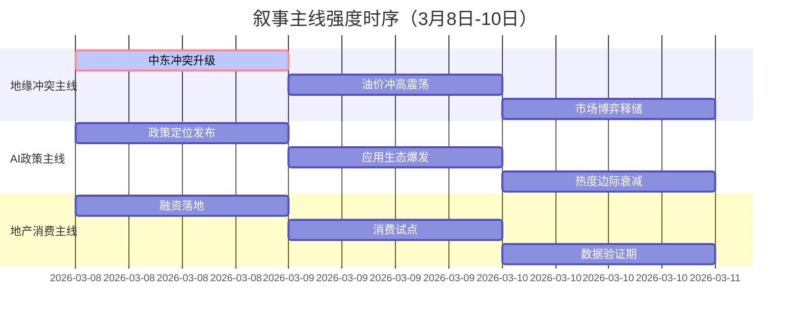

## A股市场情绪分析报告

数据时段：最近5日（2026-03-05 至 2026-03-09）  
生成时间：2026-03-10

### 🔥 宏观叙事焦点（24小时三级过滤）

#### 📌 叙事主线一：中东军事冲突全面升级与全球能源供应危机 ⭐⭐⭐
**主要事件**：美以对伊朗发动大规模军事打击，伊朗革命卫队实施"真实承诺-4"系列反击，霍尔木兹海峡航运实际受阻  
**筛选标签**：`地缘冲突` `能源安全` `全球资产重定价`  
**宏观逻辑**：  
> ① **归类**：地缘政治风险→能源供应中断→全球滞胀预期重燃  
> ② **历史镜像**：1990年伊拉克入侵科威特导致油价翻倍，2022年俄乌冲突爆发后布伦特原油突破120美元  
> ③ **市场传导**：布伦特原油突破117美元（单日+25%）→亚太股市熔断式暴跌（韩国-8%、日本-7%）→黄金失守5020美元（避险逻辑失效）→美英国债收益率飙升（通胀预期重定价）  
> ④ **叙事强度**：冲突从"有限报复"升级为"全面军事对抗"，霍尔木兹海峡实际航运量降至个位数，G7紧急讨论联合释放战略石油储备，供应冲击已从预期变为现实

**行业映射**：  
- 石油石化（情绪评分 **9.2/10**）：油价上涨直接利好上游开采，设备和服务需求激增  
- 国防军工（**8.8/10**）：地缘紧张推动军售预期和装备升级需求  
- 黄金（**2.5/10**）：传统避险属性被削弱，资金转向原油与美元  
- 航运物流（**1.5/10**）：霍尔木兹海峡受阻导致航线改道，成本飙升  

**交易警示**：‼️ 建议做多原油期货波动率，持有看涨期权规避上行风险；规避航空、化工、纺织等成本敏感型下游行业；黄金暂失去避险功能，需等待局势回稳后再评估；关注G7释储决定可能引发的油价短期回落。

---

#### 📌 叙事主线二：中国AI产业政策突破与商业化加速 ⭐⭐
**主要事件**：政府工作报告首次将AI定位为"新兴支柱产业"，工信部宣布核心产业规模超1.2万亿，阶跃星辰Step 3.5 Flash开源后全球调用量登顶  
**筛选标签**：`产业政策` `新质生产力` `科技自立`  
**宏观逻辑**：  
> ① **归类**：科技自立自强→产业政策红利→资本开支周期启动  
> ② **历史镜像**：2014年"互联网+"战略推动移动互联网爆发，2020年半导体国产化政策催生产业链自主突破  
> ③ **市场传导**：Step 3.5 Flash开源登顶OpenClaw→深圳龙岗出台OpenClaw专项补贴（最高200万）→算力租赁板块持续活跃（鸿博股份、美利云涨停）→商业航天获"新兴支柱产业"定位，市场规模预计2026年达3.5万亿  
> ④ **叙事强度**：AI从"技术竞赛"进入"应用落地"阶段，具身智能融资破百亿，政策从"支持"转向"推动"，OpenClaw生态中国企业主导

**行业映射**：  
- 人工智能（**8.5/10**）：政策催化明确，应用场景从B端向C端渗透  
- 商业航天（**7.8/10**）：国家战略定位升级，发射频率提升，产业链受益  
- 半导体设备（**7.2/10**）：国产替代加速，存储芯片需求增长  
- 算力基础设施（**7.5/10**）：AI算力需求刚性增长，服务器、液冷、电源等环节订单饱满  

**交易警示**：⚠️ 关注AI应用落地节奏，警惕估值过高风险；建议聚焦有实际订单的算力基建（鸿博股份、中科曙光）与AI应用龙头（科大讯飞、商汤科技），规避纯概念炒作标的；注意美扩大AI芯片出口管制对供应链的潜在扰动。

---

#### 📌 叙事主线三：房地产融资协调见效与消费政策创新 ⭐
**主要事件**：深圳"白名单"项目放款4230亿居全国前列，五部委在50城开展有奖发票试点，文旅部对"宰客"零容忍  
**筛选标签**：`房地产` `消费刺激` `财政金融协同`  
**宏观逻辑**：  
> ① **归类**：稳楼市+促消费→需求端政策组合拳→经济托底  
> ② **历史镜像**：2015年棚改货币化去库存，2020年消费券政策拉动社零反弹  
> ③ **市场传导**：头部房企融资审批加速→销售数据边际改善预期→地产估值修复启动（保利、招商蛇口）→建材、家居板块跟涨；有奖发票激活消费→零售、餐饮现金流改善→春节相关行业收入增13.7%  
> ④ **叙事强度**：政策从"保交楼"转向"稳市场"，融资协调机制已见效，但销售端改善尚需时间验证，政策力度温和而非强刺激

**行业映射**：  
- 房地产（**6.0/10**）：政策底已现，但市场底需销售数据确认  
- 建材（**5.8/10**）：受益于存量项目复工和保交楼推进  
- 零售/餐饮（**5.5/10**）：有奖发票短期提振消费意愿，持续性待观察  
- 白酒（**5.2/10**）：消费复苏缓慢，宴席需求稳定但商务消费疲软  

**交易警示**：✓ 政策底已现，市场底需等待销售数据验证；右侧交易信号待明确，建议左侧布局低估值龙头（保利发展、万科A）；消费板块注重结构性机会，关注有实际补贴落地的区域性零售企业。

---

### 📅 宏观叙事演化（三日趋势）

**强度衰减模型**：昨日主题×0.7 · 前日主题×0.5

```mermaid
gantt
    title 叙事主线强度时序（3月8日-10日）
    dateFormat  YYYY-MM-DD
    section 地缘冲突主线
    中东冲突升级   :crit, active, 2026-03-08, 1d
    油价冲高震荡   :2026-03-09, 1d
    市场博弈释储   :2026-03-10, 1d
    
    section AI政策主线
    政策定位发布   :2026-03-08, 1d
    应用生态爆发   :2026-03-09, 1d
    热度边际衰减   :2026-03-10, 1d
    
    section 地产消费主线
    融资落地   :2026-03-08, 1d
    消费试点   :2026-03-09, 1d
    数据验证期   :2026-03-10, 1d
```

**叙事节点关联**：
- **3/08**：美以空袭伊朗→伊朗"真实承诺-4"反击→布伦特原油突破100美元→全球Risk-off，A股算力板块逆势走强
- **3/09**：布伦特原油飙升至117美元（+25%）→亚太股市熔断（韩国-8%）→黄金跌破5020→南向资金流入港股360亿港元创纪录→A股跌超1-3%但仍跑赢外围
- **3/10**：G7讨论联合释储，特朗普称油价上涨是"小小代价"→市场博弈冲突持续性；中国AI应用生态持续发酵，OpenClaw用户量周增300%

🎯 宏观叙事三要素
1️⃣ **政策意图解码**
中国政策重心从"稳增长"转向"调结构+保安全"。产业层面，AI与商业航天获"新兴支柱产业"定位，政策从"支持"转向"推动"；房地产坚持"房住不炒"，融资协调保项目而非强刺激；外交层面，王毅外长强调人类命运共同体，反对干涉内政，能源安全放在首位。

2️⃣ **市场定价偏差**
- **过度定价**：地缘冲突的持续性（市场预期油价长期位于100美元以上，但G7释储和沙特增产可能快速平抑溢价）
- **定价不足**：AI商业化速度（国产大模型开源生态爆发，阶跃星辰全球第一，OpenClaw应用周增300%，产业化进程被低估）

3️⃣ **跨市场共振**
美债收益率上行（4.2%）压制全球成长股估值 + 美元指数走强（99.6）新兴市场资本外流 = A股结构性行情窗口期。内需政策对冲外需下滑（出口承压），AI与航天等高增长板块成为资金避风港，地产链仅限政策博弈性机会。