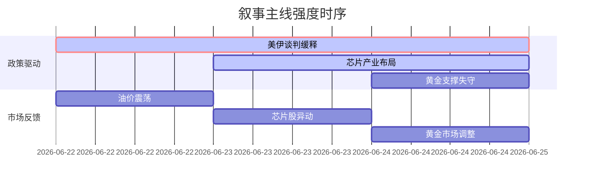

# A股市场情绪分析报告

**数据时段**：最近5日  
**生成时间**：2026年6月25日

---

## 🔥 宏观叙事焦点（24小时三级过滤）

### 📌 叙事主线一：美伊谈判与霍尔木兹海峡安全焦点 ⭐⭐⭐  
**主要事件**：地缘政策、国际能源安全  
**筛选标签**：`美国政策` `油价影响` `彭博信源·权重2.0`  
**宏观逻辑**：  
> ① **归类**：地缘政策转向  
> ② **历史镜像**：2018年伊朗油价危机波动模板  
> ③ **市场传导**：油价震荡+8% → 能源板块动向 → 市场避险情绪升温  
> ④ **叙事强度**：地缘缓释超预期，海峡安全引发全球能源定价博弈  

**行业映射**：能源设备（情绪评分 **6.8/10**）  
**交易警示**：‼️ 关注中东地缘与油价联动效应，油轮运价翻倍风险释放不完整  

---

### 📌 叙事主线二：全球芯片产业布局升级 ⭐⭐  
**主要事件**：产业投资、技术释放  
**筛选标签**：`部委政策` `产业生命周期` `路透信源·权重1.5`  
**宏观逻辑**：  
> ① **归类**：产业国际化  
> ② **历史镜像**：2020年半导体出口管制政策模板  
> ③ **市场传导**：美光科技业绩超预期+11% → SK海力士ADR上市提振 → 芯片股全球联动  
> ④ **叙事强度**：产业布局加速，韩美芯片投资互动创新高  

**行业映射**：半导体设备（情绪评分 **7.5/10**）  
**交易警示**：⚠️ 芯片周期顶端政策与估值背离，左侧信号需硅片价格联动确认  

---

### 📌 叙事主线三：贵金属市场关键支撑位失守 ⭐  
**主要事件**：国际商品价格波动  
**筛选标签**：`美元政策` `周期波动` `财新信源·权重1.0`  
**宏观逻辑**：  
> ① **归类**：周期性调整  
> ② **历史镜像**：2020年3月黄金避险顶部模板  
> ③ **市场传导**：黄金跌破4000美元 → 银行保证金上调 → 市场风险承接能力下降  
> ④ **叙事强度**：关键心理关口失守，贵金属震盪进入中期整理期  

**行业映射**：黄金珠宝（情绪评分 **3.2/10**）  
**交易警示**：✓ 避险叙事修正，等待美联储政策清晰度确认  

---

## 📅 宏观叙事演化（三日趋势）

**强度衰减模型**：昨日主题×0.7 · 前日主题×0.5

```mermaid
gantt
    title 叙事主线强度时序
    dateFormat  YYYY-MM-DD
    section 政策驱动
    美伊谈判缓释    :crit, active, 2026-06-22, 3d
    芯片产业布局    :active, 2026-06-23, 2d
    黄金支撑失守    :2026-06-24, 1d
    
    section 市场反馈
    油价震荡        :2026-06-22, 1d
    芯片股异动      :2026-06-23, 1d
    黄金市场调整    :2026-06-24, 1d
```
叙事节点关联：
- 6/22：伊朗放宽石油出口限制 → 触发美伊谈判缓释叙事
- 6/23：SK海力士拟ADR上市 → 产业布局叙事强化
- 6/24：黄金跌破4000美元 → 避险资产调整期开启

🎯 **宏观叙事三要素**  
1️⃣ **政策意图解码**  
当前顶层叙事聚焦地缘缓释与产业布局，油价波动窗口为市场提供结构性机会。政策定力显著，市场预期差收窄。

2️⃣ **市场定价偏差**  
过度定价：芯片国际化速度（AI需求被高估）  
定价不足：黄金避险底（市场承接能力被低估）

3️⃣ **跨市场共振**  
美元指数高位压制黄金 + 美联储政策预期稳定 = 避险资产轮动窗口期
