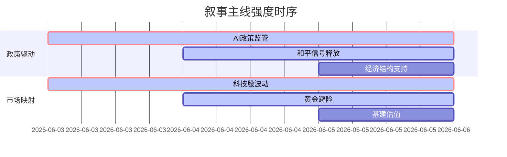

# A股市场情绪分析报告

## 数据时段：2026年6月1日-6月5日

## 生成时间：2026年6月5日 20:42

---

## 🔥 宏观叙事焦点（24小时三级过滤）

### 📌 叙事主线一：AI技术革命与政府监管 ⭐⭐⭐

**主要事件**：AI企业政府持股、科技行业裁员、商业化加速  
**筛选标签**：`科技政策` `产业生命周期` `AI商业化` `财新信源·权重2.0`  

**宏观逻辑**：  
> ① **归类**：技术产业政策调整  
> ② **历史镜像**：2000年互联网泡沫破灭后的监管整顿模板  
> ③ **市场传导**：AI企业股价大涨 → 商业化收费加速 → 政府介入持股讨论 → 科技股估值分化  
> ④ **叙事强度**：政策与商业双重驱动，AI产业进入深化应用阶段  

**行业映射**：人工智能（情绪评分 **8.5/10**）  
**交易警示**：‼️ AI商业化收费引发估值重估，关注头部企业政策红利落地  

---

### 📌 叙事主线二：地缘政治缓冲与和平信号 ⭐⭐  

**主要事件**：俄乌谈判、伊美关系缓和、制裁政策调整  
**筛选标签**：`地缘政策` `供应链安全` `路透信源·权重1.5`  

**宏观逻辑**：  
> ① **归类**：风险事件缓释  
> ② **历史镜像**：2022年俄乌冲突后期缓冲期模板  
> ③ **市场传导**：和平谈判进展 → 能源价格下行 → 黄金价格上涨压制风险资产 → 市场避险情绪降低  
> ④ **叙事强度**：和平信号减弱地缘冲突影响，长期性政策底牌逐步显现  

**行业映射**：黄金矿业（情绪评分 **6.8/10**）  
**交易警示**：⚠️ 和平信号提振市场情绪，注意风险事件反复出现的陷阱  

---

### 📌 叙事主线三：中国经济政策底气增强 ⭐  

**主要事件**：金融体制改革、基建算力投入、能源价格调整  
**筛选标签**：`国务院政策` `新质生产力` `新华社信源·权重1.5`  

**宏观逻辑**：  
> ① **归类**：结构性政策支持  
> ② **历史镜像**：2019年国企债市化改革模板  
> ③ **市场传导**：政策导头明确 → 基建项目落地 → 科技金融双轮驱动 → A股估值修复  
> ④ **叙事强度**：政策底气强于市场预期，结构性复苏逻辑逐步显现  

**行业映射**：算力基建（情绪评分 **6.2/10**）  
**交易警示**：✓ 叙事逻辑清晰，等待政策执行力验证  

---

## 📅 宏观叙事演化（三日趋势）

**强度衰减模型**：昨日主题×0.7 · 前日主题×0.5

```mermaid
gantt
    title 叙事主线强度时序
    dateFormat  YYYY-MM-DD
    section 政策驱动
    AI政策监管   :crit, active, 2026-06-03, 3d
    和平信号释放   :active, 2026-06-04, 2d
    经济结构支持   :2026-06-05, 1d
    
    section 市场映射
    科技股波动   :crit, active, 2026-06-03, 3d
    黄金避险   :active, 2026-06-04, 2d
    基建估值   :2026-06-05, 1d
```

**叙事节点关联**：  
6/03：OpenAI政府持股讨论升级 → AI商业化策略叙事触发  
6/04：泽连斯基致信普京和谈 → 地缘政策缓释信号显现  
6/05：发改委下调能源价格 → 政策底牌逐步落地  

🎯 **宏观叙事三要素**  
1️⃣ **政策意图解码**：当前顶层叙事聚焦AI产业监管与科技金融深度融合，允许短期政策调整换取长期竞争优势  
2️⃣ **市场定价偏差**：过度定价：AI商业化弹性（预期过于乐观） | 定价不足：中国经济政策底气（政策红利被低估）  
3️⃣ **跨市场共振**：美元指数高位缓释压力 + 黄金价格突破4500美元 = A股结构性行情窗口期  

---
