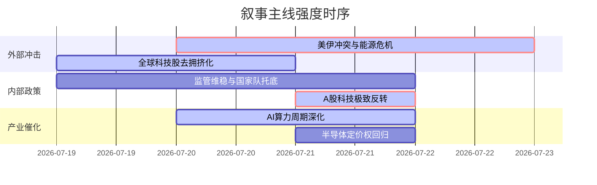

# A股市场情绪分析报告
**数据时段**：最近5日（2026-07-18 至 2026-07-22）
**生成时间**：2026-07-22 07:15:51 (UTC+8)

### 🔥 宏观叙事焦点（24小时三级过滤）

#### 📌 叙事主线一：美伊冲突升级与中东能源通道危机 ⭐⭐⭐
**主要事件**：美军连续空袭伊朗核设施与港口，霍尔木兹海峡通航量宣布降至零，胡塞武装威胁封锁红海，布伦特原油突破91美元/桶，现货黄金站稳4030美元。
**筛选标签**：`地缘冲突` `能源安全` `路透信源·权重2.0`  
**宏观逻辑**：  
> ① **归类**：地缘风险溢价重定价  
> ② **历史镜像**：1979年伊朗革命与霍尔木兹海峡封锁模板  
> ③ **市场传导**：油价飙升+2% → 全球通胀预期上行→ 美联储加息预期升温 → A股风险偏好承压后向能源/军工/黄金避险链切换  
> ④ **叙事强度**：冲突已从代理人博弈升级为直接军事对抗，能源供应中断风险打破原有弱复苏定价  

**行业映射**：油气开采、黄金珠宝、航运物流（情绪评分 **6.8/10**）  
**交易警示**：‼️ 关注停火谈判进展与油价对下游制造业成本的挤压，警惕避险情绪退潮后的获利回吐  

---

#### 📌 叙事主线二：监管维稳组合拳与A股科技极致反转 ⭐⭐  
**主要事件**：证监会密集召开座谈会释放“增强市场内在稳定性”信号，国家队ETF上周净流入850亿元，险资与央企百亿级增持护盘；随后A股深V反弹，科创50大涨10.73%，半导体全线爆发。
**筛选标签**：`证监会政策` `资本市场改革` `财新信源·权重1.5`  
**宏观逻辑**：  
> ① **归类**：政策底与资金底共振  
> ② **历史镜像**：2015年“国家队”ETF托底与2024年“924行情”政策组合拳模板  
> ③ **市场传导**：回购增持再贷款落地 → 宽基ETF放量 → 外资评级上调（花旗超配） → 科技成长估值修复  
> ④ **叙事强度**：监管从制度建设与增量资金双向发力，市场情绪从“谨慎偏弱”快速切换至“结构性亢奋”  

**行业映射**：半导体设备、AI算力、光模块、科创板权重（情绪评分 **8.1/10**）  
**交易警示**：⚠️ 量能持续性与获利盘兑现压力是关键，需验证外盘科技股财报指引是否形成持续共振  

---

#### 📌 叙事主线三：全球AI算力周期深化与半导体定价权回归 ⭐ 
**主要事件**：台积电拟2027年上调代工价格最高10%，英伟达发布Vera Rubin平台挑战CPU市场，DeepSeek完成首轮3500亿估值融资，WAIC大会签约409亿元AI项目。
**筛选标签**：`产业生命周期` `科技自主可控` `彭博信源·权重1.2`  
**宏观逻辑**：  
> ① **归类**：AI资本开支进入产能扩张期  
> ② **历史镜像**：2000年互联网基建周期与2021年存储超级周期模板  
> ③ **市场传导**：晶圆厂涨价预期 → HBM/先进封装需求爆发 → 国产算力替代加速 → A股硬科技业绩兑现（富创精密净利增877%）  
> ④ **叙事强度**：产业景气度验证叠加头部企业融资/IPO催化，科技主线从概念炒作转向基本面驱动  

**行业映射**：存储芯片、半导体材料、液冷服务器、人形机器人（情绪评分 **7.4/10**）  
**交易警示**：✓ 叙事逻辑清晰，等待中际旭创港股IPO定价及Q3业绩窗口验证  

---

### 📅 宏观叙事演化（三日趋势）

**强度衰减模型**：昨日主题×0.7 · 前日主题×0.5

```mermaid
gantt
    title 叙事主线强度时序
    dateFormat  YYYY-MM-DD
    section 外部冲击
    美伊冲突与能源危机     :crit, active, 2026-07-20, 3d
    全球科技股去拥挤化     :active, 2026-07-19, 2d
    
    section 内部政策
    监管维稳与国家队托底   :2026-07-19, 3d
    A股科技极致反转       :crit, active, 2026-07-21, 1d
    
    section 产业催化
    AI算力周期深化        :active, 2026-07-20, 2d
    半导体定价权回归      :2026-07-21, 1d
```
叙事节点关联：
07/19：美伊空袭升级 → 霍尔木兹海峡通航量归零 → 触发能源危机与避险叙事
07/20：证监会座谈+央企百亿增持 → 政策底信号明确 → 市场情绪止跌企稳
07/21：外围科技股超跌反弹+台积电涨价预期 → A股深V爆发 → 科技主线完成情绪拐点确认
07/22：科创50大涨10.73%延续 → 资金集中涌入半导体/AI → 叙事进入政策验证与业绩兑现阶段
🎯 宏观叙事三要素
1️⃣ 政策意图解码
当前顶层叙事从“防风险”转向“稳预期+促改革”，允许短期波动换取中长期制度红利。国家队托底>总量刺激，耐心资本入市与资本市场基础制度建设并重。
2️⃣ 市场定价偏差
过度定价：地缘冲突对A股的系统性冲击（实际表现为科技线独立走强）
定价不足：国内AI算力产业链景气度与半导体国产替代进度（业绩兑现速度被低估）
3️⃣ 跨市场共振
美债收益率高位+美元指数坚挺压制外围流动性 + 中东冲突推升油价通胀预期 = A股“以内需科技+避险资源”双主线对冲的外部环境窗口期

<!-- 报告正文必须在此结束，以下内容为固定格式说明，严禁添加任何额外分析、总结或展望 -->

---

*生成时间：2026-07-22 07:15:51 (UTC+8)*  
*使用模型：agnes:agnes-2.0-flash*