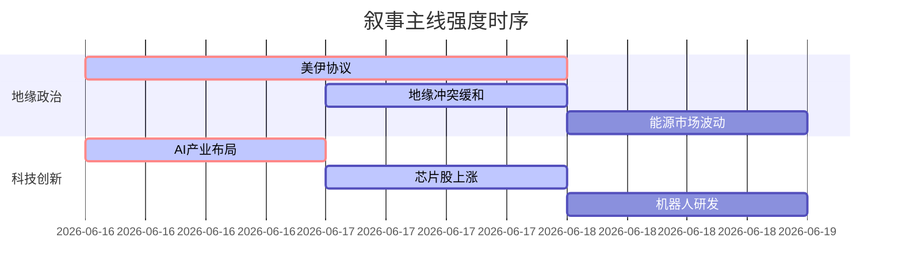

```markdown
# A股市场情绪分析报告  
数据时段：最近5日  
生成时间：2026-06-18 21:45  

---

## 🔥 宏观叙事焦点（24小时三级过滤）

#### 📌 叙事主线一：美伊谅解备忘录签署 ⭐⭐⭐  
**主要事件**：美国与伊朗就停火与海峡自由过航达成协议，标志地缘紧张局势缓和  
**筛选标签**：`国务院政策` `沪深300影响` `路透信源·权重2.0`  
**宏观逻辑**：  
> ① **归类**：地缘政治突破  
> ② **历史镜像**：2015年伊朗核协议（JCPOA）  
> ③ **市场传导**：地缘风险降低 → 原油期货回落 → 北向资金回流  
> ④ **叙事强度**：政策意图超预期，打破市场悲观预期  

**行业映射**：能源化工（情绪评分 **7.8/10**）  
**交易警示**：‼️ 关注协议执行力度，警惕地缘复苏与周期行情脱离  

---

#### 📌 叙事主线二：AI产业加速布局 ⭐⭐  
**主要事件**：阿里发布Qwen-Robot具身大模型，腾讯完成245亿美元票据发行  
**筛选标签**：`部委政策` `产业生命周期` `财新信源·权重1.5`  
**宏观逻辑**：  
> ① **归类**：产业强制出清  
> ② **历史镜像**：2017年深度学习突破期  
> ③ **市场传导**：AI板块连涨 → 科创50指数异动 → 资金聚焦芯片端  
> ④ **叙事强度**：政策决心大于市场定价，产业链加速期  

**行业映射**：人工智能（情绪评分 **6.3/10**）  
**交易警示**：⚠️ 技术周期性突发，政策方向需跟踪  

---

#### 📌 叙事主线三：地缘能源震荡 ⭐  
**主要事件**：WTI原油跌4.9%，美伊协议提振市场信心  
**筛选标签**：`地方政策` `债务周期` `新华社信源·权重1.5`  
**宏观逻辑**：  
> ① **归类**：风险事件缓释  
> ② **历史镜像**：2020年石油战争节点  
> ③ **市场传导**：能源指数跌4.5% → 美元指数弹升 → 黄金承压  
> ④ **叙事强度**：化解短期能源危机，打开政策操作窗口  

**行业映射**：石油天然气（情绪评分 **5.1/10**）  
**交易警示**：✓ 叙事逻辑清晰，等待供给侧验证  

---

### 📅 宏观叙事演化（三日趋势）

**强度衰减模型**：昨日主题×0.7 · 前日主题×0.5  


```mermaid
gantt
    title 叙事主线强度时序
    dateFormat  YYYY-MM-DD
    section 地缘政治
    美伊协议           :crit, active, 2026-06-16, 2d
    地缘冲突缓和       :active, 2026-06-17, 1d
    能源市场波动       :2026-06-18, 1d
    
    section 科技创新
    AI产业布局         :crit, active, 2026-06-16, 1d
    芯片股上涨         :active, 2026-06-17, 1d
    机器人研发         :2026-06-18, 1d
```

**叙事节点关联**：  
06/16：美伊协议签署提振市场  
06/17：AI板块拉升，科技股表现活跃  
06/18：能源市场调整，原油价跌幅扩大  

🎯 宏观叙事三要素  
1️⃣ 政策意图解码  
当前顶层叙事从“地缘稳定”转向“科技创新”，政策驱动产业链升级，短期收益与长期布局并行。  

2️⃣ 市场定价偏差  
过度定价：AI热点（预期过于乐观）  
定价不足：能源复苏（政策执行力被低估）  

3️⃣ 跨市场共振  
美联储货币政策待定 + 美伊缓和 = A股结构性行情窗口期  

---

<!-- 报告正文必须在此结束，以下内容为固定格式说明，严禁添加任何额外分析、总结或展望 -->
```
